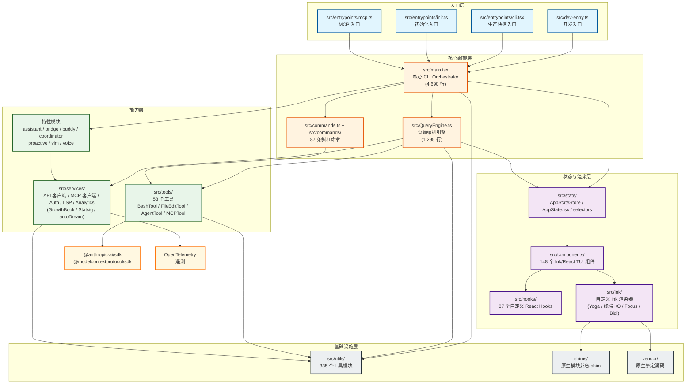

# @anthropic-ai/claude-code 项目概述

> 本文为恢复版（restored from source maps）源码树的高层概览，面向需要快速理解整体架构与目录关系的开发者。

---

## 1. 项目基本信息

| 项 | 说明 |
| :--- | :--- |
| **名称** | `@anthropic-ai/claude-code`（恢复版） |
| **包管理器** | Bun >= 1.3.5，兼容 Node >= 24 |
| **入口文件** | `src/dev-entry.ts`（开发）、`src/entrypoints/cli.tsx`（生产快速路径）、`src/main.tsx`（核心 CLI） |
| **类型** | 基于 **React + Ink** 的交互式 TUI（终端用户界面）CLI |
| **规模** | `src/` 下约 **1,987** 个 TS/TSX 文件 |

---

## 2. 高层架构图

---

## 3. 分层说明

### 3.1 入口与核心编排层

| 模块 | 职责 |
| :--- | :--- |
| `src/entrypoints/` | 多入口分发：CLI 快速启动、初始化脚本、MCP Server 入口、SDK 暴露等。 |
| `src/main.tsx` | **整个应用的心脏**。使用 Commander.js 解析命令行参数，完成环境检测、信任对话框、认证、模型解析，随后分叉进入**交互式 REPL** 或**无头模式（headless）**。 |
| `src/QueryEngine.ts` | 负责将用户输入（自然语言或斜杠命令）编排为可执行的 LLM 查询。管理上下文、工具调用序列、流式响应和错误恢复。 |
| `src/commands.ts` + `src/commands/` | 统一定义并注册 87 条斜杠命令（如 `/clear`、`/compact` 等），部分命令受特性开关控制。 |

### 3.2 状态与 TUI 渲染层

这是 Claude Code 作为**终端 UI 应用**的核心差异点。

| 模块 | 职责 |
| :--- | :--- |
| `src/ink/` | **自定义 Ink 渲染器**。基于 Yoga 布局引擎，处理终端 I/O、焦点管理（focus）、文本选择、双向文本（bidi）等。它是普通 Ink 库的一个深度 fork。 |
| `src/components/` | 148 个 React 组件，专门面向终端渲染（`Box`、`Text` 等 Ink 原生语义的扩展）。 |
| `src/hooks/` | 87 个自定义 Hooks，封装 TUI 生命周期、键盘事件、流式状态订阅等逻辑。 |
| `src/state/` | 全局状态管理：`AppStateStore`、`store.ts`、`selectors` 以及 `AppState.tsx`。QueryEngine 与 UI 组件均通过此层同步状态。 |

### 3.3 能力层（工具、服务、特性模块）

| 模块 | 职责 |
| :--- | :--- |
| `src/tools/` | 53 个底层能力工具。关键成员包括 `BashTool`（执行 shell）、`FileEditTool`（文件读写）、`AgentTool`（子代理调用）、`MCPTool`（MCP 协议工具）等。它们被 QueryEngine 动态调度。 |
| `src/services/` | 横切服务层：Anthropic API 客户端、MCP 客户端、认证流程、LSP 集成、实验平台（GrowthBook / Statsig）以及 autoDream 自动补全。 |
| `src/assistant/`、`bridge/`、`buddy/`、`coordinator/`、`proactive/`、`vim/`、`voice/` | 大型特性域。例如 `buddy` 可能对应陪伴式会话代理，`voice` 对应语音输入，`proactive` 对应主动建议，`vim` 对应编辑器集成。 |

### 3.4 基础设施层

| 模块 | 职责 |
| :--- | :--- |
| `src/utils/` | 335 个小型工具模块（字符串处理、路径解析、颜色格式化、防抖节流等），被所有上层无差别引用。 |
| `shims/` | 为原生 Node 模块提供兼容性垫片，确保在 Bun 运行时或不同平台下的行为一致。 |
| `vendor/` | 存放需要本地编译的原生绑定源码（如终端相关 native addon）。 |

---

## 4. 数据流概览

1. **启动**：`dev-entry.ts` 或 `cli.tsx` 加载环境变量与 shim，随后将控制权交给 `main.tsx`。
2. **解析**：`main.tsx` 通过 Commander.js 解析参数，执行信任检查、认证刷新、模型选择，最终进入**交互式主循环**。
3. **输入**：用户在 TUI 中键入消息或斜杠命令；`components/` 捕获键盘事件，通过 `hooks/` 将动作投递到 `state/`。
4. **编排**：`QueryEngine.ts` 订阅状态变化，将用户输入封装为 Anthropic API 请求，动态注入上下文与可用 `tools/`。
5. **执行**：LLM 返回流式响应或工具调用指令；`QueryEngine` 路由到具体 `Tool`（如 `BashTool.run()`），并将执行结果回写上下文。
6. **渲染**：工具输出与 LLM 增量文本通过 `state/` 触发 React 重渲染，`components/` + `ink/` 将其绘制到终端。
7. **遥测**：`services/` 中的 OpenTelemetry 与统计 SDK 在后台异步上报事件与性能指标。

---

## 5. 技术栈速查

| 领域 | 选型 |
| :--- | :--- |
| 终端 UI | React + 自定义 Ink fork (`src/ink/`) |
| CLI 参数 | Commander.js |
| 校验 | Zod、AJV |
| LLM API | `@anthropic-ai/sdk` |
| MCP 协议 | `@modelcontextprotocol/sdk` |
| 遥测 | OpenTelemetry |
| 特性开关 | 编译时 DCE：通过 `feature()` 函数（来源 `bun:bundle`）实现条件代码消除 |

---

## 6. 目录关系速查表

| 目录 | 被谁依赖 | 主要依赖谁 |
| :--- | :--- | :--- |
| `src/entrypoints/` | 无（最顶层） | `src/main.tsx` |
| `src/main.tsx` | `entrypoints/` | `commands/`、`QueryEngine`、`state/`、`services/`、`utils/` |
| `src/QueryEngine.ts` | `main.tsx`、`components/` | `tools/`、`services/`、`state/`、`utils/` |
| `src/commands/` | `main.tsx`、`QueryEngine` | `tools/`、`services/`、`utils/` |
| `src/components/` | `main.tsx`（渲染树） | `hooks/`、`ink/`、`state/`、`utils/` |
| `src/ink/` | `components/` | `shims/`、`vendor/`、`utils/` |
| `src/tools/` | `QueryEngine`、`commands/` | `services/`、`utils/` |
| `src/services/` | `main.tsx`、`QueryEngine`、`tools/`、特性模块 | `utils/`、外部 SDK |
| `src/state/` | `main.tsx`、`QueryEngine`、`components/` | `utils/` |
| `src/utils/` | 几乎所有模块 | 无（最底层纯函数） |
| `shims/`、`vendor/` | `ink/`、部分 services | 无 |

---

> **提示**：由于这是从 source map 恢复的源码树，部分文件可能包含回退逻辑（fallback）或 shim 行为。若遇到与原始 upstream 不一致的接口，优先以**最小可审计改动**为原则进行修复。
