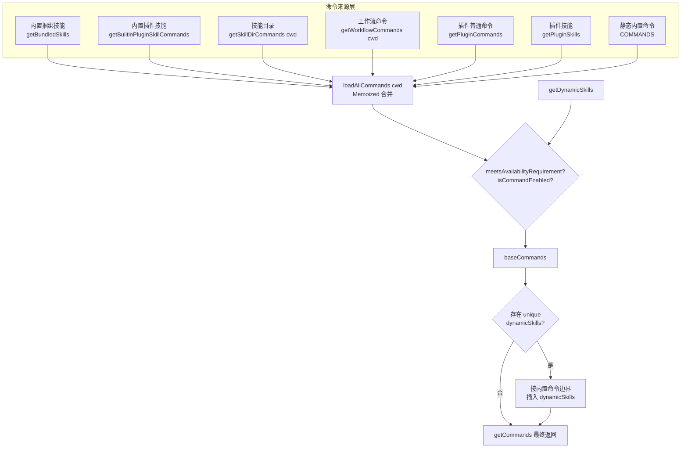

# Claude Code 命令系统分析

## 1. 命令类型定义

文件：`src/types/command.ts`

所有命令都基于 `CommandBase` 接口，并通过 `type` 字段区分为三种执行模式：

### 1.1 `prompt` 命令

- 属性：`type: 'prompt'`
- 行为：用户触发后，调用 `getPromptForCommand(args, context)` 将参数展开为一段文本提示（`ContentBlockParam[]`），随后将该文本发送给模型。
- 典型用途：技能（Skill）、工作流（Workflow）、MCP 提供的技能。
- 关键字段：`progressMessage`（执行时显示的状态文案）、`contentLength`（用于 Token 估算）、`source`（来源标记，如 `'builtin' | 'mcp' | 'plugin' | 'bundled'`）。

### 1.2 `local` 命令

- 属性：`type: 'local'`
- 行为：直接在本地执行逻辑，通过 `load()` 懒加载模块，再通过 `call(args, context)` 返回 `LocalCommandResult`（通常为纯文本输出、compact 结果或 skip）。
- 典型命令：`/clear`、`/cost`、`/compact`、`/version`。
- 特点：不经过模型，直接产出文本结果。

### 1.3 `local-jsx` 命令

- 属性：`type: 'local-jsx'`
- 行为：同样通过 `load()` 懒加载，但 `call()` 返回 `React.ReactNode`，由 Ink TUI 直接渲染交互式组件。
- 典型命令：`/config`、`/plan`、`/branch`、`/memory`、`/tasks`、`/doctor`、`/ide`。
- 特点：会弹出本地终端内的交互界面（如选择框、表单、列表）。

---

## 2. `src/commands.ts` 架构

该文件是整个命令系统的核心注册表与加载器，职责包括：静态命令导入、动态命令聚合、可用性过滤与缓存管理。

### 2.1 静态导入：100+ 命令模块

文件顶部通过 `import` 静态引入绝大多数内置命令，同时结合 `bun:bundle` 的 `feature()` 标志，使用 `require()` 进行**条件导入**：

```ts
const proactive = feature('PROACTIVE') || feature('KAIROS')
  ? require('./commands/proactive.js').default
  : null
```

类似地，以下条件命令仅在对应 Feature Flag 开启时加载：

| 命令 | 条件 |
|------|------|
| `proactive` | `PROACTIVE \|\| KAIROS` |
| `briefCommand` | `KAIROS \|\| KAIROS_BRIEF` |
| `assistantCommand` | `KAIROS` |
| `bridge` | `BRIDGE_MODE` |
| `remoteControlServerCommand` | `DAEMON && BRIDGE_MODE` |
| `voiceCommand` | `VOICE_MODE` |
| `forceSnip` | `HISTORY_SNIP` |
| `workflowsCmd` | `WORKFLOW_SCRIPTS` |
| `webCmd` | `CCR_REMOTE_SETUP` |
| `subscribePr` | `KAIROS_GITHUB_WEBHOOKS` |
| `ultraplan` | `ULTRAPLAN` |
| `torch` | `TORCH` |
| `peersCmd` | `UDS_INBOX` |
| `forkCmd` | `FORK_SUBAGENT` |
| `buddy` | `BUDDY` |

### 2.2 `INTERNAL_ONLY_COMMANDS`

```ts
export const INTERNAL_ONLY_COMMANDS = [
  backfillSessions, breakCache, bughunter, commit, commitPushPr,
  ctx_viz, goodClaude, issue, initVerifiers, forceSnip, mockLimits,
  bridgeKick, version, ultraplan, subscribePr, resetLimits,
  resetLimitsNonInteractive, onboarding, share, summary, teleport,
  antTrace, perfIssue, env, oauthRefresh, debugToolCall,
  agentsPlatform, autofixPr,
].filter(Boolean)
```

- 这些命令属于 **Ant 内部专用**，在外部发布构建中会被剔除。
- 仅在 `process.env.USER_TYPE === 'ant' && !process.env.IS_DEMO` 时通过展开运算符注入到 `COMMANDS` 中。

### 2.3 `COMMANDS = memoize(() => [...])`

- 使用 `lodash-es/memoize` 缓存基础内置命令列表。
- 返回所有静态导入的命令实例（包含条件命令和内部命令）。
- 被声明为函数形式，避免在模块初始化时立即读取配置。

### 2.4 `getSkills(cwd)`

异步加载四类技能命令：

1. `skillDirCommands` — 来自项目目录下的 `/skills/` 或 `.claude/skills/`（`loadSkillsDir.ts`）。
2. `pluginSkills` — 来自用户安装的插件（`loadPluginCommands.ts`）。
3. `bundledSkills` — 启动时同步注册的内置捆绑技能（`bundledSkills.ts`）。
4. `builtinPluginSkills` — 来自启用的内置插件（`builtinPlugins.ts`）。

加载过程通过 `Promise.all` 并行执行，并在失败时降级为空数组。

### 2.5 `loadAllCommands(cwd)`

```ts
const loadAllCommands = memoize(async (cwd: string): Promise<Command[]> => {
  const [{ skillDirCommands, pluginSkills, bundledSkills, builtinPluginSkills },
         pluginCommands, workflowCommands] = await Promise.all([
    getSkills(cwd),
    getPluginCommands(),
    getWorkflowCommands ? getWorkflowCommands(cwd) : Promise.resolve([]),
  ])

  return [
    ...bundledSkills,
    ...builtinPluginSkills,
    ...skillDirCommands,
    ...workflowCommands,
    ...pluginCommands,
    ...pluginSkills,
    ...COMMANDS(),
  ]
})
```

- 按 `cwd` 做 Memoization，避免重复的磁盘 I/O 与动态导入开销。
- 合并顺序：技能类命令在前，插件命令居中，内置命令 `COMMANDS()` 在最后。

### 2.6 `getCommands(cwd)`

```ts
export async function getCommands(cwd: string): Promise<Command[]> {
  const allCommands = await loadAllCommands(cwd)
  const dynamicSkills = getDynamicSkills()
  const baseCommands = allCommands.filter(
    _ => meetsAvailabilityRequirement(_) && isCommandEnabled(_),
  )
  // ...动态技能去重与插入
}
```

执行流程：
1. 调用 `loadAllCommands(cwd)` 获取全部命令源。
2. 获取 `dynamicSkills`（文件操作过程中动态发现的技能）。
3. 使用 `meetsAvailabilityRequirement()` 与 `isCommandEnabled()` 过滤。
4. 动态技能去重：若其 `name` 不在 `baseCommands` 中，且通过两项检查，则被保留。
5. 插入位置：在 `baseCommands` 中找到第一个内置命令（来自 `COMMANDS()`）的索引，将 `uniqueDynamicSkills` 插入到**插件命令之后、内置命令之前**。

### 2.7 `meetsAvailabilityRequirement(cmd)`

基于命令的 `availability` 数组进行权限/提供商过滤：

- `'claude-ai'`：仅当 `isClaudeAISubscriber()` 为 `true` 时可见（claude.ai 的 Pro/Max/Team/Enterprise 用户）。
- `'console'`：仅当用户**不是** claude.ai 订阅者、**不是**第三方服务（Bedrock/Vertex/Foundry）、且使用 Anthropic 官方 Base URL 时可见。

该函数**不做 Memoization**，因为会话中途可能通过 `/login` 改变认证状态。

### 2.8 缓存失效函数

```ts
export function clearCommandMemoizationCaches(): void
export function clearCommandsCache(): void
```

- `clearCommandMemoizationCaches`：清除 `loadAllCommands`、`getSkillToolCommands`、`getSlashCommandToolSkills` 的 Memoization 缓存，以及 `clearSkillIndexCache`（实验性技能搜索）。
- `clearCommandsCache`：在上述基础上进一步清除插件命令缓存、插件技能缓存和技能目录缓存。

### 2.9 技能/工具命令提取器

- `getSkillToolCommands(cwd)`：返回模型可调用的 `prompt` 类型命令（非 builtin、未被禁用、来源为 bundled/skills/commands_DEPRECATED 或具有用户指定描述）。
- `getSlashCommandToolSkills(cwd)`：返回严格的“技能”子集（`loadedFrom` 为 `skills`/`plugin`/`bundled` 或具有 `disableModelInvocation`）。
- `getMcpSkillCommands(mcpCommands)`：从 `AppState.mcp.commands` 中筛选出 `loadedFrom === 'mcp'` 且 `type === 'prompt'` 的技能（受 `MCP_SKILLS` Feature Flag 控制）。

### 2.10 远程/桥接安全白名单

```ts
export const REMOTE_SAFE_COMMANDS: Set<Command>
export const BRIDGE_SAFE_COMMANDS: Set<Command>
export function isBridgeSafeCommand(cmd: Command): boolean
export function filterCommandsForRemoteMode(commands: Command[]): Command[]
```

- `REMOTE_SAFE_COMMANDS`：`--remote` 模式下允许使用的命令（仅影响本地 TUI 状态，不依赖本地文件系统/Shell/MCP）。例如 `/session`、`/exit`、`/help`、`/theme`、`/cost`、`/plan`。
- `BRIDGE_SAFE_COMMANDS`：通过 Remote Control 桥接（手机/Web 客户端）允许执行的 `local` 命令。例如 `/compact`、`/clear`、`/cost`、`/summary`、`/files`。
- `isBridgeSafeCommand`：
  - `local-jsx` 类型 → **禁止**（会渲染 Ink UI）。
  - `prompt` 类型 → **允许**（仅展开为文本）。
  - `local` 类型 → 取决于 `BRIDGE_SAFE_COMMANDS` 白名单。

---

## 3. `src/commands/` 目录

`src/commands/` 下约有 **87+ 个 slash 命令**，以**文件夹**（`index.ts` / `index.js`）或**单文件**形式组织：

- **文件夹形式**（~87 个）：`add-dir/`、`config/`、`mcp/`、`skills/`、`plan/`、`branch/`、`doctor/`、`tasks/` 等。文件夹内可包含多文件、子组件、测试或资源。
- **单文件形式**（~15 个）：`commit.ts`、`advisor.ts`、`version.ts`、`bridge-kick.ts`、`brief.ts`、`review.ts`、`security-review.ts`、`statusline.tsx`、`ultraplan.tsx`、`insights.ts`、`init.ts`、`init-verifiers.ts`、`commit-push-pr.ts`、`createMovedToPluginCommand.ts`、`install.tsx`。

### 3.1 条件/隐藏命令（Feature Flag 控制）

| 命令 | 文件路径 | 条件 |
|------|----------|------|
| `buddy` | `src/commands/buddy/index.ts` | `BUDDY` |
| `proactive` | `src/commands/proactive.ts` | `PROACTIVE \|\| KAIROS` |
| `brief` | `src/commands/brief.ts` | `KAIROS \|\| KAIROS_BRIEF` |
| `assistant` | `src/commands/assistant/index.ts` | `KAIROS` |
| `bridge` | `src/commands/bridge/index.ts` | `BRIDGE_MODE` |
| `remoteControlServer` | `src/commands/remoteControlServer/index.ts` | `DAEMON && BRIDGE_MODE` |
| `voice` | `src/commands/voice/index.ts` | `VOICE_MODE` |
| `force-snip` | `src/commands/force-snip.ts` | `HISTORY_SNIP` |
| `workflows` | `src/commands/workflows/index.ts` | `WORKFLOW_SCRIPTS` |
| `remote-setup` | `src/commands/remote-setup/index.ts` | `CCR_REMOTE_SETUP` |
| `subscribe-pr` | `src/commands/subscribe-pr.ts` | `KAIROS_GITHUB_WEBHOOKS` |
| `ultraplan` | `src/commands/ultraplan.tsx` | `ULTRAPLAN` |
| `torch` | `src/commands/torch.ts` | `TORCH` |
| `peers` | `src/commands/peers/index.ts` | `UDS_INBOX` |
| `fork` | `src/commands/fork/index.ts` | `FORK_SUBAGENT` |

### 3.2 Ant-only 内部命令

以下命令仅在 `USER_TYPE === 'ant'` 时注入，不对外发布：

- `teleport`
- `bughunter`
- `mock-limits`
- `ctx_viz`
- `break-cache`
- `ant-trace`
- `good-claude`
- `agents-platform`
- `autofix-pr`
- `debug-tool-call`
- `reset-limits` / `reset-limits-non-interactive`
- `backfill-sessions`
- `commit`
- `commit-push-pr`
- `issue`
- `init-verifiers`
- `bridge-kick`
- `version`
- `onboarding`
- `share`
- `summary`
- `env`
- `oauth-refresh`
- `perf-issue`

---

## 4. 动态命令来源

除了 `src/commands.ts` 中静态导入的内置命令外，系统还支持四类动态命令源：

### 4.1 技能目录命令（Skill Directory Commands）

- 来源：项目目录下的 `/skills/` 或 `.claude/skills/`。
- 加载器：`src/skills/loadSkillsDir.ts` 中的 `getSkillDirCommands(cwd)`。
- 特点：用户可自定义 Markdown/TS 技能，Claude Code 将其解析为 `prompt` 类型命令。

### 4.2 插件命令（Plugin Commands）

- 来源：用户通过 `/plugin` 安装的第三方插件。
- 加载器：`src/utils/plugins/loadPluginCommands.ts` 中的 `getPluginCommands()` 与 `getPluginSkills()`。
- 插件可以提供普通命令（`pluginCommands`）和技能（`pluginSkills`）。

### 4.3 工作流命令（Workflow Commands）

- 来源：`WorkflowTool` 动态生成。
- 加载器：`src/tools/WorkflowTool/createWorkflowCommand.ts` 中的 `getWorkflowCommands(cwd)`（受 `WORKFLOW_SCRIPTS` 标志控制）。
- 特点：由 `.claude/workflows/` 下的 YAML/JSON 工作流定义自动映射为 `prompt` 命令，标记 `kind: 'workflow'`。

### 4.4 MCP 提供的技能（MCP Skills）

- 来源：通过 MCP（Model Context Protocol）服务器连接的外部工具。
- 加载器：MCP 配置在运行时注入到 `AppState.mcp.commands`，随后通过 `getMcpSkillCommands(mcpCommands)` 提取。
- 特点：独立的命令池，不直接进入 `getCommands()` 的返回列表，需要调用方显式传入并合并。

---

## 5. `getCommands()` 命令组装流程图



流程说明：
1. `loadAllCommands(cwd)` 并行拉取 7 类命令源，按 **技能 → 工作流 → 插件命令 → 插件技能 → 内置命令** 的顺序合并。
2. `getCommands(cwd)` 在此基础上拉取 `dynamicSkills`（文件操作中动态触发的技能）。
3. 通过 `meetsAvailabilityRequirement()`（权限/提供商过滤）和 `isCommandEnabled()`（Feature Flag/状态过滤）筛掉不可用命令，得到 `baseCommands`。
4. 对 `dynamicSkills` 去重并再次过滤。
5. 将去重后的动态技能插入到 `baseCommands` 中**第一个内置命令之前**的位置，形成最终列表返回。
