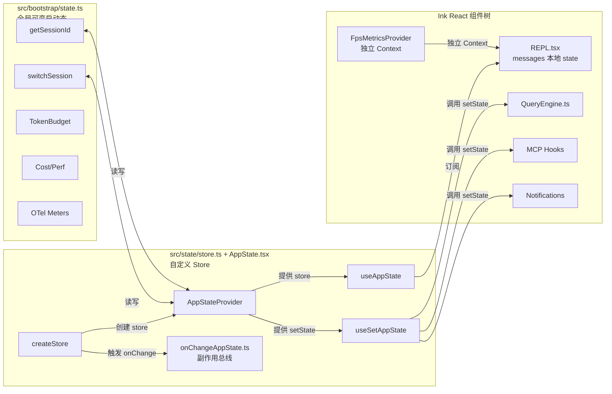

# Claude Code 状态管理架构分析

本文分析 Claude Code 当前代码库中的状态管理分层设计，涵盖核心类型定义、自定义 Store、React 集成层以及独立于 React 树的全局启动态。

---

## 1. 核心状态类型：`AppState`（`src/state/AppStateStore.ts`）

`src/state/AppStateStore.ts` 是整个 UI 与业务状态的**类型契约中心**。它定义了 `AppState` 类型与默认值工厂 `getDefaultAppState()`。

### 1.1 不可变语义：`DeepImmutable<>`

`AppState` 的主体被包装在 `DeepImmutable<>` 中（来自 `src/types/utils.js`），这意味着顶层对象及其嵌套字面量类型在 TypeScript 层面被视为深度只读。需要指出的是，当前代码库中**并没有真正的不可变数据结构库**（如 Immer 或 ImmutableJS），不可变性依赖编码约定与展开运算符手动替换。

```ts
export type AppState = DeepImmutable<{
  settings: SettingsJson
  verbose: boolean
  mainLoopModel: ModelSetting
  mainLoopModelForSession: ModelSetting
  statusLineText: string | undefined
  expandedView: 'none' | 'tasks' | 'teammates'
  // ... 更多字段
}>
```

### 1.2 关键字段一览

| 字段 | 类型 | 说明 |
|------|------|------|
| `settings` | `SettingsJson` | 用户设置（模型、主题、快捷键等） |
| `mainLoopModel` / `mainLoopModelForSession` | `ModelSetting` | 当前会话使用的主模型，后者为会话级覆盖 |
| `verbose` | `boolean` | 详细日志模式 |
| `statusLineText` | `string \| undefined` | 底部状态栏瞬时文本 |
| `expandedView` | `'none' \| 'tasks' \| 'teammates'` | 扩展面板视图状态 |
| `toolPermissionContext` | `ToolPermissionContext` | 工具权限上下文（模式、绕过开关等） |
| `spinnerTip` | `string \| undefined` | 加载提示文案 |
| `agent` | `string \| undefined` | `--agent` CLI 标志或设置中的代理名称 |
| `kairosEnabled` | `boolean` | Assistant 模式总开关 |
| `remoteSessionUrl` | `string \| undefined` | `--remote` 远程会话 URL |
| `speculation` | `SpeculationState` | 推测执行状态：idle 或 active（含 abort、messagesRef、writtenPathsRef、boundary 等） |
| `tasks` | `{ [taskId: string]: TaskState }` | 统一任务状态表（**显式排除**在 `DeepImmutable` 外，因为 `TaskState` 包含函数） |
| `mcp` | `{ clients, tools, commands, resources, pluginReconnectKey }` | MCP 服务器连接与可用工具/命令/资源 |
| `sessionHooks` | `SessionHooksState` | 会话级 Hook 注册表 |
| `plugins` | `{ enabled, disabled, commands, errors, installationStatus, needsRefresh }` | 插件系统状态 |
| `denialTracking` | `DenialTrackingState \| undefined` | 拒绝跟踪（用于 YOLO/headless 模式回退） |
| `fileHistory` | `FileHistoryState` | 文件历史快照状态 |
| `attribution` | `AttributionState` | Commit Attribution 状态 |
| `authVersion` | `number` | 登录/登出时递增，触发 auth 依赖数据重拉 |
| `initialMessage` | `{ message: UserMessage, ... } \| null` | 初始待处理消息（来自 CLI 参数或 plan mode 退出） |
| `activeOverlays` | `ReadonlySet<string>` | 当前激活的覆盖层（用于 Escape 键协调） |

### 1.3 关于对话历史与其他字段的实际位置

**注意**：在当前代码库中，以下字段**并未存放在 `AppState` 中**，而是由其他机制管理：

- **`messages`（对话历史）**：不是 `AppState` 的字段。主对话历史 `messages` 是 `src/screens/REPL.tsx` 中的**本地 React `useState`**（`const [messages, rawSetMessages] = useState<MessageType[]>(...)`），通过 `messagesRef` 与回调透传给子组件和 QueryEngine。
- **`fileStateCache`**：不在 `AppState` 中。`REPL.tsx` 通过 `useRef` 持有 `readFileState`（类型为 `FileStateCache`），并在 `ProcessUserInputContext` 中向下传递。
- **`fpsMetrics`**：不在 `AppState` 中。由独立的 React Context `FpsMetricsProvider`（`src/context/fpsMetrics.tsx`）通过 `useFpsMetrics()` 提供。
- **`pendingPermissions`** / **`lastSavedAt`**：在当前 `AppState` 类型定义中不存在。

### 1.4 默认值工厂：`getDefaultAppState()`

```ts
export function getDefaultAppState(): AppState {
  // ... 懒加载 teammate.ts 避免循环依赖
  return {
    settings: getInitialSettings(),
    tasks: {},
    agentNameRegistry: new Map(),
    verbose: false,
    mainLoopModel: null,
    mainLoopModelForSession: null,
    // ... 其余字段初始化为空或默认值
  }
}
```

---

## 2. 自定义 Store 实现（`src/state/store.ts`）

Claude Code **没有使用 Redux、Zustand 或 Recoil**，而是实现了一个不足 40 行的**极简自定义 Store**：

```ts
export type Store<T> = {
  getState: () => T
  setState: (updater: (prev: T) => T) => void
  subscribe: (listener: Listener) => () => void
}

export function createStore<T>(
  initialState: T,
  onChange?: OnChange<T>,
): Store<T> {
  let state = initialState
  const listeners = new Set<Listener>()

  return {
    getState: () => state,

    setState: (updater) => {
      const prev = state
      const next = updater(prev)
      if (Object.is(next, prev)) return   // 引用未变则短路
      state = next
      onChange?.({ newState: next, oldState: prev })
      for (const listener of listeners) listener()
    },

    subscribe: (listener) => {
      listeners.add(listener)
      return () => listeners.delete(listener)
    },
  }
}
```

特性：
- **无中间件、无切片（slice）**：单一根状态树。
- **手动不可变性**：调用方必须返回新对象；`Object.is` 用于跳过无意义更新。
- **可订阅**：Ink/React 通过 `subscribe` + `getState` 消费状态变化。
- **变化回调**：可选的 `onChange` 参数用于挂载全局副作用（见第 4 节）。

---

## 3. 状态更新模式：`AppStateStore.ts` 与去中心化更新

### 3.1 没有集中式 Action Creator

与常见假设不同，`src/state/AppStateStore.ts` **仅导出类型与默认值**，并不导出类似 `setMessages()`、`appendMessage()`、`setSettings()` 的集中式 action creator，也不存在模块级的 `appStateStore` 单例实例。

状态更新采用**去中心化**模式：
- React 组件通过 `useSetAppState()` 获取 `setState` 函数。
- 各组件/服务直接在本地调用 `setAppState(prev => ({ ...prev, key: newValue }))` 完成更新。

典型代码分布：
- `src/QueryEngine.ts`：直接调用 `setAppState(prev => ({ ...prev, verbose: true }))`。
- `src/services/mcp/useManageMCPConnections.ts`：大量 `setAppState(prevState => ({ ...prevState, mcp: { ... } }))`。
- `src/services/PromptSuggestion/speculation.ts`：`startSpeculation()` / `completeSpeculation()` 等逻辑内部直接操作 `setAppState`。
- `src/context/notifications.tsx`：通知队列的入队/出队直接通过 `setAppState` 修改 `state.notifications`。

### 3.2 任务状态的更新示例

任务状态（`tasks`）的增删改没有统一 action creator，而是在多处直接展开：
- `src/utils/task/framework.ts` 中存在 `updateTask()`、`removeTask()` 等辅助函数，但它们接受 `setAppState` 作为参数，而非直接操作全局 store。

### 3.3 副作用总线：`onChangeAppState.ts`

虽然更新是去中心化的，但**副作用是集中收敛**的。`createStore` 的第二个参数传入 `onChangeAppState`（`src/state/onChangeAppState.ts`），任何导致状态引用变化的 `setState` 都会触发它。

```ts
export function onChangeAppState({ newState, oldState }: { newState: AppState; oldState: AppState }) {
  // 1. 权限模式同步到 CCR / SDK
  if (oldState.toolPermissionContext.mode !== newState.toolPermissionContext.mode) {
    notifyPermissionModeChanged(newState.toolPermissionContext.mode)
    notifySessionMetadataChanged({ permission_mode: ... })
  }

  // 2. mainLoopModel 与 settings 的双向同步
  if (newState.mainLoopModel !== oldState.mainLoopModel) {
    updateSettingsForSource('userSettings', { model: newState.mainLoopModel })
    setMainLoopModelOverride(newState.mainLoopModel)
  }

  // 3. expandedView / verbose 持久化到全局配置
  if (newState.expandedView !== oldState.expandedView) { ...saveGlobalConfig(...) }
  if (newState.verbose !== oldState.verbose) { ...saveGlobalConfig(...) }

  // 4. settings 变化时清空认证缓存
  if (newState.settings !== oldState.settings) {
    clearApiKeyHelperCache()
    clearAwsCredentialsCache()
    clearGcpCredentialsCache()
    if (newState.settings.env !== oldState.settings.env) applyConfigEnvironmentVariables()
  }
}
```

这实现了**"写时分散、读副作用集中"**的架构：任何代码路径修改 `toolPermissionContext.mode` 都会自动同步到外部 CCR 与 SDK，无需调用方关心。

---

## 4. 启动态 / 全局可变状态（`src/bootstrap/state.ts`）

`src/bootstrap/state.ts` 是**独立于 React Store 的模块级可变状态**。它在 `main.tsx` 启动时即被初始化，早于 Ink React 树挂载，用于承载跨切面的会话元数据、成本统计、OpenTelemetry 遥测等。

### 4.1 状态容器

```ts
type State = {
  originalCwd: string
  projectRoot: string
  totalCostUSD: number
  totalAPIDuration: number
  // ... 大量字段
}

const STATE: State = getInitialState()
```

### 4.2 关键访问器分类

| 类别 | 代表函数 | 用途 |
|------|---------|------|
| **会话身份** | `getSessionId()`、`switchSession(id)`、`getParentSessionId()`、`regenerateSessionId()` | 会话 ID 切换与血缘追踪 |
| **目录状态** | `getOriginalCwd()`、`setOriginalCwd()`、`getCwdState()`、`setCwdState()`、`getProjectRoot()` | CWD 与项目根目录 |
| **交互模式** | `setIsInteractive()`、`getIsInteractive()`、`setClientType()` | CLI/IDE/SDK 模式区分 |
| **渠道与设置源** | `setAllowedChannels()`、`setAllowedSettingSources()` | `--channels` 与配置来源白名单 |
| **功能开关** | `setKairosActive()`、`setStrictToolResultPairing()`、`setSessionBypassPermissionsMode()` | 会话级功能布尔开关 |
| **远程/传送** | `setIsRemoteMode()`、`setTeleportedSessionInfo()`、`markFirstTeleportMessageLogged()` | 远程会话与 teleport 追踪 |
| **Token 预算** | `snapshotOutputTokensForTurn(budget)`、`getCurrentTurnTokenBudget()`、`getBudgetContinuationCount()`、`incrementBudgetContinuationCount()` | 单轮输出 token 预算控制 |
| **性能/成本统计** | `getTurnHookDurationMs()`、`getTurnToolDurationMs()`、`getTurnClassifierDurationMs()`、`addToTotalCostState()`、`addToToolDuration()` | 成本与耗时聚合 |
| **OpenTelemetry** | `setMeter()`、`setLoggerProvider()`、`setTracerProvider()` | 遥测基础设施挂载 |
| **Hook 注册** | `registerHookCallbacks()`、`getRegisteredHooks()`、`clearRegisteredHooks()` | SDK 与原生插件 Hook |

### 4.3 设计意图

`bootstrap/state.ts` 被设计为**DAG 叶子节点**（尽量减少被其他模块导入后再被导入的风险），并在文件顶部以显式注释警告：

```ts
// DO NOT ADD MORE STATE HERE - BE JUDICIOUS WITH GLOBAL STATE
```

它解决的是 "React 树尚未挂载前就需要状态" 以及 "非 UI 代码需要低依赖地读写数据" 的问题。

---

## 5. React 集成层（`src/state/AppState.tsx`）

`AppState.tsx` 是自定义 Store 与 Ink 组件树之间的**唯一桥梁**。

### 5.1 `AppStateProvider`

```tsx
export function AppStateProvider({ children, initialState, onChangeAppState }) {
  // 禁止嵌套
  const hasAppStateContext = useContext(HasAppStateContext)
  if (hasAppStateContext) throw new Error("AppStateProvider can not be nested...")

  // 在 Provider 内部创建 store 实例（无全局单例）
  const [store] = useState(() => createStore(initialState ?? getDefaultAppState(), onChangeAppState))

  // 挂载时自动禁用绕过权限模式（如果远程设置已提前加载）
  useEffect(() => {
    const { toolPermissionContext } = store.getState()
    if (toolPermissionContext.isBypassPermissionsModeAvailable && isBypassPermissionsModeDisabled()) {
      store.setState(prev => ({ ...prev, toolPermissionContext: createDisabledBypassPermissionsContext(prev.toolPermissionContext) }))
    }
  }, [store])

  // 设置变更监听
  const onSettingsChange = useEffectEvent(source => applySettingsChange(source, store.setState))
  useSettingsChange(onSettingsChange)

  return (
    <HasAppStateContext.Provider value={true}>
      <AppStoreContext.Provider value={store}>
        <MailboxProvider><VoiceProvider>{children}</VoiceProvider></MailboxProvider>
      </AppStoreContext.Provider>
    </HasAppStateContext.Provider>
  )
}
```

**重要**：`createStore` 在 `AppStateProvider` 内部被调用，因此不存在模块级 `appStateStore` 单例。每个渲染树（如果存在多个）会有独立的 store，但运行时通常只有一个根 Provider。

### 5.2 消费 Hook

| Hook | 签名 | 说明 |
|------|------|------|
| `useAppState(selector)` | `(state: AppState) => T => T` | 基于 `useSyncExternalStore` 的状态切片订阅，按 `Object.is` 比较返回值 |
| `useSetAppState()` | `() => ((prev: AppState) => AppState) => void` | 仅获取 `setState`，不订阅，组件不会因状态变化重渲染 |
| `useAppStateStore()` | `() => AppStateStore` | 直接拿到 store 实例，用于传给非 React 代码 |
| `useAppStateMaybeOutsideOfProvider(selector)` | 同 `useAppState` | 安全版本，Provider 外返回 `undefined` |

`useAppState` 的文档注释特别强调：**不要从 selector 中返回新对象**，否则 `Object.is` 会永远判定为变化，导致无限重渲染。正确做法是返回已有的子对象引用：

```ts
// ✅ 好：返回现有子对象
const { text, promptId } = useAppState(s => s.promptSuggestion)

// ❌ 坏：每次返回新对象
const summary = useAppState(s => ({ text: s.promptSuggestion.text }))
```

---

## 6. 架构关系图



### 数据流向说明

1. **`bootstrap/state.ts` → Store**：启动参数（如 `isInteractive`、`kairosActive`）在 `main.tsx` 中被设置，随后 `AppStateProvider` 初始化时可能读取其中部分值来构造 `initialState`。
2. **Store ↔ React**：`AppStateProvider` 通过 React Context 向下传递 `store` 实例。组件使用 `useAppState` 订阅切片，`useSetAppState` 获取更新函数。
3. **去中心化写入**：`REPL.tsx`、QueryEngine、MCP Hooks、Notifications 等模块各自调用 `setAppState(prev => ...)` 修改自己关心的字段。
4. **集中化副作用**：所有导致引用变化的 `setState` 都会流经 `onChangeAppState`，在这里统一完成持久化、缓存清理、CCR/SDK 同步。
5. **独立 Context**：`messages`（对话历史）和 `fpsMetrics` 由于更新频率极高或生命周期特殊，**没有纳入 `AppState`**，而是分别由 `REPL.tsx` 的本地 `useState` 和 `FpsMetricsProvider` 管理。

---

## 7. 小结

Claude Code 的状态管理是一种**"轻量自定义 Store + 去中心化更新 + 集中副作用"**的混合架构：

- **不依赖外部状态库**：`store.ts` 仅用原生 JS 实现了 `getState / setState / subscribe` 三元组。
- **没有集中 Action Creator**：状态更新由各处业务代码直接通过 `useSetAppState()` 完成。
- **副作用收敛在单一 diff 函数**：`onChangeAppState.ts` 是观察状态变化、同步外部系统的唯一闸口。
- **双轨状态**：`AppState` 负责 UI 与业务配置状态；`bootstrap/state.ts` 负责会话元数据、成本、遥测等跨切面全局状态；`REPL.tsx` 本地 state 负责高频变化的对话历史。
