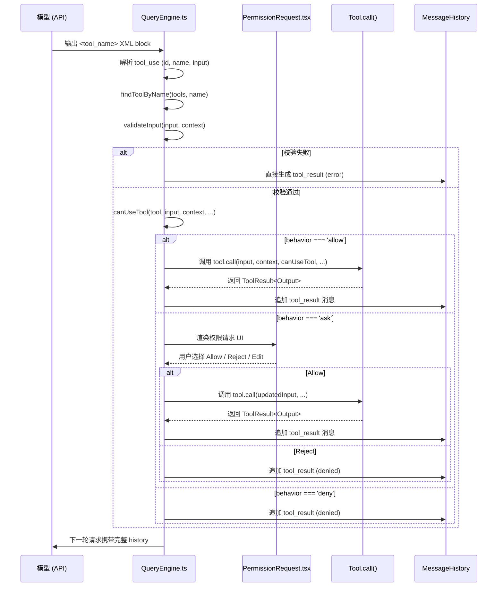

# Claude Code 工具系统架构分析

## 1. Tool 抽象层 (`src/Tool.ts`)

`src/Tool.ts` 是整个工具系统的核心类型定义层，提供了统一的工具接口、辅助类型和构建函数。

### 1.1 `Tool<TInput, TOutput>` 接口

```typescript
export type Tool<
  Input extends AnyObject = AnyObject,
  Output = unknown,
  P extends ToolProgressData = ToolProgressData,
> = { ... }
```

该接口定义了每个工具必须实现的方法集，核心方法包括：

- **`call(args, context, canUseTool, parentMessage, onProgress?)`**：执行工具的实际逻辑，返回 `Promise<ToolResult<Output>>`。
- **`description(input, options)`**：生成供权限提示框显示的工具用途描述。
- **`prompt(options)`**：生成面向模型的工具使用提示（system prompt 中的 tool descriptions）。
- **`checkPermissions(input, context)`**：工具级别的权限检查逻辑。
- **`validateInput(input, context)`**：输入校验，返回 `ValidationResult`。
- **`renderToolUseMessage(input, options)`**：渲染工具调用时的 UI 消息。
- **`renderToolResultMessage(content, progressMessages, options)`**：渲染工具结果消息。
- **`mapToolResultToToolResultBlockParam(content, toolUseID)`**：将工具输出映射为 Anthropic SDK 的 `ToolResultBlockParam`。

工具属性：
- **`name`** / **`aliases`**：工具主名称和兼容别名（如 `AgentTool` 兼容旧名 `Task`）。
- **`inputSchema`** / **`outputSchema`**：基于 Zod v4 的结构化输入/输出模式。
- **`inputJSONSchema`**：对于 MCP 工具，可直接提供 JSON Schema 而非从 Zod 转换。
- **`isEnabled()`** / **`isReadOnly(input)`** / **`isConcurrencySafe(input)`** / **`isDestructive(input)`**：元数据能力声明。
- **`maxResultSizeChars`**：工具结果在超过该阈值后会被持久化到磁盘（`Infinity` 表示永不持久化）。
- **`shouldDefer`** / **`alwaysLoad`**：Tool Search（延迟加载）相关标记。

### 1.2 `ToolInputJSONSchema`

```typescript
export type ToolInputJSONSchema = {
  [x: string]: unknown
  type: 'object'
  properties?: { [x: string]: unknown }
}
```

用于 MCP 工具直接声明其输入的 JSON Schema，绕过 Zod 转换路径。

### 1.3 `ToolPermissionContext`

```typescript
export type ToolPermissionContext = DeepImmutable<{
  mode: PermissionMode
  additionalWorkingDirectories: Map<string, AdditionalWorkingDirectory>
  alwaysAllowRules: ToolPermissionRulesBySource
  alwaysDenyRules: ToolPermissionRulesBySource
  alwaysAskRules: ToolPermissionRulesBySource
  isBypassPermissionsModeAvailable: boolean
  isAutoModeAvailable?: boolean
  strippedDangerousRules?: ToolPermissionRulesBySource
  shouldAvoidPermissionPrompts?: boolean
  awaitAutomatedChecksBeforeDialog?: boolean
  prePlanMode?: PermissionMode
}>
```

该上下文贯穿整个会话，存储了当前的权限模式（`default` / `plan` / `acceptEdits` / `auto` / `bypassPermissions` 等）以及按来源分组的 allow/deny/ask 规则。

### 1.4 `toolMatchesName()` 与 `findToolByName()`

```typescript
export function toolMatchesName(
  tool: { name: string; aliases?: string[] },
  name: string,
): boolean
```

支持通过主名称或别名查找工具，广泛用于 `QueryEngine`、权限检查、MCP 工具去重等场景。

### 1.5 `buildTool()`

```typescript
export function buildTool<D extends AnyToolDef>(def: D): BuiltTool<D>
```

所有内置工具均通过 `buildTool()` 构造。该函数为未声明的方法填充安全默认值（fail-closed）：
- `isEnabled` → `true`
- `isConcurrencySafe` → `false`
- `isReadOnly` → `false`
- `checkPermissions` → 直接放行（委托给通用权限系统）
- `toAutoClassifierInput` → `''`（跳过 auto-mode 分类器）

### 1.6 `ToolUseContext`

包含工具执行所需的完整运行时上下文：`options`（命令列表、工具集、模型名等）、`abortController`、`readFileState`（文件读取缓存）、`messages`、各种状态更新回调（`setAppState`、`setToolJSX`、`updateFileHistoryState` 等）、以及子代理特有的 `agentId` / `renderedSystemPrompt` 等字段。

---

## 2. 工具注册与过滤 (`src/tools.ts`)

### 2.1 `getAllBaseTools()`

返回当前环境（含 feature flag 和 `process.env` 条件）下所有**可能可用**的内置工具列表。包含 `AgentTool`、`BashTool`、`FileEditTool`、`FileReadTool`、`FileWriteTool`、`GlobTool`、`GrepTool`、`NotebookEditTool`、`WebFetchTool`、`WebSearchTool`、`TodoWriteTool`、`TaskCreateTool`/`TaskGetTool`/`TaskUpdateTool`/`TaskListTool`、`TaskStopTool`、`AskUserQuestionTool`、`SkillTool`、`EnterPlanModeTool`/`ExitPlanModeV2Tool`、`EnterWorktreeTool`/`ExitWorktreeTool`、`BriefTool`、`LSPTool`、`MCPTool` 系列、`SleepTool`、`SnipTool`、`SyntheticOutputTool`、`OverflowTestTool` 等。

条件加载示例：
- 当 `hasEmbeddedSearchTools()` 为真时，省略 `GlobTool` / `GrepTool`。
- 当 `feature('COORDINATOR_MODE')` 开启时，追加 `AgentTool`、`TaskStopTool`、`SendMessageTool`。
- 当 `feature('KAIROS')` 开启时，追加 `SleepTool`、`SendUserFileTool`、`PushNotificationTool`。
- 当 `feature('AGENT_TRIGGERS')` 开启时，追加 `CronCreateTool` / `CronDeleteTool` / `CronListTool`。
- 当 `feature('TRANSCRIPT_CLASSIFIER')` 开启且乐观判断启用时，追加 `ToolSearchTool`。

### 2.2 `getTools(permissionContext)`

在 `getAllBaseTools()` 基础上执行三层过滤：
1. **Deny 规则过滤**：`filterToolsByDenyRules()` 根据 `alwaysDenyRules` 剔除被全局拒绝的工具（含 MCP server 前缀规则如 `mcp__server`）。
2. **REPL 模式过滤**：若 `isReplModeEnabled()` 且 `REPLTool` 启用，则隐藏 `REPL_ONLY_TOOLS`（原始工具被封装进 REPL VM）。
3. **`isEnabled()` 过滤**：每个工具的动态启用检查（如 `SleepTool` 仅在 proactive 模式下启用）。
4. **`CLAUDE_CODE_SIMPLE` 简化模式**：仅保留 `BashTool`、`FileReadTool`、`FileEditTool`（以及 REPL 模式下的 `REPLTool`）。

### 2.3 `assembleToolPool()` 与 `getMergedTools()`

```typescript
export function assembleToolPool(
  permissionContext: ToolPermissionContext,
  mcpTools: Tools,
): Tools
```

这是内置工具与 MCP 工具合并的唯一可信来源：
1. 获取内置工具（`getTools()`）。
2. 对 MCP 工具应用 deny 规则过滤。
3. 分别按名称排序（保证 prompt cache 稳定性），再用 `uniqBy(..., 'name')` 去重——**内置工具优先**。

`REPL.tsx` 通过 `useMergedTools()` 调用此函数；`runAgent.ts` 为协调器工作线程调用此函数，确保工具池组装逻辑完全一致。

---

## 3. 核心工具架构 (`src/tools/*/`, `src/interactiveHelpers.tsx`)

以下对主要工具的架构设计进行概述，重点说明其职责边界和与周边系统的交互方式。

### 3.1 `BashTool/` — 命令执行与沙箱

**入口**：`src/tools/BashTool/BashTool.tsx`

- **职责**：执行任意 Bash 命令，支持前台/后台运行、超时控制、沙箱隔离、进度流式上报。
- **输入模式**：`command`、`timeout`、`description`、`run_in_background`、`dangerouslyDisableSandbox`、内部字段 `_simulatedSedEdit`。
- **执行流**：`BashTool.call()` → `runShellCommand()`（async generator）→ `exec()`（`src/utils/Shell.ts`）→ 实际子进程。
- **进度上报**：`onProgress` 回调触发 generator yield `BashProgress` 事件，最终通过 `onProgress` 回调传递给 `QueryEngine` 并生成 `progress` 消息。
- **后台任务**：若 `run_in_background: true` 或超时/ assistant 模式下阻塞超 15s，通过 `spawnShellTask()` 将命令转为后台任务（`LocalShellTask`），返回 `backgroundTaskId`。
- **沙箱**：`shouldUseSandbox()` 判定是否启用沙箱；`SandboxManager` 在命令执行前进行拦截和 stderr 违规标注。
- **权限**：`bashToolHasPermission()` 在 `checkPermissions` 中调用，支持基于命令前缀/通配符的 allow/deny 规则匹配；`preparePermissionMatcher()` 对复合命令进行 Bash AST 解析，确保 `ls && git push` 不会绕过 `Bash(git *)` 规则。
- **只读判定**：`isSearchOrReadBashCommand()` 分析命令语义，将 `cat`/`grep`/`find`/`ls` 等识别为可折叠的搜索/读取操作；`checkReadOnlyConstraints()` 判定是否纯只读。
- **渲染**：`src/tools/BashTool/UI.tsx` 提供 `renderToolUseMessage`、`renderToolResultMessage`、`renderToolUseProgressMessage`；结果以 `OutputLine` 组件展示 stdout/stderr。

### 3.2 `FileEditTool/` — 文件原地编辑

**入口**：`src/tools/FileEditTool/FileEditTool.ts`

- **职责**：基于 `old_string` / `new_string` 的搜索替换实现原子化文件编辑，支持 `replace_all`。
- **校验逻辑（`validateInput`）**：
  1. 检查 Team Memory  Secrets 泄露。
  2. 检查 `old_string === new_string`。
  3. 检查 deny 规则。
  4. 检查 UNC 路径（防止 NTLM 凭证泄漏）。
  5. 检查文件大小（上限 1 GiB）。
  6. 检查文件是否已存在（空 `old_string` 表示创建新文件）。
  7. **强制先读后写**：`readFileState.get(fullFilePath)` 为空或 `isPartialView` 时拒绝，防止盲写。
  8. 检查文件自上次读取后是否被外部修改（mtime + content fallback）。
  9. 使用 `findActualString()` 做引号归一化匹配；若多匹配且未开 `replace_all` 则拒绝。
  10. Settings 文件额外校验（`validateInputForSettingsFileEdit`）。
- **执行逻辑（`call`）**：
  1. 加载原始内容（`readFileForEdit`，sync read）。
  2. 再次 mtime 校验保证原子性。
  3. `getPatchForEdit()` 生成 patch 和更新后内容。
  4. `writeTextContent()` 写入磁盘（保留原编码和换行符）。
  5. 通知 LSP Server（`didChange` + `didSave`）。
  6. 通知 VSCode MCP diff 视图。
  7. 更新 `readFileState` 以重置后续写入的时间戳依赖。
- **权限 UI**：`src/components/permissions/FileEditPermissionRequest/` 提供 diff 预览和确认交互。

### 3.3 `FileReadTool/` — 文件读取与缓存

**入口**：`src/tools/FileReadTool/FileReadTool.ts`

- **职责**：读取文本文件、图片、PDF、Jupyter Notebook，维护 `readFileState` 缓存。
- **输入**：`file_path`、`offset`、`limit`、`pages`（PDF 专用）。
- **校验**：deny 规则、UNC 路径、二进制扩展名（排除图片/PDF/SVG）、阻塞设备文件（`/dev/urandom` 等）。
- **去重优化**：若同一文件、同一 range 的 mtime 未变，则返回 `file_unchanged` stub，避免重复读取浪费 cache_creation tokens。
- **多媒体支持**：
  - 图片（PNG/JPEG/GIF/WebP）经 `compressImageBufferWithTokenLimit()` 压缩后返回 base64 image block。
  - PDF 页数过多时拒绝；支持按页范围提取为图片（`extractPDFPages`）或返回完整 base64 PDF。
  - `.ipynb` 经 `readNotebook()` 解析为 cells 数组。
- **缓存**：每次成功读取后在 `readFileState` 中记录 `{ content, timestamp, offset, limit }`，供 `FileEditTool` 做写入 staleness 校验。
- **结果大小**：`maxResultSizeChars: Infinity`，因为持久化到文件会造成 `Read → file → Read` 循环。

### 3.4 `FileWriteTool/` — 文件写入

- **职责**：创建或覆盖文件。
- 与 `FileEditTool` 共享类似的权限、deny 规则、UNC 防护、LSP/VSCode 通知逻辑。
- 同样强制要求文件路径已被 `FileReadTool` 读取过（或为空 `old_string` 的新建场景）。

### 3.5 `GlobTool/` / `GrepTool/` — 文件发现

- **职责**：`GlobTool` 基于模式匹配查找文件；`GrepTool` 基于 `ripgrep` 在文件内容中搜索。
- 两者均被标记为 `isReadOnly()` 和 `isConcurrencySafe()`。
- 在 Ant 原生构建中，若系统已嵌入 `bfs`/`ugrep`，则这两个专用工具会被省略（`hasEmbeddedSearchTools()` 判断），因为 Bash 中的 `find`/`grep` 已被 alias 到这些快速实现。
- UI 渲染结果被归类为 `isSearchOrReadCommand`，支持折叠显示（condensed view）。

### 3.6 `AgentTool/` — 子代理与多智能体

**入口**：`src/tools/AgentTool/AgentTool.tsx`

- **职责**：启动子代理（subagent / teammate / fork worker / remote agent）。
- **输入**：`description`、`prompt`、`subagent_type`、`model`、`run_in_background`、`name`、`team_name`、`mode`、`isolation`（`worktree`/`remote`）、`cwd`。
- **代理类型解析**：
  - 显式 `subagent_type` → 查找对应 `AgentDefinition`。
  - 未指定且 fork gate 开启 → 进入 `FORK_AGENT` 路径（递归 fork 禁止）。
  - 未指定且 fork gate 关闭 → 默认 `GENERAL_PURPOSE_AGENT`。
- **MCP 依赖检查**：`requiredMcpServers` 存在时，会轮询等待 pending MCP 连接完成（最多 30s）。
- **执行分支**：
  - **同步代理**：直接在当前 turn 内运行 `runAgent()`，阻塞直到完成；支持 foreground 注册和自动 background 转换（2 分钟无结果）。
  - **异步代理**：`registerAsyncAgent()` + `runAsyncAgentLifecycle()`，在后台运行，完成后通过 `enqueueAgentNotification()` 向主会话推送任务完成消息。
  - **Teammate**：当 `team_name` 且 `name` 均提供时，调用 `spawnTeammate()` 启动 tmux/in-process teammate。
  - **Remote（CCR）**：`isolation: 'remote'` 时通过 `teleportToRemote()` 在远程 CCR 环境启动代理。
- **Worktree 隔离**：`isolation: 'worktree'` 时调用 `createAgentWorktree()` 创建临时 git worktree；代理结束后检测变更，无变更则自动清理。
- **颜色管理**：通过 `agentColorManager.ts` 为每个 `agentType` 分配显示颜色，用于 UI 分组和标识。
- **系统提示**：普通代理使用 `AgentDefinition.getSystemPrompt()`；fork 路径继承父代理的系统提示以保证 prompt cache 前缀一致。

### 3.7 MCP 相关工具

- **`MCPTool`**：将连接到的 MCP Server 工具动态包装为 `Tool`，名称格式为 `mcp__serverName__toolName`（或无前缀模式）。
- **`McpAuthTool`**：处理 MCP Server 的 OAuth 认证流程。
- **`ListMcpResourcesTool`** / **`ReadMcpResourceTool`**：列出和读取 MCP Server 提供的资源。
- MCP 工具在 `assembleToolPool()` 时与内置工具合并，支持 deny 规则过滤和 `alwaysLoad` / `shouldDefer` 标记。

### 3.8 `SkillTool/` — Skill 调用

- **职责**：将用户定义的 Slash Command Skill 暴露为模型可调用的工具。
- Skill 的输入模式由其 `toolInputSchema` 定义；执行时调用 `invokeSkillAsTool()`，将结果返回给模型。
- 权限 UI 使用 `SkillPermissionRequest`，展示 skill 的来源和预期行为。

### 3.9 `AskUserQuestionTool/` — 用户交互暂停

- **职责**：当模型需要向用户澄清问题时，主动暂停并弹出输入框等待用户回复。
- `requiresUserInteraction()` 返回 `true`，`interruptBehavior()` 为 `block`。
- 权限组件为 `AskUserQuestionPermissionRequest`，渲染问题内容和选项。

### 3.10 Plan Mode 工具

- **`EnterPlanModeTool`**：将权限模式切换为 `plan`，后续所有工具调用均需要用户批准。
- **`ExitPlanModeV2Tool`**：退出 plan mode，恢复之前的权限模式（`prePlanMode` 字段）。
- 两者均配有专门的 `EnterPlanModePermissionRequest` / `ExitPlanModePermissionRequest` UI 组件。

### 3.11 Worktree 工具

- **`EnterWorktreeTool`** / **`ExitWorktreeTool`**：切换当前会话到指定的 git worktree（或返回原始工作区），实现文件系统隔离。
- 由 `isWorktreeModeEnabled()` feature gate 控制。

### 3.12 其他工具概览

| 工具 | 核心职责 |
|------|----------|
| `BriefTool` | 生成 KAIROS 模式的 brief 摘要 |
| `TaskCreateTool` / `TaskGetTool` / `TaskListTool` | 任务管理（Todo V2） |
| `SendMessageTool` | 在 agent swarm / team 中发送消息 |
| `ScheduleCronTool` (CronCreate/Delete/List) | Cron 定时任务调度 |
| `RemoteTriggerTool` | 触发远程动作 |
| `NotebookEditTool` | Jupyter Notebook 的 JSON 级编辑 |
| `PowerShellTool` | Windows PowerShell 命令执行 |
| `LSPTool` | 与 Language Server Protocol 交互 |
| `REPLTool` | 在 REPL VM 中运行工具调用 |
| `SnipTool` | 截断历史消息（history snip） |
| `SyntheticOutputTool` | 强制模型输出符合给定 JSON Schema 的结构化结果 |
| `SleepTool` | Proactive 模式下的主动睡眠/等待 |
| `OverflowTestTool` | 内部测试工具（结果溢出测试） |
| `WebSearchTool` / `WebFetchTool` / `WebBrowserTool` | 网络搜索、页面获取、浏览器操作 |
| `TungstenTool` / `MonitorTool` / `WorkflowTool` | 各种实验性/场景化工具 |

---

## 4. 工具执行流

Claude Code 的工具执行遵循以下生命周期：



### 4.1 详细步骤说明

1. **模型输出 `tool_use` 块**：流式响应中，`<tool_name>` XML 块被 `claude.ts` 解析为 `ToolUseBlockParam`。
2. **`query.ts` / `QueryEngine.ts` 接管**：在 `query.ts` 的流处理循环中，当遇到 `content_block_stop` 且块类型为 `tool_use` 时，提取 `tool_use_id`、`name` 和已流式累积的 `input` JSON。
3. **工具查找**：通过 `findToolByName(tools, name)` 定位具体 `Tool` 实例；找不到则直接报错。
4. **输入校验**：调用 `tool.validateInput(input, context)`。若失败，将错误信息作为 `tool_result` 返回给模型，不进入权限检查。
5. **权限决策**：调用 `canUseTool(tool, input, context, assistantMessage, toolUseID)`（由 `useCanUseTool.tsx` 提供实现）：
   - 先调用 `hasPermissionsToUseTool()`（`src/utils/permissions/permissions.ts`）基于 `ToolPermissionContext` 做规则匹配。
   - 若规则允许（`allow`），直接执行。
   - 若规则拒绝（`deny`），直接拒绝。
   - 若规则要求询问（`ask`），进入交互式权限流程。
6. **交互式权限（REPL 模式）**：
   - `useCanUseTool.tsx` 的 `handleInteractivePermission()` 将权限请求加入队列。
   - `REPL.tsx` 渲染 `PermissionRequest` 组件（或工具特定的子组件如 `BashPermissionRequest`、`FileEditPermissionRequest`）。
   - 用户操作（Allow / Reject / Always allow / 编辑输入）通过回调回传到 `canUseTool` 的 Promise 解析。
7. **工具执行**：权限通过后，调用 `tool.call(args, context, canUseTool, parentMessage, onProgress)`。
   - 工具可在执行过程中通过 `onProgress` 发送进度事件（如 `BashProgress`、`AgentToolProgress`）。
   - `QueryEngine` 将进度事件生成为 `progress` 类型消息，插入消息流。
8. **结果映射与历史追加**：
   - `tool.mapToolResultToToolResultBlockParam(output, toolUseID)` 将工具输出转换为 Anthropic API 格式的 `tool_result` 块。
   - `QueryEngine` 将该块包装为 `assistant` 消息（内部实现）或附加到原 `tool_use` 对应的消息序列中，并追加到 `mutableMessages`。
   - 若启用了会话持久化，调用 `recordTranscript()` 写入磁盘。
9. **下一轮请求**：包含 `tool_result` 的完整消息历史被发送回模型，驱动下一轮推理。

---

## 5. 权限系统集成

### 5.1 `PermissionMode` 定义

```typescript
export type PermissionMode =
  | 'default'
  | 'plan'
  | 'acceptEdits'
  | 'bypassPermissions'
  | 'dontAsk'
  | 'auto'
  | 'bubble'
```

- **`default`**：需要用户批准的编辑/写操作会弹出权限请求。
- **`plan`**：Plan Mode，所有工具调用均需批准。
- **`acceptEdits`**：自动接受文件编辑，但 Bash 等仍可能需批准。
- **`auto`**：基于 transcript classifier 自动批准/拒绝（需要 `TRANSCRIPT_CLASSIFIER` feature）。
- **`bypassPermissions`**：完全绕过权限提示（受组织策略 killswitch 控制）。
- **`bubble`**：子代理的宽松模式（类似 `acceptEdits` 的变体）。

### 5.2 `ToolPermissionContext` 与规则来源

权限规则按来源（source）分组存储在 `ToolPermissionContext` 中：
- `alwaysAllowRules: ToolPermissionRulesBySource`
- `alwaysDenyRules: ToolPermissionRulesBySource`
- `alwaysAskRules: ToolPermissionRulesBySource`

来源包括：
- `cliArg`（`--allowed-tools`、`--disallowed-tools`）
- `userSettings` / `projectSettings` / `localSettings`（settings.json）
- `session`（会话内通过 `/permissions` 动态添加）
- `command`（来自 slash command 的临时允许列表）
- `flagSettings` / `policySettings`（由 GrowthBook 等策略注入）

### 5.3 `useCanUseTool` Hook

**文件**：`src/hooks/useCanUseTool.tsx`

该 Hook 返回 `CanUseToolFn`，是工具权限决策的**唯一入口**。其内部逻辑：

1. **创建权限上下文**：`createPermissionContext()` 封装工具、输入、回调、队列操作。
2. **规则匹配**：调用 `hasPermissionsToUseTool()`：
   - 遍历 `alwaysDenyRules` → 命中则 `deny`。
   - 遍历 `alwaysAllowRules` → 命中则 `allow`。
   - 遍历 `alwaysAskRules` → 命中则 `ask`。
   - 若均不匹配，调用 `tool.checkPermissions(input, context)` 获取工具特定决策。
   - 最终回退到基于 `PermissionMode` 的默认行为。
3. **分类器加速（Bash Classifier）**：
   - 对于 `BashTool`，若存在预计算好的 `pendingClassifierCheck`（speculative classifier），会与弹窗进行竞速；若分类器高置信度匹配允许规则，可自动批准而无需等待用户。
4. **Coordinator / Swarm Worker 特殊处理**：
   - `handleCoordinatorPermission()`：协调器模式下的批量自动审批逻辑。
   - `handleSwarmWorkerPermission()`：swarm 工作线程的权限同步（通过 mailbox 向 leader 请求批准）。
5. **交互式弹窗**：`handleInteractivePermission()` 将请求推入 `toolUseConfirmQueue`，由 `REPL.tsx` 的 `PermissionRequest` 组件消费。

### 5.4 Auto Mode 的危险权限剥离

**文件**：`src/utils/permissions/permissionSetup.ts`

当用户进入 `auto` 模式时，系统调用 `stripDangerousPermissionsForAutoMode()`：

- 扫描 `alwaysAllowRules` 中的规则。
- 识别“危险规则”：
  - `Bash` / `Bash(*)` / `Bash(python:*)` / `Bash(node:*)` 等可执行任意代码的通配规则。
  - `PowerShell` 的类似宽泛规则（`iex`、`Start-Process` 等）。
  - `Agent(*)` 或任何 `Agent` 允许规则（因为子代理会绕过分类器）。
- 将这些规则从内存中的 `ToolPermissionContext` 剥离，并记录到 `strippedDangerousRules` 字段。
- 退出 `auto` 模式时，调用 `restoreDangerousPermissions()` 将规则恢复。

这确保了 auto-mode classifier 不会在用户配置的 `Bash(*)` 规则面前失效，是安全性设计的关键防线。

### 5.5 `PermissionRequest.tsx` 的渲染分发

**文件**：`src/components/permissions/PermissionRequest.tsx`

```typescript
function permissionComponentForTool(tool: Tool): React.ComponentType<PermissionRequestProps> {
  switch (tool) {
    case FileEditTool: return FileEditPermissionRequest;
    case FileWriteTool: return FileWritePermissionRequest;
    case BashTool: return BashPermissionRequest;
    case PowerShellTool: return PowerShellPermissionRequest;
    case NotebookEditTool: return NotebookEditPermissionRequest;
    case SkillTool: return SkillPermissionRequest;
    case AskUserQuestionTool: return AskUserQuestionPermissionRequest;
    // ...
    default: return FallbackPermissionRequest;
  }
}
```

`PermissionRequest` 组件根据工具类型选择专门的权限请求 UI：
- `BashPermissionRequest`：展示命令、描述、超时、后台运行选项。
- `FileEditPermissionRequest`：展示 diff 预览、允许用户修改 `new_string`。
- `FallbackPermissionRequest`：通用允许/拒绝弹窗。

每个 PermissionRequest 子组件都接收 `ToolUseConfirm` 对象，包含 `onAllow(updatedInput, permissionUpdates)` 和 `onReject()` 回调，支持在批准时修改工具输入或持久化新的权限规则。

---

## 6. 总结

Claude Code 的工具系统是一个高度结构化、类型安全的架构：

- **`Tool.ts`** 提供了统一的泛型接口和 `buildTool()` 工厂，确保所有工具具备一致的输入校验、权限检查、渲染和结果映射能力。
- **`tools.ts`** 作为工具注册中心，通过 feature flag、环境变量和权限上下文动态组装最终暴露给模型的工具池，并内置与 MCP 工具的合并逻辑。
- **`QueryEngine.ts`** 驱动工具调用的完整生命周期：从流式解析 `tool_use`、输入校验、权限决策、实际执行、进度上报到结果回写消息历史。
- **`REPL.tsx` + `PermissionRequest.tsx`** 负责交互式环境下的权限弹窗渲染，不同工具拥有专属的 PermissionRequest 组件以提供上下文相关的批准体验。
- **权限系统**以 `ToolPermissionContext` 为中心，支持多来源的 allow/deny/ask 规则，并在 `auto` 模式下通过剥离危险权限来保障分类器安全机制的有效性。
