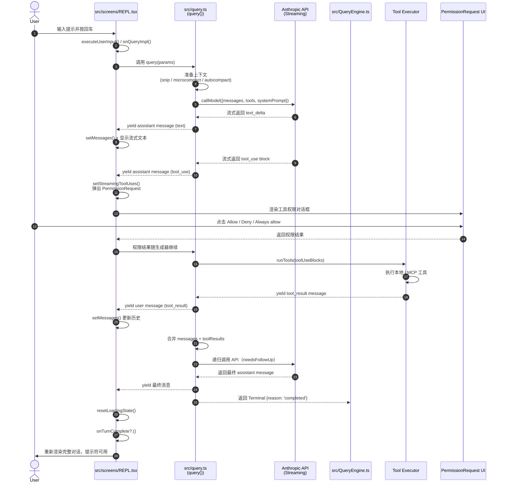

# REPL 与 QueryEngine 架构分析

本文档分析 Claude Code 的交互式核心：REPL（Read-Eval-Print Loop）UI 层与 QueryEngine 后端如何协同工作，完成用户输入→模型调用→工具执行→状态更新→重新渲染的完整闭环。

---

## 1. 启动入口：`src/replLauncher.tsx`

该文件是 REPL 的**懒加载启动器**，职责极为单一：在需要时才把 `App` 与 `REPL` 组件拉入内存，并将其挂载到 Ink 的 root 上。

```ts
export async function launchRepl(
  root: Root,
  appProps: AppWrapperProps,
  replProps: REPLProps,
  renderAndRun: (root: Root, element: React.ReactNode) => Promise<void>,
): Promise<void>
```

- **Lazy-imports**：`await import('./components/App.js')` 与 `await import('./screens/REPL.js')` 避免在 CLI 冷启动阶段就加载巨大的 React 树。
- **渲染结构**：`renderAndRun(root, <App {...appProps}><REPL {...replProps} /></App>)`
  - `App` 提供全局上下文（keybindings、notifications、app state 等）。
  - `REPL` 是实际的主屏幕组件。

---

## 2. 交互式主屏幕：`src/screens/REPL.tsx`

`REPL` 是一个**超大型的 Ink 函数组件**（数百行，导入几十个 hook），几乎承载了交互模式下的全部 UI 与业务逻辑。

### 2.1 核心子系统一览

| 子系统 | 涉及的关键组件 / Hook | 说明 |
|--------|----------------------|------|
| **提示输入** | `PromptInput`、`PromptInputQueuedCommands` | 支持 vim 模式（INSERT / NORMAL）、快捷键、粘贴引用、排队命令提示 |
| **消息历史** | `VirtualMessageList`、`MessageSelector`、`Messages` | 虚拟滚动、搜索高亮、消息选择器（用于 /select-message 等命令） |
| **工具权限** | `PermissionRequest`、`WorkerPendingPermission`、`SandboxPermissionRequest` | 模型请求调用工具时，向用户弹出允许/拒绝/总是允许对话框 |
| **MCP 引导** | `ElicitationDialog` | 当 MCP 工具返回 `-32042`（需要用户授权/URL 登录）时弹出引导 |
| **成本跟踪** | `useCostSummary` | 在 UI 角落显示本轮及累计 API 花费 |
| **桥接/远程** | `useReplBridge`、`useRemoteSession`、`useDirectConnect`、`useSSHSession` | 支持 mobile bridge、`--remote` CCR 模式、`claude connect`、`claude ssh` |
| **Swarm/团队** | `useSwarmInitialization` | 初始化队友 Agent、将用户消息注入到队友任务流 |
| **闲置返回** | `IdleReturnDialog` | 用户长时间离开后再次输入，提示是否继续原会话 |
| **通知** | `useNotifications`、`useTerminalNotification` | 系统级通知、终端标签页标题动画（`AnimatedTerminalTitle`） |
| **后台清理** | `startBackgroundHousekeeping` | 定期清理缓存、刷新状态 |
| **提前输入** | `consumeEarlyInput` | 在 REPL 尚未挂载前捕获的 stdin 字符，初始化时回填到输入框 |
| **Hooks / Post-sampling** | `useDeferredHookMessages`、`PromptDialog` | 会话启动 hook、延迟插入 hook 结果消息 |

### 2.2 状态管理要点

- **`messages` / `setMessages`**：会话消息数组，使用自定义 `useCallback` 包装，确保 `messagesRef` 与 React state 同步，避免异步闭包读到旧数据。
- **`queryGuard`**：`QueryGuard` 的同步状态机，取代早期容易失步的 `isLoading` + `isQueryRunningRef` 双状态模式，是判断“当前是否有查询在跑”的**唯一真相源**。
- **`abortController`**：每一轮查询都会新建 `AbortController`，用户按 `Ctrl+C` 时调用 `.abort()`，可在流式接收或工具执行阶段中断。
- **`streamMode` / `streamingText`**：跟踪模型当前是在 responding、tool-use 还是 requesting，并在屏幕下方实时显示流式文本（受 reduced-motion 设置控制）。

### 2.3 查询触发链路

当用户在 `PromptInput` 中提交后，REPL 会走以下路径：

1. `onSubmit` → `executeUserInput()` → `onQueryImpl()`。
2. `onQueryImpl` 内部调用 `query(...)`（来自 `src/query.ts`），并用 `for await (... of query(...))` 消费异步生成器。
3. 生成器每 yield 一个事件/消息，REPL 就调用 `handleMessageFromStream` 或 `setMessages` 更新 UI。
4. 若 yield 的是 `tool_use`，REPL 通过 `setToolUseConfirmQueue` 弹出权限请求；用户响应后，权限结果随消息重新进入生成器。
5. 一轮结束后调用 `onTurnComplete`（如果提供），并执行 `resetLoadingState()`。

---

## 3. 查询生成器：`src/query.ts`

`query.ts` 是**面向 REPL/QueryEngine 的通用查询生成器**，负责把消息历史、系统提示、上下文整理成 API 请求，并处理流式返回、工具循环、自动压缩、错误恢复等。

### 3.1 关键导出

```ts
export type QueryParams = { /* ... */ }

export async function* query(
  params: QueryParams,
): AsyncGenerator<
  | StreamEvent
  | RequestStartEvent
  | Message
  | TombstoneMessage
  | ToolUseSummaryMessage,
  Terminal
>
```

### 3.2 核心职责

1. **上下文准备**
   - 在每次循环开头取 `getMessagesAfterCompactBoundary(messages)`，只把 compact boundary 之后的消息发给 API。
   - 调用 `applyToolResultBudget` 对超长工具结果做内容替换（content replacement），防止 token 爆炸。
   - 如果开启了 `HISTORY_SNIP`，先做 `snipCompactIfNeeded` 截断旧消息。
   - 接着执行 `microcompact` 与可选的 `contextCollapse`。
   - 最后执行 `autocompact`：若上下文超过阈值，自动做对话摘要压缩，并 yield `compact_boundary` 消息。

2. **API 流式调用**
   - 调用 `deps.callModel({ ... })`，传入 `systemPrompt`、`messages`、`tools`、`signal` 等。
   - 在 `for await` 中接收流事件：
     - `message_start` / `message_delta` / `message_stop`
     - `content_block_start` / `delta` / `stop`
   - 每收到一个完整的 assistant message 就 yield 给上层。

3. **工具识别与流式工具执行**
   - 如果 assistant message 包含 `tool_use` block，设置 `needsFollowUp = true`。
   - 若开启 `streamingToolExecution`，会把 `tool_use` 交给 `StreamingToolExecutor`，在流尚未结束时就提前启动工具，减少等待时间。

4. **错误恢复与重试**
   - **Fallback 模型**：当收到 `FallbackTriggeredError` 时，切换到 `fallbackModel` 并重试整轮请求，同时 yield tombstone 清理旧消息。
   - **Prompt too long (413)**：流式过程中会 withhold 错误，结束后先尝试 `contextCollapse.recoverFromOverflow`，再尝试 `reactiveCompact`，都失败才向用户展示错误。
   - **max_output_tokens**：自动追加恢复用的 meta user message，让模型继续输出；最多重试 3 次。
   - **Token budget**：开启 `TOKEN_BUDGET` 后，若单轮产出超过预算，自动注入 continuation nudge 继续生成。

5. **工具执行循环**
   - 流结束后，若 `needsFollowUp` 为真，调用 `runTools(...)` 或 `streamingToolExecutor.getRemainingResults()` 执行全部工具。
   - 收集 `toolResults`，再与 `messagesForQuery`、`assistantMessages` 合并，递归进入下一轮 `while (true)` 循环。
   - 每次递归前还会拉取 `queuedCommandsSnapshot` 与 `getAttachmentMessages`，把系统通知、附件等作为 user message 注入。

6. **Stop hooks / Post-sampling hooks**
   - 模型响应完成后执行 `executePostSamplingHooks`。
   - 若本回合没有 tool use，则执行 `handleStopHooks`：hooks 可阻止继续、或注入 blocking error 消息触发再试。

---

## 4. 会话引擎：`src/QueryEngine.ts`

`QueryEngine` 是一个**面向 SDK / Headless / CCR 的 class**，把 `query()` 的生成器消费、消息持久化、Usage 统计、权限记录等打包成可复用的会话对象。

### 4.1 类定义与生命周期

```ts
export class QueryEngine {
  private config: QueryEngineConfig
  private mutableMessages: Message[]
  private abortController: AbortController
  private permissionDenials: SDKPermissionDenial[]
  private totalUsage: NonNullableUsage
  private readFileState: FileStateCache
  /* ... */
}
```

- 一个 `QueryEngine` 实例对应**一次会话**（conversation）。
- 每调用一次 `submitMessage(prompt)` 就开启**一轮新 turn**。
- 状态（`mutableMessages`、`readFileState`、`totalUsage`）在轮次之间持久保留。

### 4.2 关键职责

| 职责 | 实现细节 |
|------|----------|
| **会话状态维护** | `mutableMessages` 保存完整对话历史；`readFileState`（`FileStateCache`）缓存已读文件内容，供工具上下文使用。 |
| **用户输入预处理** | 调用 `processUserInput()` 解析 slash 命令、附件、引用；支持 `shouldQuery` 为 `false` 时仅本地执行命令不调用 API。 |
| **API 调用与流消费** | 内部调用 `query(...)`，用 `for await` 消费。对不同类型消息做分类处理：`assistant`、`user`、`progress`、`attachment`、`stream_event`、`system`、`tool_use_summary`。 |
| **Usage 与 Cost 跟踪** | 累加 `message_start` / `message_delta` 中的 usage，更新 `this.totalUsage`；最终通过 `getTotalCost()` 等函数读取。 |
| **权限拒绝记录** | 将 `canUseTool` 包装成 `wrappedCanUseTool`，若返回 `behavior !== 'allow'` 则记录到 `permissionDenials` 中供 SDK 查看。 |
| **持久化** | 在关键节点（用户消息进入后、assistant 消息到达后、compact boundary 前后）调用 `recordTranscript(messages)` 写入会话日志，支持 `--resume`。 |
| **结构化输出** | 若检测到 `SYNTHETIC_OUTPUT_TOOL_NAME`，会限制重试次数（默认 5 次），超限后返回 `error_max_structured_output_retries`。 |
| **预算与轮次限制** | 检查 `maxTurns`、`maxBudgetUsd`，超限即返回对应错误 result。 |
| **取消与中断** | 暴露 `interrupt()` 方法，调用 `this.abortController.abort()`。 |

### 4.3 便捷包装：`ask()` 函数

```ts
export async function* ask({ ... }): AsyncGenerator<SDKMessage, void, unknown>
```

- 为一次性非交互式调用提供的语法糖。
- 内部 `new QueryEngine(...)`，执行 `engine.submitMessage()`，并在 `finally` 中将 `readFileState` 写回调用方提供的 cache。

---

## 5. 交互辅助层：`src/interactiveHelpers.tsx`

该模块是 **Ink 渲染与命令式 CLI 流程之间的桥梁**，被 `main.tsx` 大量调用。

### 5.1 核心函数

| 函数 | 签名 | 作用 |
|------|------|------|
| `renderAndRun` | `(root, element) => Promise<void>` | 把 React 元素渲染进 root，启动延迟预取，然后 `root.waitUntilExit()`，最后 `gracefulShutdown(0)`。 |
| `getRenderContext` | `(exitOnCtrlC) => { renderOptions, getFpsMetrics, stats }` | 构建 Ink `RenderOptions`（含 FPS 追踪、frame timing log、flicker 检测）。 |
| `showSetupScreens` | `(root, permissionMode, ...) => Promise<boolean>` | 按顺序弹出启动对话框：Onboarding → TrustDialog → MCP 批准 → Claude.md 外部引用警告 → Grove 政策 → API Key 批准 → Bypass/Auto 模式提示 → DevChannels 等。 |
| `exitWithError` | `(root, message, beforeExit?) => Promise<never>` | 用 Ink 渲染错误文本（因为 `console.error` 被 Ink patchConsole 吞掉），卸载 root，然后 `process.exit(1)`。 |
| `exitWithMessage` | `(root, message, options?) => Promise<never>` | 同上，但支持自定义颜色与退出码。 |

### 5.2 在整体流程中的位置

```
main.tsx
  ├─ getRenderContext()          // 获取 Ink root + options
  ├─ showSetupScreens()          // 信任对话框、onboarding
  ├─ launchRepl(root, ..., renderAndRun)
  │     └─ interactiveHelpers.renderAndRun(root, <App><REPL/></App>)
  └─ 或 exitWithError(root, ...) // 异常退出
```

---

## 6. 交互循环时序图

以下 Mermaid 序列图展示了一个典型 turn 的完整数据流：从用户在 REPL 中敲下回车，到模型响应、工具执行、结果回写、REPL 重新渲染的全过程。



### 关键说明

- **步骤 4–5**：`query.ts` 在真正发请求前会先做上下文压缩（snip / microcompact / autocompact），保证 token 数在模型窗口内。
- **步骤 8–11**：如果模型输出包含 `tool_use`，REPL 会暂停生成器消费，弹出 `PermissionRequest`；用户决策后结果写回消息流，再继续后续步骤。
- **步骤 12–14**：工具执行在 `query.ts` 内部通过 `runTools()` 或 `StreamingToolExecutor` 完成，结果作为 `user` / `tool_result` 消息 yield 出来。
- **步骤 15**：若模型还有后续追问，会递归进入下一轮 `while (true)` 循环；若已 `completed`，则向上返回 `Terminal`。

---

## 7. 小结

| 层级 | 文件 | 角色 |
|------|------|------|
| **启动器** | `src/replLauncher.tsx` | 懒加载 `App` + `REPL`，挂载到 Ink。 |
| **UI 层** | `src/screens/REPL.tsx` | 巨型 Ink 组件，负责所有用户可见的交互、状态展示、权限弹窗、远程模式桥接。 |
| **查询生成器** | `src/query.ts` | 无状态异步生成器，负责上下文整理、API 流式调用、工具循环、压缩/恢复/重试。 |
| **会话引擎** | `src/QueryEngine.ts` | 有状态 class，包装 `query()`，处理持久化、Usage 统计、SDK 兼容、错误结果封装。 |
| **交互桥梁** | `src/interactiveHelpers.tsx` | 连接命令式 CLI 流程与声明式 Ink 渲染，管理启动对话框与异常退出。 |

三者的分工边界清晰：

- **REPL 管 UI 与交互**（何时弹窗、如何滚动、怎么显示 spinner）。
- **query.ts 管模型往返与工具循环**（怎么发请求、怎么处理流、怎么递归）。
- **QueryEngine 管会话生命周期与 SDK 输出**（消息存哪、花了多少钱、给 SDK 什么格式）。

这种分层使得同一套 `query()` 逻辑既能驱动交互式 TUI，也能被 `QueryEngine` 封装后供 headless/SDK 模式复用。
