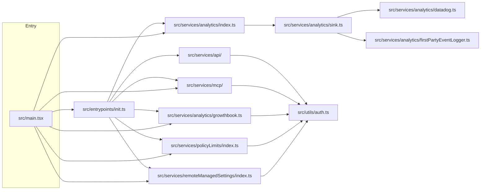

# Claude Code 服务层与特性门控架构分析

本文档分析 Claude Code 的服务层（`src/services/`）组织方式、核心初始化序列（`src/entrypoints/init.ts`），以及多层特性门控（Feature Gate）架构，并涵盖认证与提供方（Auth / Provider）体系。

---

## 1. 服务层目录结构 (`src/services/`)

服务层按功能域划分为多个子目录，核心模块如下：

### 1.1 API 客户端 (`src/services/api/`)

| 文件 | 职责 |
|------|------|
| `claude.ts` | 核心 Claude API 调用封装（消息发送、流式处理、usage 统计） |
| `bootstrap.ts` | 启动数据预取（用户上下文、组织信息、订阅状态） |
| `filesApi.ts` | 文件上传 / 下载 API 封装 |
| `errors.ts` | API 错误分类与转换（如 `OverloadedError`、`BadRequestError`） |
| `referral.ts` | 引荐码（referral）相关 API |
| `client.ts` | `@anthropic-ai/sdk` 客户端配置（超时、重试、代理） |
| `withRetry.ts` | 通用指数退避重试逻辑 |
| `usage.ts` | Token 用量追踪与配额检查 |
| `sessionIngress.ts` | 会话入口（Session Ingress）JWT 获取 |
| `ultrareviewQuota.ts` | Ultrareview 配额查询 |
| `promptCacheBreakDetection.ts` | Prompt Cache 断裂检测 |

### 1.2 MCP 服务 (`src/services/mcp/`)

| 文件 | 职责 |
|------|------|
| `client.ts` | MCP 客户端实现，支持 **stdio / SSE / HTTP / WebSocket / claudeai-proxy / in-process** 等多种传输 |
| `config.ts` | MCP 服务器配置解析（`mcpServers`、`mcpInit`） |
| `claudeai.ts` | claude.ai 官方 MCP 连接器的配置与状态标记 |
| `officialRegistry.ts` | 官方 MCP 注册表（服务器发现、元数据） |
| `channelPermissions.ts` | 频道级别的 MCP 权限控制 |
| `elicitationHandler.ts` | MCP Elicitation（请求澄清）消息的处理与生命周期 |
| `xaaIdpLogin.ts` | XAA IDP 登录流程（MCP 企业认证场景） |
| `auth.ts` | `ClaudeAuthProvider`：MCP OAuth 认证提供者 |
| `normalization.ts` | MCP 配置规范化（名称去重、字段兼容） |
| `headersHelper.ts` | 动态请求头组装 |
| `InProcessTransport.ts` | 进程内传输（用于 Chrome MCP、Computer Use MCP） |

### 1.3 分析服务 (`src/services/analytics/`)

| 文件 | 职责 |
|------|------|
| `growthbook.ts` | **GrowthBook 客户端**。支持 `remoteEval`、磁盘缓存、`onGrowthBookRefresh` 订阅、环境变量/配置覆盖 |
| `sink.ts` | 分析事件路由到 **Datadog** 与 **1P 事件日志** |
| `index.ts` | 分析公共 API（`logEvent` / `logEventAsync`），带事件队列，零依赖避免循环引用 |
| `firstPartyEventLogger.ts` | 1P 事件日志初始化与暴露实验记录 |
| `datadog.ts` | Datadog RUM / 事件追踪 |
| `config.ts` | 分析后端配置（采样率、 killswitch） |
| `metadata.ts` | 事件元数据丰富化 |

### 1.4 LSP 服务 (`src/services/lsp/`)

| 文件 | 职责 |
|------|------|
| `manager.ts` | LSP 服务器管理器（启动、关闭、生命周期） |
| `LSPClient.ts` | LSP 客户端通信 |
| `LSPServerInstance.ts` | 单个 LSP 服务器实例 |
| `LSPServerManager.ts` | 多服务器协调 |
| `config.ts` | LSP 配置与发现 |

### 1.5 AutoDream — KAIROS 记忆自动固化 (`src/services/autoDream/`)

实现背景记忆固化的四阶段流水线：**Orient → Gather → Consolidate → Prune**

| 文件 | 职责 |
|------|------|
| `autoDream.ts` | 主逻辑。以 forked subagent 方式执行 `/dream`，由 GrowthBook 标志 `tengu_onyx_plover` 控制时间/会话阈值 |
| `consolidationPrompt.ts` | 构建 consolidation 提示词 |
| `consolidationLock.ts` | 进程级文件锁，防止多进程并发执行 consolidation |
| `config.ts` | 功能开关（`isAutoDreamEnabled`） |

关键阈值（默认值）：
- `minHours`: 24 小时
- `minSessions`: 5 个新会话

### 1.6 其他服务模块

| 目录/文件 | 职责 |
|-----------|------|
| `PromptSuggestion/` | 提示词建议（基于上下文推测） |
| `skillSearch/` | 技能搜索（本地索引 + 远程技能加载） |
| `teamMemorySync/` | 团队记忆同步（`TEAMMEM` 门控），含 `secretScanner.ts` |
| `SessionMemory/` | 会话记忆持久化与提示词注入 |
| `extractMemories/` | 从对话中提取结构化记忆 |
| `tips/` | 提示系统（`tipRegistry.ts`、`tipScheduler.ts`） |
| `voice.ts` / `voiceStreamSTT.ts` | 语音模式相关服务 |
| `vcr.ts` | VCR 录制与回放（测试/调试辅助） |

### 1.7 策略限制与远程管理设置

| 目录 | 职责 |
|------|------|
| `policyLimits/index.ts` | 获取组织级策略限制，ETag / SHA-256 校验缓存，后台轮询（1 小时），**fail-open** |
| `remoteManagedSettings/index.ts` | 企业远程管理设置同步，同采用 checksum 缓存 + 后台轮询 + fail-open |

---

## 2. 核心初始化序列 (`src/entrypoints/init.ts`)

入口 `init()` 被 `memoize` 包裹，确保整个进程生命周期只执行一次。以下按实际代码顺序列出关键步骤：

1. **`enableConfigs()`**  
   启用配置系统，允许后续代码安全读取 `~/.claude.json` 及项目设置。

2. **`applySafeConfigEnvironmentVariables()`**  
   在信任对话框弹出**之前**，仅应用“安全”的环境变量覆盖，避免提前暴露敏感配置。

3. **`applyExtraCACertsFromConfig()`**  
   从 `settings.json` 读取 `NODE_EXTRA_CA_CERTS` 并写入 `process.env`。由于 Bun 在启动时即缓存 TLS 证书存储，此操作必须在首次 TLS 握手前完成。

4. **`setupGracefulShutdown()`**  
   注册进程退出清理钩子。

5. **异步启动 1P 事件日志与 GrowthBook**  
   动态导入 `firstPartyEventLogger.js` 与 `growthbook.js`，调用 `initialize1PEventLogging()`，并注册 GrowthBook 刷新监听器以便在 `tengu_1p_event_batch_config` 变化时重建 LoggerProvider。

6. **`populateOAuthAccountInfoIfNeeded()`**  
   若 OAuth 账户信息尚未缓存，则异步填充（处理 VSCode 扩展登录场景）。

7. **`initJetBrainsDetection()`** / **`detectCurrentRepository()`**  
   异步检测 IDE 类型与当前 GitHub 仓库，为后续功能填充缓存。

8. **初始化 `RemoteManagedSettings` 与 `PolicyLimits` 加载 Promise**  
   对符合条件的用户调用 `initializeRemoteManagedSettingsLoadingPromise()` 与 `initializePolicyLimitsLoadingPromise()`，让后续系统可以 `await` 它们而不阻塞启动。

9. **`recordFirstStartTime()`**  
   记录会话首次启动时间（用于遥测）。

10. **`configureGlobalMTLS()` / `configureGlobalAgents()`**  
    配置全局 mTLS 与 HTTP(S) 代理。

11. **`preconnectAnthropicApi()`**  
    在动作处理前预热 TCP+TLS 连接，节省约 100–200 ms。

12. **`initUpstreamProxy()`**（条件）  
    若 `CLAUDE_CODE_REMOTE` 为真，启动本地 CONNECT 中继，供子进程通过组织配置的上游代理出站。

13. **`setShellIfWindows()`**  
    Windows 平台下设置 Git Bash。

14. **注册 LSP / Swarm Team 清理钩子**  
    `shutdownLspServerManager` 与 `cleanupSessionTeams`。

15. **`ensureScratchpadDir()`**（条件）  
    若 scratchpad 功能启用，则创建临时目录。

### 2.1 信任后的遥测初始化

`initializeTelemetryAfterTrust()` 在 `main.tsx` 的信任对话框（或 `--print` 的隐式信任）之后被调用：
- 对 **RemoteManagedSettings 合格用户**，会先 `waitForRemoteManagedSettingsToLoad()`，然后重新应用完整环境变量，再初始化 OpenTelemetry。
- 对 **非合格用户**，直接初始化。
- 通过 `doInitializeTelemetry()` → `setMeterState()` → `initializeTelemetry()` 延迟加载 ~400KB 的 OpenTelemetry + protobuf 模块。

---

## 3. 特性门控（Feature Gate）架构

Claude Code 使用三层门控体系：**编译时门控**（DCE）、**用户类型门控**（ant-only）、**运行时门控**（GrowthBook / Statsig）。

### 3.1 编译时门控（`bun:bundle`）

源码中通过 `import { feature } from 'bun:bundle'` 获取编译时门控。它返回布尔值，允许打包工具在**外部构建**中直接剥离对应的 `require()` 块，实现死代码消除（Dead Code Elimination, DCE）。

代码中广泛出现的模式：

```typescript
const assistantModule = feature('KAIROS')
  ? require('./assistant/index.js') as typeof import('./assistant/index.js')
  : null
```

已知的编译时门控约 **50+** 个，核心列举如下：

| 门控名称 | 对应功能域 |
|----------|------------|
| `BUDDY` | ASCII 虚拟宠物 |
| `KAIROS` / `KAIROS_BRIEF` / `KAIROS_CHANNELS` / `KAIROS_DREAM` / `KAIROS_GITHUB_WEBHOOKS` / `KAIROS_PUSH_NOTIFICATION` | KAIROS 持久助手、Brief 模式、频道、GitHub Webhook |
| `ULTRAPLAN` | 云端深度规划（Ultraplan） |
| `BRIDGE_MODE` / `CCR_MIRROR` / `CCR_AUTO_CONNECT` / `CCR_REMOTE_SETUP` | 桥接模式、远程控制、CCR 镜像 |
| `COORDINATOR_MODE` | 多智能体协调器 |
| `VOICE_MODE` | 语音模式 |
| `PROACTIVE` | 主动式行为/通知 |
| `DAEMON` | 守护进程模式 |
| `SSH_REMOTE` / `DIRECT_CONNECT` | SSH 远程会话、直接连接 |
| `TEMPLATES` | 模板系统 |
| `TRANSCRIPT_CLASSIFIER` | 转录分类器（权限/自动模式） |
| `BASH_CLASSIFIER` | Bash 分类器 |
| `CHICAGO_MCP` | Computer Use MCP（in-process） |
| `MCP_SKILLS` | MCP 技能动态加载 |
| `WORKFLOW_SCRIPTS` | 工作流脚本 |
| `BG_SESSIONS` / `UDS_INBOX` | 后台会话、Unix Domain Socket 消息队列 |
| `TEAMMEM` | 团队记忆同步 |
| `CONTEXT_COLLAPSE` | 上下文折叠 |
| `TOKEN_BUDGET` | Token 预算提示 |
| `HISTORY_SNIP` / `REACTIVE_COMPACT` / `CACHED_MICROCOMPACT` / `PROMPT_CACHE_BREAK_DETECTION` | 多种压缩与缓存策略 |
| `MONITOR_TOOL` | 后台监控工具 |
| `AGENT_TRIGGERS` / `AGENT_TRIGGERS_REMOTE` | 智能体触发器 |
| `EXTRACT_MEMORIES` / `AGENT_MEMORY_SNAPSHOT` | 记忆提取与快照 |
| `FORK_SUBAGENT` | Fork 子智能体 |
| `WEB_BROWSER_TOOL` | Web 浏览器工具 |
| `HARD_FAIL` | 硬失败（测试/调试） |
| `TORCH` | 内部 `torch` 命令 |
| `MESSAGE_ACTIONS` / `QUICK_SEARCH` / `HISTORY_PICKER` | UI 快捷操作 |
| `LODESTONE` | Lodestone 功能 |
| `FILE_PERSISTENCE` | 文件持久化 |
| `COMMIT_ATTRIBUTION` | Commit 归属 |
| `DOWNLOAD_USER_SETTINGS` / `UPLOAD_USER_SETTINGS` | 设置同步上传/下载 |

### 3.2 用户类型门控（`USER_TYPE === 'ant'`）

`process.env.USER_TYPE === 'ant'` 是内部构建的硬性开关，解锁以下行为：

- **GrowthBook 环境变量覆盖**：通过 `CLAUDE_INTERNAL_FC_OVERRIDES` JSON 覆盖任意 GrowthBook 标志值（仅用于 eval harness）。
- **配置覆盖**：`/config` 命令中的 **Gates 标签页**，允许运行时修改 `growthBookOverrides`。
- **内部命令**：如 `torch`（`src/commands/torch.js`）仅在 `feature('TORCH')` 且 `ant` 构建中可用。
- **增强调试日志**：大量 `if (process.env.USER_TYPE === 'ant')` 分支会输出 GrowthBook 初始化详情、缓存命中、模型覆盖等调试信息。

### 3.3 运行时门控（GrowthBook）

运行时门控由 `src/services/analytics/growthbook.ts` 统一托管。GrowthBook 客户端配置为 **`remoteEval: true`**，由服务端预计算标志值，客户端通过 Bearer Token 或 `x-api-key` 拉取。

#### 主要 GrowthBook 标志

| 标志名 | 用途 |
|--------|------|
| `tengu_kairos` | KAIROS 功能主开关 |
| `tengu_ultraplan_model` | Ultraplan 使用的模型配置 |
| `tengu_cobalt_frost` | 其他功能开关 |
| `tengu_1p_event_batch_config` | 1P 事件日志批处理配置 |
| `tengu_event_sampling_config` | 全局事件采样配置 |
| `tengu_log_datadog_events` | Datadog 事件日志开关（`sink.ts` 使用） |
| `tengu_ant_model_override` | 内部模型覆盖 |
| `tengu_onyx_plover` | AutoDream 调度阈值 `{ minHours, minSessions }` |
| `tengu_max_version_config` | 最大版本限制（kill switch） |

#### API 分类

| 函数 | 阻塞性 | 用途 |
|------|--------|------|
| `getFeatureValue_CACHED_MAY_BE_STALE<T>(feature, defaultValue)` | **非阻塞** | 优先读内存缓存，其次磁盘缓存。启动关键路径首选。 |
| `getFeatureValue_DEPRECATED<T>(feature, defaultValue)` | 阻塞 | 等待 GrowthBook 初始化完成。**已弃用**。 |
| `checkStatsigFeatureGate_CACHED_MAY_BE_STALE(gate)` | 非阻塞 | Statsig → GrowthBook 迁移期兼容，回退到 `cachedStatsigGates`。 |
| `checkSecurityRestrictionGate(gate)` | 半阻塞 | 安全门控。若 GrowthBook 正在 re-init（如登录切换），会等待完成。 |
| `checkGate_CACHED_OR_BLOCKING(gate)` | 条件阻塞 | 缓存为 `true` 时立即返回；为 `false`/缺失时阻塞拉取最新值。适合用户主动触发功能的订阅校验。 |

---

## 4. 隐藏/内部功能摘要

以下功能均受编译时门控保护，在外部构建中通常被完全剥离：

### 4.1 `buddy/` — ASCII 虚拟宠物
- 门控：`BUDDY`
- 文件：`src/buddy/CompanionSprite.tsx`、`src/buddy/prompt.ts`、`src/buddy/useBuddyNotification.tsx`
- 特性：18 个物种、稀有度分级、闪光（shiny）变体。

### 4.2 `assistant/` + `proactive/` — KAIROS 持久助手
- 门控：`KAIROS`、`PROACTIVE`
- 文件：`src/assistant/index.ts`、`src/assistant/gate.js`、`src/proactive/...`
- 特性：持久对话上下文、自动 dream（`autoDream/`）、主动式 tick 与通知（`proactive/`）。

### 4.3 `bridge/` — WebSocket 远程控制
- 门控：`BRIDGE_MODE`、`CCR_MIRROR`、`CCR_AUTO_CONNECT`
- 文件：`src/bridge/bridgeEnabled.ts`、`src/bridge/bridgeMain.ts`、`src/bridge/remoteBridgeCore.ts`
- 特性：允许从 claude.ai Web 端或移动 App 远程控制本地 REPL。

### 4.4 `coordinator/` — 多智能体协调器模式
- 门控：`COORDINATOR_MODE`
- 文件：`src/coordinator/coordinatorMode.ts`
- 特性：主进程作为协调器，管理多个 worker 子进程并行处理任务。

### 4.5 `voice/` — 语音模式
- 门控：`VOICE_MODE`
- 文件：`src/voice/voiceModeEnabled.ts`、`src/services/voice.ts`、`src/services/voiceStreamSTT.ts`
- 特性：语音输入（流式 STT）与语音输出集成。

### 4.6 `ultraplan/` — 云端深度规划
- 门控：`ULTRAPLAN`
- 文件：`src/ultraplan/...`
- 特性：通过远程 CCR（Claude Code Remote）会话执行深度规划任务。

### 4.7 `remote/` / `server/` / `ssh/`
- 门控：`SSH_REMOTE`、`DIRECT_CONNECT`
- 文件：`src/ssh/sshAuthProxy.ts`、`src/remote/...`
- 特性：SSH 后端会话、直接 TCP 连接、远程工作区管理。

---

## 5. 认证与提供方架构

核心认证逻辑位于 **`src/utils/auth.ts`**（约 1700+ 行），是整个服务层的信任根基。

### 5.1 认证来源优先级

| 来源 | 说明 |
|------|------|
| **Claude.ai OAuth** | 通过 `getClaudeAIOAuthTokens()` 从 macOS 钥匙串或安全存储获取。scope 校验决定订阅级别。 |
| **Console API Key** | `ANTHROPIC_API_KEY` 环境变量、`~/.claude.json` 中的托管 key、`apiKeyHelper` 脚本、macOS 钥匙串。 |
| **AWS Bedrock** | `CLAUDE_CODE_USE_BEDROCK=1`，使用 AWS STS 凭证。 |
| **Google Vertex** | `CLAUDE_CODE_USE_VERTEX=1`，使用 GCP ADC 凭证。 |
| **Foundry** | `CLAUDE_CODE_USE_FOUNDRY=1`，第三方托管服务。 |

### 5.2 关键判断函数

```typescript
// src/utils/auth.ts
export function isClaudeAISubscriber(): boolean
export function isUsing3PServices(): boolean
export function isFirstPartyAnthropicBaseUrl(): boolean
export function isAnthropicAuthEnabled(): boolean
export function getAuthTokenSource(): { source: ..., hasToken: boolean }
```

| 函数 | 逻辑摘要 |
|------|----------|
| `isClaudeAISubscriber()` | 当 `isAnthropicAuthEnabled() === true` 且 OAuth token 的 scopes 包含 Claude.ai 推理 scope 时返回 `true`。用于区分 Max/Pro/Enterprise/Team 订阅用户。 |
| `isUsing3PServices()` | 检查 `CLAUDE_CODE_USE_BEDROCK` / `USE_VERTEX` / `USE_FOUNDRY` 任一是否为 truthy。 |
| `isFirstPartyAnthropicBaseUrl()` | 若 `ANTHROPIC_BASE_URL` 未设置或指向 `api.anthropic.com`（ant 构建额外允许 `api-staging.anthropic.com`）则返回 `true`。 |
| `isAnthropicAuthEnabled()` | 在 `--bare` 模式、存在外部 API key / auth token（非托管上下文）、或使用 3P 服务时返回 `false`。 |

### 5.3 安全控制

对于来自**项目设置**（`projectSettings` / `localSettings`）的可执行配置，执行前必须确认 workspace trust：

- `apiKeyHelper`
- `awsAuthRefresh`
- `awsCredentialExport`
- `gcpAuthRefresh`

若 trust 未确认且当前为交互式会话，则抛出安全错误并记录遥测事件（如 `tengu_apiKeyHelper_missing_trust11`）。

---

## 6. 服务层依赖图

以下 Mermaid 图展示了从 `main.tsx` 到 `init.ts`，再到各核心服务的初始化依赖关系：



### 依赖说明

- **`main.tsx` → `init.ts`**：`main.tsx` 的 `setup()` 或 `preAction` 钩子中调用 `init()`，完成最底层的网络、配置、代理、OAuth 预填充。
- **`init.ts` → 六大服务**：在 `init()` 内部或之后，依次触发分析队列、API 预连接、MCP 缓存、GrowthBook 1P 日志、策略限制 Promise、远程管理设置 Promise 的初始化。
- **`main.tsx` 直接依赖**：在 `setupBackend()` 中直接调用 `initializeAnalyticsGates()`；在 `preAction` 中直接调用 `loadRemoteManagedSettings()`、`loadPolicyLimits()`；在 action 中按需 `await initializeGrowthBook()`。
- **所有服务最终收敛到 `src/utils/auth.ts`**：API、MCP、GrowthBook、PolicyLimits、RemoteManagedSettings 都需要从 `auth.ts` 获取当前认证状态（API key / OAuth token / 3P 标识）以决定请求头、目标 endpoint 或功能可用性。

---

*文档生成时间：2026-04-02*  
*基于源码路径：`src/services/`、`src/entrypoints/init.ts`、`src/main.tsx`、`src/utils/auth.ts`*
