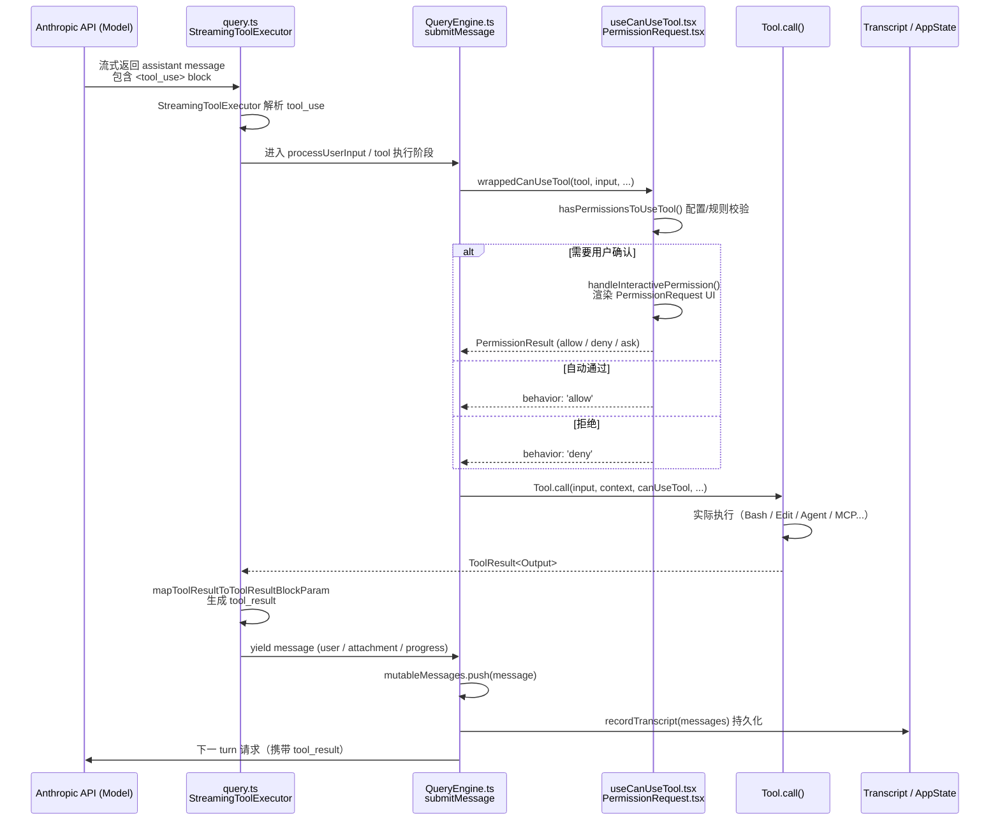

# Claude Code 工具系统（Tool System）深度解析

> 本文档基于 `@anthropic-ai/claude-code` 的恢复源码树，对其核心工具系统架构进行逐层拆解。该系统向模型暴露约 53 个内置工具（Bash、FileEdit、Agent、MCP 等），并通过流式循环（streaming loop）实现工具调用、权限校验、UI 渲染、结果回传与会话持久化。

---

## 一、总览（Overview）

Claude Code 的 Tool System 是一个**以模型为中心、流式驱动、权限 gated** 的执行框架。它的核心职责可以概括为：

1. **工具注册与发现**：在启动和运行时动态组装内置工具 + MCP（Model Context Protocol）外部工具池。
2. **提示词注入**：将可用工具的描述、schema、prompt 注入到 system prompt 中，供模型决策。
3. **流式解析与调度**：解析模型返回的 `tool_use` XML block，定位对应工具，执行前置校验与权限检查。
4. **执行与回传**：调用 `Tool.call()`，将执行结果通过 `tool_result` block 写回消息历史，驱动下一 turn。
5. **生命周期与持久化**：在 `QueryEngine` 中维护 `mutableMessages`、`readFileState`、用量统计（usage）以及 transcript 落盘。

整个流程从 REPL/SDK 的用户输入开始，到 `QueryEngine.submitMessage()` 统筹，再到 `query.ts` 的流式循环，最终回到模型——形成一个**多 turn 的 agentic 闭环**。

---

## 二、完整调用时序图



---

## 三、工具抽象层：Tool.ts

### 3.1 `Tool<TInput, TOutput>` 接口

`src/Tool.ts` 定义了所有工具必须实现的统一契约。关键成员如下：

| 成员 | 作用 |
|------|------|
| `call(args, context, canUseTool, parentMessage, onProgress)` | 异步执行核心逻辑，返回 `ToolResult<TOutput>`。 |
| `description(input, options)` | 动态生成工具在人类/模型视角下的描述。 |
| `prompt(options)` | 返回该工具的 system prompt 片段（通常是一段 XML 说明）。 |
| `inputSchema` / `outputSchema` | Zod schema，用于输入校验与 API schema 生成。 |
| `checkPermissions(input, context)` | 工具级权限判断，返回 `PermissionResult`。 |
| `validateInput(input, context)` | 输入合法性预检（如文件不存在、old_string 不匹配等）。 |
| `renderToolUseMessage` / `renderToolResultMessage` | React 渲染函数，用于 TUI/UI 展示。 |
| `mapToolResultToToolResultBlockParam` | 将 `TOutput` 序列化为 API 所需的 `ToolResultBlockParam`。 |
| `isConcurrencySafe` / `isReadOnly` / `isDestructive` | 元数据标志，影响并发调度与 UI 折叠行为。 |
| `toAutoClassifierInput` | 为 auto-mode 安全分类器提供精简输入摘要。 |

### 3.2 `buildTool({...})` 工厂

所有工具导出前须经过 `buildTool()` 包装，它提供** fail-closed（默认关闭）**的安全默认值：

- `isEnabled` → `true`
- `isConcurrencySafe` → `false`（默认不安全，需显式声明）
- `isReadOnly` → `false`（默认视为写操作）
- `checkPermissions` → `{ behavior: 'allow' }`（交由通用权限系统处理）
- `toAutoClassifierInput` → `''`（无安全相关性时跳过分类器）

### 3.3 工具查找

```typescript
export function toolMatchesName(tool, name): boolean
export function findToolByName(tools: Tools, name: string): Tool | undefined
```

支持通过主名称或 `aliases`（别名数组）匹配，用于兼容历史工具名。

### 3.4 `ToolUseContext` 与 `ToolPermissionContext`

#### `ToolUseContext`
这是贯穿工具调用全生命周期的**上下文对象**，包含：

- `options`: 命令列表、工具池、模型名、MCP 客户端、预算等。
- `abortController`: 用于中断当前 turn 的执行。
- `readFileState`: `FileStateCache` LRU 缓存，记录文件的读取时间戳与内容片段，防止陈旧写入（stale write）。
- `getAppState` / `setAppState`: 访问全局应用状态。
- `nestedMemoryAttachmentTriggers` / `loadedNestedMemoryPaths`: 管理嵌套 memory（如 `CLAUDE.md`）的去重注入。
- `dynamicSkillDirTriggers` / `discoveredSkillNames`: 动态技能发现与遥测。
- `queryTracking`: `QueryChainTracking`，记录查询链 ID 与嵌套深度。
- `contentReplacementState`: 工具结果预算（tool result budget）的内容替换状态。
- `renderedSystemPrompt`: fork 子代理复用父级 prompt cache 的冻结快照。

#### `ToolPermissionContext`
定义当前权限规则集合：

```typescript
export type ToolPermissionContext = DeepImmutable<{
  mode: PermissionMode
  additionalWorkingDirectories: Map<string, AdditionalWorkingDirectory>
  alwaysAllowRules: ToolPermissionRulesBySource
  alwaysDenyRules: ToolPermissionRulesBySource
  alwaysAskRules: ToolPermissionRulesBySource
  isBypassPermissionsModeAvailable: boolean
  isAutoModeAvailable?: boolean
  strippedDangerousRules?: ToolPermissionRulesBySource
  shouldAvoidPermissionPrompts?: boolean
  awaitAutomatedChecksBeforeDialog?: boolean
  prePlanMode?: PermissionMode
}>
```

`PermissionMode` 包括：`default`、`plan`、`acceptEdits`、`auto`、`bypassPermissions`、`bubble`。不同模式会改变 `canUseTool` 的分支路径与 UI 行为。

---

## 四、工具注册与过滤：tools.ts

### 4.1 `getAllBaseTools()`

`src/tools.ts` 中的 `getAllBaseTools()` 是**所有可能可用工具的权威来源**。它静态罗列了内置工具，并根据 feature flag（如 `feature('PROACTIVE')`、`isToolSearchEnabledOptimistic()`、`process.env.USER_TYPE === 'ant'` 等）条件性地追加：

- `BriefTool`、`SleepTool`、`DiscoverSkillsTool`（ gated on `PROACTIVE` / `KAIROS`）
- `CronCreateTool` / `CronDeleteTool` / `CronListTool`（ gated on `AGENT_TRIGGERS`）
- `REPLTool`、`SuggestBackgroundPRTool`、`WebBrowserTool` 等（Ant-only 或特定 gate）

### 4.2 `getTools()` 四层过滤

`getTools(permissionContext)` 对 `getAllBaseTools()` 的结果实施**四层过滤**：

1. **deny-rules 过滤** (`filterToolsByDenyRules`)：根据 `ToolPermissionContext.alwaysDenyRules` 剔除被 blanket-deny 的工具（支持 `mcp__server` 前缀规则批量剔除 MCP 工具）。
2. **REPL 模式过滤**：当 `isReplModeEnabled()` 为真且 `REPLTool` 已启用时，隐藏 `REPL_ONLY_TOOLS` 中的原始工具（如 Bash、Read、Edit 等被 REPL 封装）。
3. **`isEnabled()` 逐工具过滤**：每个工具自行决定是否启用（如 `LSP_TOOL` 依赖 `ENABLE_LSP_TOOL`）。
4. **`CLAUDE_CODE_SIMPLE` 简化过滤**：若环境变量开启，仅保留 `BashTool`、`FileReadTool`、`FileEditTool`（以及 coordinator 模式下追加的 `AgentTool`、`TaskStopTool` 等）。

### 4.3 `assembleToolPool()` 与 `getMergedTools()`

```typescript
export function assembleToolPool(
  permissionContext: ToolPermissionContext,
  mcpTools: Tools,
): Tools
```

这是**内置工具与 MCP 工具合并的唯一可信源**。逻辑如下：

1. 通过 `getTools()` 获取已过滤的内置工具；
2. 对 MCP 工具再次执行 `filterToolsByDenyRules`；
3. 分别按名称排序（保证 prompt cache 的稳定性）；
4. 使用 `uniqBy([...builtIns, ...mcpTools], 'name')` 去重，**内置工具优先**。

`getMergedTools()` 是它的简化版本，用于 token counting 等只需简单拼接的场景。

---

## 五、QueryEngine 的 Turn 循环

### 5.1 `QueryEngine` 类（`src/QueryEngine.ts`）

`QueryEngine` 是会话级别的状态持有者。构造函数初始化：

- `mutableMessages`: 当前会话的完整消息历史（`Message[]`）。
- `abortController`: 用于中断当前 turn。
- `permissionDenials`: SDK 上报用的权限拒绝记录。
- `readFileState`: `FileStateCache`，跨 turn 持久化文件读取状态。
- `totalUsage`: 累计 API token 用量。

### 5.2 `submitMessage(prompt, options?)` 主控流程

`submitMessage` 是一次用户输入（或 SDK 调用）的完整 orchestrator，执行步骤如下：

1. **包装 `canUseTool`**：
   将外部传入的 `canUseTool` 包装为 `wrappedCanUseTool`，在权限被拒绝时自动向 `permissionDenials` 追加记录，用于最终 SDK 结果上报。

2. **获取系统提示**：
   调用 `fetchSystemPromptParts()` 获取 `defaultSystemPrompt`、`userContext`、`systemContext`。支持 `customSystemPrompt` 与 `appendSystemPrompt` 覆盖。

3. **构建 `processUserInputContext`**（第一次）：
   在处理 slash command 之前，先构建一个上下文对象。`setMessages` 在此阶段是**有效的**（可响应 `/force-snip` 等修改消息历史的命令）。

4. **调用 `processUserInput()`**：
   处理 slash commands、attachment 注入、模型切换（如 `/model`）等，返回：
   - `messagesFromUserInput`: 用户输入生成的消息列表；
   - `shouldQuery`: 是否需要进入 API 查询循环；
   - `allowedTools`: slash command 可能更新的允许工具规则；
   - `modelFromUserInput`: 用户通过命令指定的模型覆盖。

5. **持久化 transcript**：
   在真正调用 API **之前**，先将用户消息写入 `recordTranscript()`。这是为了应对进程被 kill 后仍能通过 transcript 恢复会话。

6. **第二次构建 `processUserInputContext`**：
   `setMessages` 变为 no-op，因为此后不再允许消息数组被外部命令修改。

7. **yield `buildSystemInitMessage`**：
   向 SDK/REPL 广播一条 system 消息，宣布当前可用的 tools、commands、agents、skills、plugins。

8. **本地命令短路**：
   若 `shouldQuery === false`（如纯本地 slash command），直接将本地命令输出 yield 出去，并返回 `result` 终止。

9. **进入 `query()` 流式循环**：
   ```typescript
   for await (const message of query({ messages, systemPrompt, userContext, systemContext, canUseTool: wrappedCanUseTool, toolUseContext, ... }))
   ```

10. **消息类型分发与状态更新**：
    对 `query()` yield 出的各类消息进行处理：
    - `assistant`: 推入 `mutableMessages`，yield 给上层，捕获 `stop_reason`。
    - `user`: 增加 `turnCount`，推入消息历史。
    - `progress`: 内联记录到 transcript，防止 resume 时 dedup 错乱。
    - `stream_event`: 累积 usage（`message_start`、`message_delta`、`message_stop`），更新 `lastStopReason`。
    - `attachment`: 提取 `structured_output` 数据；处理 `max_turns_reached`。
    - `system` (subtype `compact_boundary`): 截断 `mutableMessages` 以释放 GC 前的旧消息；处理 `api_error` 子类型。
    - `tombstone`: 控制信号，跳过 UI 渲染。
    - `tool_use_summary`: 汇总上一 turn 的工具调用，yield 给 SDK。

11. **预算与终止检查**：
    - `maxBudgetUsd`: 超预算时返回 `error_max_budget_usd`。
    - `maxTurns`: 由 `query()` 通过 `attachment` 类型 `max_turns_reached` 触发。
    - Structured output retry limit：防止无限循环。

12. **结果判定**：
    使用 `isResultSuccessful()` 判断最后一条消息是否为有效的 assistant text/thinking 或 user tool_result。失败则返回 `error_during_execution`，成功则返回带有 `textResult` 和 `structured_output` 的 `result`。

### 5.3 `ask()` 便捷包装器

`ask()` 创建一个新的 `QueryEngine` 实例并消费 `submitMessage()`，同时在 finally 中将 `readFileState` 写回调用方提供的 cache setter，保证文件状态在多次 `ask()` 调用间共享。

---

## 六、query.ts：流式查询与工具执行引擎

`src/query.ts` 中的 `query()` 和 `queryLoop()` 是实际与 Anthropic API 交互并驱动工具执行的**流式发电机**。

### 6.1 查询前准备

每一 turn 迭代开始时，`queryLoop` 会执行多项上下文压缩与预算管理：

1. **`applyToolResultBudget`**：基于 `contentReplacementState` 对超长的工具结果进行内容替换（如将大段输出替换为指向磁盘文件的引用），减少上下文 token 占用。
2. **Snip Compact**（`HISTORY_SNIP` gate）：截断旧消息，yield `snip_boundary`。
3. **Microcompact**：在 autocompact 之前执行轻量级压缩。
4. **Context Collapse**（`CONTEXT_COLLAPSE` gate）：应用分层折叠，保留粒度上下文。
5. **Autocompact**：当上下文超过阈值时，调用 Haiku/Ops 模型对历史消息进行摘要压缩，生成 `compact_boundary`。

### 6.2 API 流式调用

通过 `deps.callModel()` 发起带 streaming 的 API 请求。期间处理：

- **模型回退（Fallback）**：若触发 `FallbackTriggeredError`，切换至 `fallbackModel`，清空已缓存的 assistant/tool_use 消息，yield 系统提示说明回退原因，然后 `continue` 重试。
- ** withheld 错误恢复**：
  - `prompt_too_long`（413）：先尝试 `contextCollapse.recoverFromOverflow()` 排出 staged collapses；若仍失败，再尝试 `reactiveCompact.tryReactiveCompact()` 进行激进摘要；最终无可恢复时才抛出错误。
  - `max_output_tokens`：首先尝试将输出上限从默认 8k 提升到 64k（`ESCALATED_MAX_TOKENS`）；若仍不足，注入 meta 用户消息让模型分块继续，最多重试 3 次。
- **Tool use backfill**：在 yield 给上层前，对 `tool_use` block 的 input 调用 `tool.backfillObservableInput()`，注入派生/ legacy 字段（供 SDK 流和 transcript 使用），但**绝不修改原始对象**以保护 prompt cache。

### 6.3 `StreamingToolExecutor`

当 feature gate `streamingToolExecution` 开启时，`query.ts` 实例化 `StreamingToolExecutor`：

- 在流式解析过程中，一旦检测到 `tool_use` block，立即通过 `addTool(toolBlock, assistantMessage)` 入队。
- `getCompletedResults()` 在流中逐步返回已执行完毕的工具结果，实现**边流边执行**的并发效果。
- 若发生 fallback 或 abort，可调用 `discard()` 丢弃 pending 结果，防止旧 `tool_use_id` 泄漏到重试后的消息链中。

若未开启 streaming execution，则在模型响应完整结束后通过 `runTools()` 串行/批量调度工具执行。

### 6.4 Stop Hooks 与 Token Budget

工具执行完毕后，进入 stop hook 阶段：

- `handleStopHooks()` 评估是否需要阻止继续（`preventContinuation`）或注入阻塞错误（`blockingErrors`）到下一 turn。
- `TOKEN_BUDGET` gate 下，`checkTokenBudget()` 根据当前 turn 的输入/输出 token 占比决定是否注入 nudge 消息让模型收敛并结束。

最后，通过 `getAttachmentMessages()` 注入：
- 队列中的用户命令（queued commands）；
- 预取的记忆附件（memory prefetch）；
- 技能发现附件（skill prefetch）。

更新 `messages` 状态后，若未达 `maxTurns`，则 `continue` 进入下一递归调用（即下一 model turn）。

---

## 七、BashTool 内部机制

`src/tools/BashTool/BashTool.tsx` 是工具系统中最复杂、功能最密集的工具之一。以下按功能模块拆解。

### 7.1 命令分类与 UI 折叠

```typescript
export function isSearchOrReadBashCommand(command: string): { isSearch; isRead; isList }
```

该函数通过 `splitCommandWithOperators()` 将命令按管道/逻辑运算符拆分，逐段判断基础命令：

- **Search**：`find`, `grep`, `rg`, `ag`, `ack`, `locate`, `which`, `whereis`
- **Read**：`cat`, `head`, `tail`, `less`, `more`, `wc`, `stat`, `file`, `strings`, `jq`, `awk`, `cut`, `sort`, `uniq`, `tr`
- **List**：`ls`, `tree`, `du`
- **语义中性命令**（`echo`, `printf`, `true`, `false`, `:`）会被跳过，不影响整体判定。

若整条 pipeline 的所有非中性段均落在上述集合中，则该 Bash 调用在 UI 上可被折叠为紧凑视图（condensed view）。

### 7.2 权限规则匹配

`bashToolHasPermission`（以及配套函数 `commandHasAnyCd`、`matchWildcardPattern`、`permissionRuleExtractPrefix`）实现了 Bash 特有的权限规则引擎：

- 支持前缀匹配（如 `npm run test:*`）和通配符匹配。
- `preparePermissionMatcher` 中对复合命令进行 AST 解析（`parseForSecurity`），按 `argv` 拆分后对每段子命令分别匹配，防止 `ls && git push` 绕过 `Bash(git *)` 规则。
- 环境变量前缀（`FOO=bar git push`）在匹配时会被剥离。

### 7.3 沙盒（Sandbox）

`shouldUseSandbox(input)` 决定是否对该命令启用沙盒执行。`dangerouslyDisableSandbox` 参数允许用户/模型显式覆盖，但会在 schema 层面加以限制。

### 7.4 AST 安全扫描

`parseForSecurity(command)` 基于抽象语法树对命令进行安全扫描，检测潜在危险结构，为权限校验提供输入。

### 7.5 SED 编辑解析器

`parseSedEditCommand(command)` 检测 `sed -i` 就编辑。当用户在权限弹窗中预览并批准 sed 修改时，`_simulatedSedEdit` 字段会被注入 input，BashTool 的 `call()` 方法检测到该字段后，**不再真正执行 sed**，而是直接调用 `applySedEdit()` 通过 `FileEditTool` 的原子写入路径完成修改。这确保了“用户预览即所得”，避免 sed 实际行为与预览不一致。

### 7.6 后台任务（Background Tasks）

`runShellCommand()` 是一个 async generator，支持 `run_in_background`：

- **显式后台**：`run_in_background: true` 时直接调用 `spawnShellTask()`，返回 `backgroundTaskId`。
- **超时自动后台**：若命令运行超过 `timeout`，且 `shouldAutoBackground` 允许，则通过 `onTimeout` 回调将前台任务转为后台（`backgroundExistingForegroundTask` 或重新 `spawnShellTask`）。
- **Assistant 模式自动后台**：当 `KAIROS` 开启且为主线程时，阻塞命令运行超过 `ASSISTANT_BLOCKING_BUDGET_MS`（15 秒）后自动后台化，保证主代理的响应性。

### 7.7 进度流式（Progress Streaming）

`runShellCommand()` 通过 `onProgress` 回调接收 shell 输出的增量更新。当两次更新间隔触发时，generator 会 yield 一个 `bash_progress` 事件（包含 `output`、`fullOutput`、`elapsedTimeSeconds`、`totalLines`、`totalBytes`）。UI 层在 `PROGRESS_THRESHOLD_MS`（2 秒）后渲染进度面板。

### 7.8 大结果存储

Bash 输出若超过 `maxResultSizeChars`（30,000），`mapToolResultToToolResultBlockParam` 会将其替换为 `<persisted-output>` 引用，并在 `call()` 中将完整输出复制到 `tool-results` 目录（通过 `buildLargeToolResultMessage`、`generatePreview`、`getToolResultPath`）。模型后续可通过 `FileReadTool` 读取该文件。

### 7.9 图像输出检测与缩放

`isImageOutput(stdout)` 检测 stdout 是否包含图像数据。若是，调用 `resizeShellImageOutput()` 对图片进行尺寸/大小压缩，确保符合 API 图像限制。失败时回退为文本输出。

### 7.10 语义结果解释

`interpretCommandResult(command, exitCode, stdout, stderr)` 对非零退出码进行语义分类：某些命令（如 `git diff` 返回 1 表示“有差异”）不应被视为错误。分类结果通过 `returnCodeInterpretation` 字段回传给模型，减少误判。

---

## 八、AgentTool 内部机制

`src/tools/AgentTool/AgentTool.tsx` 实现了子代理（subagent）的多种派生模式：同步内联、异步后台、fork 子代理、teammate 多代理、worktree 隔离、远程 CCR。

### 8.1 输入 Schema

```typescript
{
  description: string
  prompt: string
  subagent_type?: string
  model?: 'sonnet' | 'opus' | 'haiku'
  run_in_background?: boolean
  name?: string           // 多代理命名
  team_name?: string      // 团队名称
  mode?: PermissionMode   // 子代理权限模式
  isolation?: 'worktree' | 'remote'
  cwd?: string            // 覆盖工作目录
}
```

### 8.2 `prompt()` 方法：代理过滤

`AgentTool.prompt()` 在生成 system prompt 时：

1. 扫描当前工具池，收集带 `mcp__` 前缀的 MCP server 名称；
2. 调用 `filterAgentsByMcpRequirements()` 剔除需要但未连接 MCP server 的 agent；
3. 再调用 `filterDeniedAgents()` 应用权限规则（如 `Agent(git-expert)` deny 规则）。

### 8.3 `call()` 的分支逻辑

`call()` 是 AgentTool 的核心路由函数，按优先级分支：

#### A. Teammate Spawn（`ENABLE_AGENT_SWARMS`）
当 `team_name` 和 `name` 均提供时，调用 `spawnTeammate()` 启动一个 tmux/in-process  teammate。返回 `TeammateSpawnedOutput` 状态。

#### B. Fork Subagent（`isForkSubagentEnabled`）
当 `subagent_type` 未指定且 fork gate 开启时，进入 fork 路径：
- 选择 `FORK_AGENT`；
- 禁止在 fork child 内部再次 fork（递归守卫）；
- 使用父级的 `renderedSystemPrompt` 以保持 prompt cache 一致；
- 通过 `buildForkedMessages()` 构造包含父级完整 `tool_use` + placeholder `tool_result` 的消息链；
- `useExactTools: true` 继承父级精确工具数组。

#### C. Worktree 隔离（`isolation: 'worktree'`）
在代理执行前调用 `createAgentWorktree(slug)` 创建临时 git worktree。代理结束后，若 worktree 无变更（`hasWorktreeChanges`），则调用 `removeAgentWorktree()` 自动清理；否则保留供用户查看。

#### D. 远程 CCR（`isolation: 'remote'`）
调用 `teleportToRemote()` 创建远程会话，再通过 `registerRemoteAgentTask()` 注册任务。返回 `RemoteLaunchedOutput`。

#### E. 后台异步代理（`run_in_background` / `background: true`）
通过 `registerAsyncAgent()` 注册后台任务，随后调用 `runAsyncAgentLifecycle()` 在 detached closure 中执行 `runAgent()`。主线程立即返回 `async_launched` 结果，包含 `agentId` 与 `outputFile`。

#### F. 同步内联代理（默认路径）
直接在当前 turn 内执行 `runAgent()`，通过 async iterator 消费子代理的 yield 消息。支持：
- 前台任务注册（`registerAgentForeground`），可被用户手动后台化（Ctrl+B）；
- `PROGRESS_THRESHOLD_MS` 后显示 BackgroundHint UI；
- 若被后台化，iterator 会被优雅关闭，随后以 `isAsync: true` 重新启动后台执行；
- 支持 `startAgentSummarization()` 为 SDK 生成进度摘要。

### 8.4 `runAgent()` 与工具池

`runAgent()` 在 `src/tools/AgentTool/runAgent.ts` 中实现。它会：
- 基于 `assembleToolPool(workerPermissionContext, appState.mcp.tools)` 为子代理**独立组装**工具池；
- 子代理默认使用 `permissionMode: 'acceptEdits'`（或 agent 定义中指定的模式），不受父级权限规则限制；
- 创建新的 `QueryEngine` 或直接调用 `query()`，形成嵌套的 turn 循环。

### 8.5 颜色管理

`agentColorManager.ts` 维护 agent type 到 UI 颜色的映射，用于在多代理/折叠视图中区分不同子代理。

### 8.6 `agentToolUtils.ts`

提供后台代理生命周期辅助函数：
- `runAsyncAgentLifecycle`: 包裹异步执行、进度跟踪、错误处理与完成通知；
- `emitTaskProgress`: 向上层发送进度事件；
- `finalizeAgentTool`: 从代理消息历史中提取最终结果；
- `classifyHandoffIfNeeded`: 在代理完成后评估是否需要交接警告（handoff warning）。

---

## 九、FileEditTool 与 MCPTool 要点

### 9.1 FileEditTool（`src/tools/FileEditTool/FileEditTool.ts`）

FileEditTool 实现**原子化的搜索/替换多文件编辑**。核心设计要点：

- **陈旧性检查（Staleness Check）**：
  `validateInput()` 与 `call()` 中均检查 `readFileState.get(fullFilePath)`。若文件自上次读取后被修改（时间戳变化，且内容不完全一致），则拒绝编辑并提示 `"File has been modified since read..."`。

- **输入验证**：
  - 拒绝 `old_string === new_string` 的空操作；
  - 检查文件是否存在、是否为 `.ipynb`（要求改用 `NotebookEditTool`）；
  - 检查 `old_string` 是否能在文件中找到；
  - 若有多处匹配且 `replace_all` 为 false，则要求增加上下文；
  - 支持 `findActualString()` 进行引号规范化匹配（直引号 vs 弯引号）。

- **原子写入**：
  从磁盘读取 → 生成 patch（`getPatchForEdit`）→ `writeTextContent()` 写入磁盘。中间无异步打断，保证原子性。

- **LSP/IDE 集成**：
  写入后调用 `getLspServerManager().changeFile()` 与 `.saveFile()` 通知语言服务器；调用 `notifyVscodeFileUpdated()` 触发 VSCode diff 视图更新。

- **文件历史（Undo/Rewind）**：
  若 `fileHistoryEnabled()` 为真，编辑前调用 `fileHistoryTrackEdit()` 记录快照，支持后续撤销。

- **技能发现**：
  编辑文件路径会触发 `discoverSkillDirsForPaths()` 与 `activateConditionalSkillsForPaths()`，自动加载相关技能。

### 9.2 MCPTool（`src/tools/MCPTool/MCPTool.ts`）

MCPTool 是 MCP 外部工具的**桥接器（bridge）**。注意：该文件中的定义大多为占位符，真实名称、schema、实现会在 `mcpClient.ts` 中动态覆盖。

- **命名规范**：`mcp__<server_name>__<tool_name>`。
- **Schema 透传**：MCP 工具的原生 JSON Schema 直接透传给模型，无需经过 Zod 转换（`inputJSONSchema`）。
- **权限行为**：`checkPermissions` 返回 `behavior: 'passthrough'`，实际权限决策由通用权限系统结合 MCP server 级别规则处理。
- **UI 折叠**：`classifyForCollapse.ts` 为 MCP 工具提供与内置工具一致的折叠行为分类。

---

## 十、权限系统集成

### 10.1 `useCanUseTool.tsx`

`src/hooks/useCanUseTool.tsx` 定义了 `CanUseToolFn`，是权限系统的**总入口**。其决策流程如下：

1. **前置检查**：若 `abortController` 已触发，立即 resolve 为取消状态。
2. **规则引擎**：调用 `hasPermissionsToUseTool()`（在 `src/utils/permissions/permissions.ts` 中）结合 `ToolPermissionContext` 的 allow/deny/ask 规则进行判定。
3. **结果分支**：
   - **`allow`**：直接 `resolve(buildAllow(...))`；若为 auto-mode 分类器通过，记录 `setYoloClassifierApproval`。
   - **`deny`**：记录拒绝日志；若为 auto-mode 分类器拒绝，调用 `recordAutoModeDenial()` 并推送 UI 通知。
   - **`ask`**：进入交互式/自动化权限处理流水线：
     - **Coordinator Worker**（`awaitAutomatedChecksBeforeDialog === true`）：先由 `handleCoordinatorPermission()` 处理，可能直接批准或等待。
     - **Swarm Worker**（`handleSwarmWorkerPermission()`）：群集子代理的特殊快捷路径。
     - **Bash Classifier Race**：对 Bash 工具，若存在 speculative classifier check，会与 2 秒超时进行竞速。若分类器以高置信度命中 allow 规则，则自动批准，无需弹窗。
     - **Interactive Permission**：以上均未能自动解决时，调用 `handleInteractivePermission()` 渲染 UI 弹窗，等待用户点击 Allow/Deny。

### 10.2 `PermissionRequest.tsx`

`src/components/permissions/PermissionRequest.tsx` 是权限弹窗的**路由层**。它根据工具类型映射到专用的子组件：

- `BashPermissionRequest`：支持命令预览、分类器标签、规则匹配说明。
- `FileEditPermissionRequest`：展示 diff 预览（old → new），支持用户直接修改 proposed edit。
- `FileWritePermissionRequest`：展示文件内容与路径确认。
- `AgentPermissionRequest`：展示子代理任务描述、模型、隔离模式等元数据。
- `FilesystemPermissionRequest`：用于 Glob/Grep/FileRead 等只读文件系统工具。
- `FallbackPermissionRequest`：通用回退弹窗。

每个子组件接收 `ToolUseConfirm` 对象，包含 `tool`、`input`、`permissionResult`、`onAllow`、`onReject` 等回调。用户交互后，结果通过 `resolve()` 回传给 `useCanUseTool` 的 Promise。

### 10.3 PermissionMode 与 Auto-Mode

`PermissionMode` 枚举：

| 模式 | 说明 |
|------|------|
| `default` | 标准模式，按规则表执行 allow/deny/ask。 |
| `plan` | 计划模式，要求用户在执行前批准计划（ExitPlanMode 工具触发）。 |
| `acceptEdits` | 自动接受文件编辑，但仍对 Bash/Agent 等敏感操作 ask。 |
| `auto` | 自动模式，启用安全分类器对 Bash 等工具进行自动审批；失败时降级为 ask。 |
| `bypassPermissions` | 完全绕过权限提示（仅限特定内测场景）。 |
| `bubble` | 子代理专用，将权限决策冒泡回父级。 |

**Auto-Mode 危险权限剥离**：
`stripDangerousPermissionsForAutoMode` 会在进入 `auto` 模式前，从 `alwaysAllowRules` 中移除高危规则（如通配 Bash 允许），防止自动模式因过度宽松的规则而执行危险操作。剥离后的规则保存在 `strippedDangerousRules` 中，退出 auto 模式后自动恢复。

---

## 十一、关键文件速查表

| 文件路径 | 核心职责 | 提及的关键函数/概念 |
|---------|---------|-------------------|
| `src/Tool.ts` | 工具抽象接口与工厂 | `Tool<TInput,TOutput>`、`buildTool()`、`toolMatchesName()`、`findToolByName()`、`ToolUseContext`、`ToolPermissionContext` |
| `src/tools.ts` | 工具注册与过滤 | `getAllBaseTools()`、`getTools()`（四层过滤）、`assembleToolPool()`、`getMergedTools()` |
| `src/QueryEngine.ts` | Turn 级状态与 orchestration | `QueryEngine` 类、`submitMessage()`、`wrappedCanUseTool`、`mutableMessages`、`recordTranscript()`、`ask()` |
| `src/query.ts` | 流式 API 查询与工具调度 | `query()` / `queryLoop()`、`StreamingToolExecutor`、autocompact/microcompact/snip、fallback/recovery、stop hooks |
| `src/tools/BashTool/BashTool.tsx` | Shell 命令执行 | `isSearchOrReadBashCommand()`、`bashToolHasPermission`、`shouldUseSandbox`、`parseForSecurity`、`parseSedEditCommand`、background tasks、progress streaming、large result storage、`interpretCommandResult` |
| `src/tools/AgentTool/AgentTool.tsx` | 子代理调用 | Input schema、`call()` 分支（fork/teammate/worktree/remote/async/sync）、`runAgent()`、`assembleToolPool`、颜色管理、`agentToolUtils.ts` |
| `src/tools/FileEditTool/FileEditTool.ts` | 原子文件编辑 | Staleness check、`validateInput`、`fileHistoryTrackEdit`、LSP/VSCode 通知、`notifyVscodeFileUpdated` |
| `src/tools/MCPTool/MCPTool.ts` | MCP 外部工具桥接 | `mcp__<server>__<tool>` 命名、`inputJSONSchema` 透传、`classifyForCollapse` |
| `src/hooks/useCanUseTool.tsx` | 权限决策总入口 | `CanUseToolFn`、`hasPermissionsToUseTool()`、coordinator/swarm/classifier/interactive 分支 |
| `src/components/permissions/PermissionRequest.tsx` | 权限弹窗路由 | `PermissionRequest`、`permissionComponentForTool`、Bash/FileEdit/Agent 专用子组件 |

---

## 结语

Claude Code 的 Tool System 是一个高度工程化的 agentic 执行框架。它以 `Tool.ts` 的强类型接口为基石，通过 `tools.ts` 的动态组装实现灵活的 feature-gating 与 MCP 扩展，再以 `QueryEngine` + `query.ts` 的流式循环完成模型交互、上下文压缩、错误恢复与持久化。BashTool 和 AgentTool 分别代表了**环境执行能力**与**递归代理能力**的两大高峰，而贯穿始终的权限系统（`useCanUseTool` → `PermissionRequest`）则在自动化与用户控制之间建立了安全边界。
