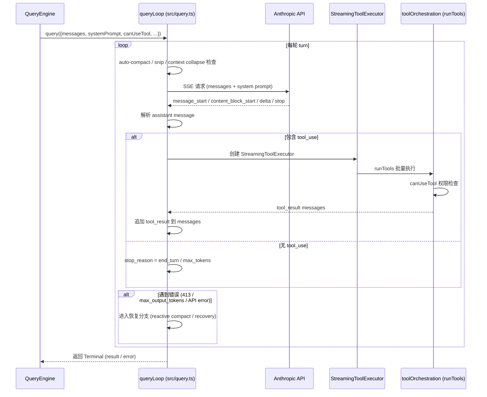

# QueryEngine 架构详解

> 文件：`src/QueryEngine.ts`（~1296 行）+ `src/query.ts`  
> 本文从配置、状态、生命周期、循环控制、消息流、持久化与边界处理等维度，系统梳理 Claude Code 的核心对话引擎。

---

## 1.  overview：QueryEngine 的职责边界

`QueryEngine` 是 Claude Code 的**“主循环控制器”**。它的核心任务是：
- 维护一次完整对话的**可变状态**（`mutableMessages`、`readFileState`、累计 `usage`、权限拒绝记录等）。
- 处理一次用户输入（`submitMessage`），将其展开为**多轮 agentic turn**（模型输出 → 工具调用 → 结果回写 → 再调用模型…）。
- 在每一轮中负责**上下文组装**（system prompt + user context + system context）、**权限校验**、**transcript 持久化**、**预算/回合数/结构化输出重试**等边界检查。
- 以 `AsyncGenerator<SDKMessage>` 的形式向上层（headless `-p`、SDK、REPL）yield 标准化的消息流。

`src/query.ts` 中的 `query()` / `queryLoop()` 则是**真正的 API 流式循环**：它负责与 Anthropic API 建立 SSE 连接、处理 `message_start` / `content_block_delta` / `message_delta` / `message_stop`、驱动 `StreamingToolExecutor` 执行工具、并在遇到错误时进入**恢复分支**（reactive compact、max_output_tokens recovery、413 recovery 等）。

两者关系可以概括为：
- **QueryEngine** = 会话级状态机 + 边界检查 + transcript 管理。
- **query.ts** = 单次 API 请求的内部循环 + 流式解析 + 错误恢复 + 工具执行编排。

---

## 2.  类结构与状态字段

```ts
// src/QueryEngine.ts:L185
export class QueryEngine {
  private config: QueryEngineConfig
  private mutableMessages: Message[]
  private abortController: AbortController
  private permissionDenials: SDKPermissionDenial[]
  private totalUsage: NonNullableUsage
  private hasHandledOrphanedPermission = false
  private readFileState: FileStateCache
  private discoveredSkillNames = new Set<string>()
  private loadedNestedMemoryPaths = new Set<string>()
  // ...
}
```

### 2.1 QueryEngineConfig（构造时注入）
| 字段 | 作用 |
|------|------|
| `cwd` | 当前工作目录，会 `setCwd(cwd)` 确保工具执行环境正确 |
| `tools` / `commands` / `mcpClients` / `agents` | 当前会话可用的工具池、斜杠命令、MCP 连接、Agent 定义 |
| `canUseTool` | `CanUseToolFn`，来自 `useCanUseTool.ts`，封装了权限规则 + UI 弹窗逻辑 |
| `getAppState` / `setAppState` | 读取/更新全局 React store（如 `fileHistory`、`attribution`、`toolPermissionContext`） |
| `initialMessages` | 恢复会话时的历史消息 |
| `readFileCache` | `FileStateCache`，记录本回合已读文件，避免重复读取 |
| `customSystemPrompt` / `appendSystemPrompt` | CLI `--system-prompt` 覆盖 |
| `userSpecifiedModel` / `fallbackModel` | 模型选择 |
| `thinkingConfig` | 思考模式（adaptive / enabled / disabled） |
| `maxTurns` / `maxBudgetUsd` / `taskBudget` | 安全边界：最大回合数、美元预算、token 预算 |
| `jsonSchema` | 结构化输出约束 |
| `replayUserMessages` / `includePartialMessages` | SDK 行为开关 |
| `orphanedPermission` | 跨 turn 遗留的权限状态（仅处理一次） |
| `snipReplay` | `HISTORY_SNIP` 功能注入的回调，用于在历史被 snip 后重放边界 |

### 2.2 实例状态
- **`mutableMessages`**：对话历史的**唯一可变源**。每次 `submitMessage` 会在其基础上追加用户输入、assistant 输出、工具结果等。
- **`totalUsage`**：跨 turn 累积的 API token 使用统计。
- **`permissionDenials`**：本轮中被拒绝的工具调用清单，最终写入 `result` 消息供 SDK/遥测消费。
- **`readFileState`**：文件读取状态缓存，在 `QueryEngine` 生命周期内持续累积，通过 `ask()` 的 `finally` 块写回外部缓存。
- **`discoveredSkillNames`** / **`loadedNestedMemoryPaths`**：本轮范围内记录动态发现的 skill 和已加载的嵌套 memory，防止无限增长。

---

## 3.  submitMessage() 主控流程（12 步）

```mermaid
flowchart TB
    A[用户调用 submitMessage] --> B[解包 config & 初始化 wrappedCanUseTool]
    B --> C[fetchSystemPromptParts 并行拉取上下文]
    C --> D[组装 systemPrompt & 注册 structured output hook]
    D --> E[构建 processUserInputContext 第 1 版]
    E --> F[处理 orphanedPermission]
    F --> G[processUserInput 处理斜杠命令]
    G --> H[预持久化 transcript]
    H --> I[更新 ToolPermissionContext & 重建 processUserInputContext 第 2 版]
    I --> J[yield buildSystemInitMessage]
    J --> K{shouldQuery?}
    K -->|No| L[直接返回本地命令结果]
    K --> Yes --> M[进入 query() 流式循环]
    M --> N[循环结束后：flush + 构造 result]
```

### 3.1 步骤详解

#### 1）权限包装器 `wrappedCanUseTool`
在 `canUseTool` 外包一层，拦截所有 `behavior !== 'allow'` 的结果，把拒绝记录推入 `this.permissionDenials`。这是 SDK 消费端需要的数据。

#### 2）拉取上下文三件套 `fetchSystemPromptParts`
并行执行：
- `getSystemPrompt(tools, mainLoopModel, …)` → `defaultSystemPrompt`
- `getUserContext()` → `userContext`（含 CLAUDE.md + currentDate）
- `getSystemContext()` → `systemContext`（含 gitStatus + cacheBreaker）

如果用户传了 `customSystemPrompt`，则跳过默认 system prompt 和 systemContext 的获取。

#### 3）组装最终 `systemPrompt`
```ts
const systemPrompt = asSystemPrompt([
  ...(customPrompt ? [customPrompt] : defaultSystemPrompt),
  ...(memoryMechanicsPrompt ? [memoryMechanicsPrompt] : []),
  ...(appendSystemPrompt ? [appendSystemPrompt] : []),
])
```
若同时存在 `customPrompt` 和 `CLAUDE_COWORK_MEMORY_PATH_OVERRIDE`，会额外注入 `loadMemoryPrompt()` 让模型知道如何使用 memory 目录。

#### 4）两次构建 `processUserInputContext`
**第一次**发生在 `processUserInput()` 之前：
- `setMessages` 是可写的，会把斜杠命令（如 `/force-snip`）对消息数组的修改写回 `this.mutableMessages`。
- 其他字段包括 `options`（模型、工具、命令表、`maxBudgetUsd` 等）、`abortController`、`readFileState`、memory/skill 触发器集合、fileHistory/attribution 的 updater。

**第二次**发生在 `processUserInput()` 之后：
- `messages` 已经更新，且斜杠命令可能修改了模型（`/model`）。
- 此时 `setMessages` 被替换为 no-op，防止后续流程意外覆盖。

#### 5）`processUserInput()` 处理用户输入
这一步会把原始 `prompt`（字符串或 `ContentBlockParam[]`）解析为：
- 普通用户消息；
- 斜杠命令展开（如 `/commit` 会调用对应的 `Command.getPromptForCommand`，生成新的消息内容）；
- 返回 `{ messages, shouldQuery, allowedTools, model, resultText }`。

如果 `shouldQuery === false`（纯本地命令如 `/cost`、`/clear`），直接跳过 API 调用，yield 本地结果后 `return`。

#### 6）Transcript 预持久化
在调用 `query()` 之前，先把用户消息写入磁盘 transcript。这样即使用户在 API 响应到达前杀进程，`--resume` 仍能从这条用户消息恢复。

#### 7）`buildSystemInitMessage`
在真正进 API 循环前，yield 一条 `system` 子类型为 `system_init` 的消息，向模型广播当前可用的工具列表、斜杠命令、agent 定义、skill、plugin、fast mode 状态等。这是模型决定调用哪个工具的“能力说明书”。

---

## 4.  query() 流式循环：queryLoop 详解



### 4.1 queryLoop 的状态结构
```ts
type State = {
  messages: Message[]
  toolUseContext: ToolUseContext
  autoCompactTracking: AutoCompactTrackingState | undefined
  maxOutputTokensRecoveryCount: number
  hasAttemptedReactiveCompact: boolean
  maxOutputTokensOverride: number | undefined
  pendingToolUseSummary: Promise<ToolUseSummaryMessage | null> | undefined
  stopHookActive: boolean | undefined
  turnCount: number
  transition: Continue | undefined
}
```

### 4.2 循环体的关键阶段

#### A. 上下文压缩前置检查
每轮循环开头会检查：
- **Auto-compact**：根据上下文 token 数触发自动摘要（`services/compact/autoCompact.ts`）。
- **Snip**：`HISTORY_SNIP` 功能，裁剪掉过长的历史。
- **Context collapse**：`CONTEXT_COLLAPSE` 功能，更激进的上下文压缩。
- **Reactive compact**：当收到 413 或 prompt too long 时，在循环内直接触发。

#### B. 调用 API
使用 `src/services/api/claude.ts` 的流式接口。请求体会注入：
- `system` prompt（由静态段 + 动态段组成）
- `userContext` 和 `systemContext`（通过 `prependUserContext` / `appendSystemContext` 包装）
- `tools` 描述（含 MCP 工具）
- `taskBudget.remaining`（如果启用了 `TOKEN_BUDGET`）

#### C. StreamingToolExecutor
当流中检测到 `tool_use` content block 时，`queryLoop` 会实例化 `StreamingToolExecutor`，后者：
- 收集所有 `tool_use` 块；
- 调用 `runTools()`（位于 `src/services/tools/toolOrchestration.ts`）并行执行；
- 每个工具执行前会调用 `canUseTool`（即 QueryEngine 传进来的 `wrappedCanUseTool`）做权限判定；
- 执行结果映射为 `tool_result` user messages，回写到 `state.messages`。

#### D. 错误恢复分支
`queryLoop` 不是简单的“成功/失败”二态，而是支持多种**继续（continue）** transitions：

| 错误/场景 | 恢复策略 |
|-----------|----------|
| `413 Payload Too Large` / Prompt Too Long | `reactiveCompact` 触发上下文压缩后继续；若已尝试过则 fallback 到 `contextCollapse` |
| `max_output_tokens` | 进入 `max_output_tokens recovery`：yield 一条继续提示（"keep going"）并继续循环，最多尝试 `MAX_OUTPUT_TOKENS_RECOVERY_LIMIT`（默认 3）次 |
| 一般 API retryable error | `withRetry` 封装层自动重试，`queryLoop` 通过 `api_retry` system 消息报告进度 |
| Image size / resize error | 捕获后作为 error result yield 出去，结束本 turn |

#### E. Stop hooks
当模型正常停止（`end_turn`）后，`queryLoop` 会执行 `handleStopHooks()`（`src/query/stopHooks.ts`），可能触发：
- post-sampling hooks
- stop-failure hooks
- 额外的问题建议（prompt suggestion）

这些 hooks 可能产生新的 progress/attachment messages，也会被 yield 回 QueryEngine。

---

## 5.  QueryEngine 的消息分发与边界检查

`for await (const message of query({...}))` 收到 `queryLoop` yield 的每一条消息后，QueryEngine 进入一个大型 `switch(message.type)` 分支。

### 5.1 消息类型处理表

| 类型 | 行为 |
|------|------|
| `assistant` | `mutableMessages.push(message)`；`yield* normalizeMessage(message)`；从 `message_delta` 捕获 `lastStopReason` |
| `user` | 追加到 `mutableMessages`；`turnCount++`；yield 归一化消息 |
| `progress` | 追加并内联持久化（`recordTranscript` fire-and-forget），防止 resume 时进度消息与 tool_result 交错导致 chain fork |
| `stream_event` | 更新 `currentMessageUsage`（`message_start` / `message_delta` / `message_stop`）；若 `includePartialMessages` 则 yield 原始事件 |
| `attachment` | 追加并内联持久化；处理 `structured_output`（提取到 `structuredOutputFromTool`）和 `max_turns_reached` |
| `system` | 处理 `compact_boundary`（裁剪 `mutableMessages` 和本地 `messages` 数组以释放 GC）、`api_error`（yield `api_retry`） |
| `tool_use_summary` | yield 给 SDK |
| `tombstone` | 跳过（控制信号） |

### 5.2 预算与重试边界检查
循环体的最后会检查两条硬边界：

1. **`maxBudgetUsd`**：若 `getTotalCost() >= maxBudgetUsd`，yield `error_max_budget_usd` result 并 `return`。
2. **结构化输出重试上限**：若 `jsonSchema` 开启，统计本轮 `SYNTHETIC_OUTPUT_TOOL_NAME` 调用次数，超过 `MAX_STRUCTURED_OUTPUT_RETRIES`（默认 5）则 yield `error_max_structured_output_retries`。

---

## 6.  结果构造：成功、执行错误、预算超支

当 `query()` 的 generator 耗尽后，QueryEngine 进入收尾阶段：

### 6.1 `isResultSuccessful()` 判定
检查最后一条有效消息（`assistant` 或 `user`）是否构成一个成功的终止状态：
- `assistant` 消息的最后 content block 是 `text` 或 `thinking`；
- 或者 `user` 消息全是 `tool_result` blocks（工具链正常结束）；
- `stop_reason` 为 `end_turn` 等正常值。

若判定失败，yield `error_during_execution` result，并附带上本轮范围内的内存错误日志（通过 `errorLogWatermark` 做 ring-buffer 切片）。

### 6.2 成功 result
```ts
yield {
  type: 'result',
  subtype: 'success',
  result: textResult,          // 最后一条 assistant text
  stop_reason: lastStopReason,
  usage: this.totalUsage,
  modelUsage: getModelUsage(),
  permission_denials: this.permissionDenials,
  structured_output: structuredOutputFromTool,
  // ... 耗时、cost、fast_mode_state 等
}
```

---

## 7.  `ask()` 便捷包装器

`src/QueryEngine.ts:L1187` 的 `ask()` 是一个纯函数式包装器：

```ts
export async function* ask({...}): AsyncGenerator<SDKMessage, void, unknown> {
  const engine = new QueryEngine({
    ...,
    readFileCache: cloneFileStateCache(getReadFileCache()),
    ...(feature('HISTORY_SNIP') ? { snipReplay: ... } : {}),
  })
  try {
    yield* engine.submitMessage(prompt, { uuid: promptUuid, isMeta })
  } finally {
    setReadFileCache(engine.getReadFileState())
  }
}
```

它适合**一次性/headless**调用：创建引擎 → 跑一轮 → 把 `readFileState` 写回外部缓存。REPL 场景则通常直接持有 `QueryEngine` 实例并反复调用 `submitMessage()`。

---

## 8.  关键设计模式总结

### 8.1 双层循环分离
- **外层**（`QueryEngine.submitMessage`）= 会话级 orchestrator，负责状态、持久化、边界检查。
- **内层**（`query.ts queryLoop`）= API 级 reactor，负责流式解析、工具执行、错误恢复。

### 8.2 Generator 作为背压-safe 的消息总线
`AsyncGenerator<SDKMessage>` 让 QueryEngine 可以边收边发：API 每 yield 一个 `assistant` 文本块，headless/SDK 就能立刻消费并输出，无需等待整轮结束。

### 8.3 可变历史 + 本地快照
- `mutableMessages` 是**唯一可变源**，跨 turn 持续累积。
- `messages = [...this.mutableMessages]` 是**本地快照**，供 `queryLoop` 在当前 turn 内操作（如追加 tool_result、compact boundary 后 splice 释放内存）。

### 8.4 预持久化 + 内联持久化策略
- **预持久化**：用户消息一产生就 `await recordTranscript()`（非 bare 模式），保证 kill-safe resume。
- **内联持久化**：`progress` / `attachment` 消息在循环内 `void recordTranscript()` fire-and-forget，保证 resume chain 不被这些“额外消息”打断。

### 8.5 错误恢复而非异常中断
`queryLoop` 大量使用了**continue transitions**而不是 throw。这样可以在不销毁 `QueryEngine` 实例的情况下，对 413、max_output_tokens 等可恢复错误做上下文压缩或继续提示，保持会话连续性。

---

## 9.  文件速查表

| 文件 | 核心职责 |
|------|----------|
| `src/QueryEngine.ts` | `QueryEngine` 类、`submitMessage()`、`ask()`；会话状态、权限包装、transcript 管理、结果构造 |
| `src/query.ts` | `query()` / `queryLoop()`；API 流式请求、工具执行编排、错误恢复、stop hooks |
| `src/services/api/claude.ts` | 实际发起 Anthropic API SSE 请求，处理 message_start/delta/stop |
| `src/services/tools/StreamingToolExecutor.ts` | 流式工具执行器，聚合 tool_use 并驱动并行执行 |
| `src/services/tools/toolOrchestration.ts` | `runTools()`，批量调用 `Tool.call()`，含权限前置检查 |
| `src/utils/processUserInput/processUserInput.ts` | 解析用户输入、识别斜杠命令、生成初始消息列表 |
| `src/utils/queryContext.ts` | `fetchSystemPromptParts()`，并行拉取 system prompt + contexts |
| `src/utils/messages.ts` | `createUserMessage`、`normalizeMessagesForAPI`、`buildSystemInitMessage` 等 |
| `src/utils/sessionStorage.ts` | `recordTranscript()`、`flushSessionStorage()` |
| `src/utils/queryHelpers.ts` | `isResultSuccessful()`、`handleOrphanedPermission()` |
| `src/query/stopHooks.ts` | `handleStopHooks()`，post-sampling / stop-failure hooks |
| `src/query/tokenBudget.ts` | `createBudgetTracker()`、`checkTokenBudget()` |
