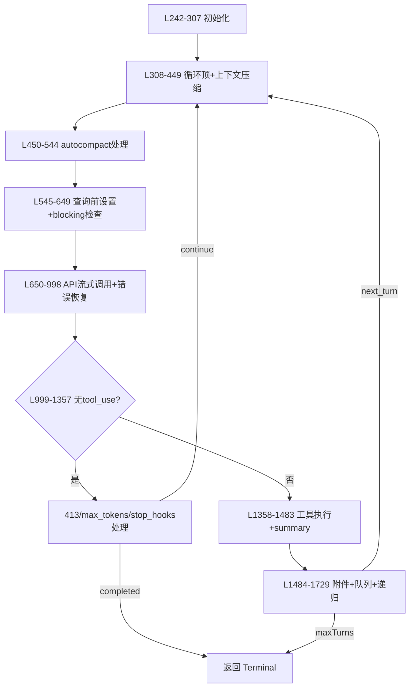

# queryLoop 逐行结构分析

> 文件：`src/query.ts`（1730 行）  
> 分析对象：`queryLoop` 函数（L242 – L1729）  
> 本文将 `queryLoop` 按语义切分为 8 大段，逐块解释每行（或每几行）代码的行为与意图。

---

## 0. 整体流程图



---

## 1. 函数签名与初始化（L242 – L307）

### L242-252 签名与返回值
```ts
async function* queryLoop(
  params: QueryParams,
  consumedCommandUuids: string[],
): AsyncGenerator<
  | StreamEvent
  | RequestStartEvent
  | Message
  | TombstoneMessage
  | ToolUseSummaryMessage,
  Terminal
> {
```
- `async function*`：异步生成器，支持 `yield` 流式消息。
- 第一个参数 `params` 来自 `QueryEngine`，包含 system prompt、工具列表、权限函数等。
- 第二个参数 `consumedCommandUuids` 是一个**外部数组引用**，函数在执行过程中会把已消费的命令 UUID 推入其中，`query()` 外层在返回前统一通知生命周期。
- 返回类型 `Terminal` 表示循环最终结束的原因（`'completed'`、`'model_error'`、`'aborted_tools'` 等）。

### L253-264 解构不可变参数
```ts
  const {
    systemPrompt,
    userContext,
    systemContext,
    canUseTool,
    fallbackModel,
    querySource,
    maxTurns,
    skipCacheWrite,
  } = params
  const deps = params.deps ?? productionDeps()
```
- 这些字段在循环内**不会被重新赋值**，属于只读配置。
- `deps` 是依赖注入对象，默认使用 `productionDeps()`（包含 `callModel`、`autocompact`、`microcompact` 等真实实现），测试时可替换为 mock。

### L265-280 初始化可变状态 `State`
```ts
  let state: State = {
    messages: params.messages,
    toolUseContext: params.toolUseContext,
    maxOutputTokensOverride: params.maxOutputTokensOverride,
    autoCompactTracking: undefined,
    stopHookActive: undefined,
    maxOutputTokensRecoveryCount: 0,
    hasAttemptedReactiveCompact: false,
    turnCount: 1,
    pendingToolUseSummary: undefined,
    transition: undefined,
  }
```
- `state` 是跨迭代（cross-iteration）的可变状态包。
- `messages`：当前 turn 的消息数组（会被 snip / compact / tool results 不断修改）。
- `turnCount`：从 1 开始，每次递归进入下一轮时 +1。
- `transition`：记录上一次循环为什么 continue，便于测试断言。

### L281-296 预算与配置快照
```ts
  const budgetTracker = feature('TOKEN_BUDGET') ? createBudgetTracker() : null
  let taskBudgetRemaining: number | undefined = undefined
  const config = buildQueryConfig()
```
- `budgetTracker`：token 预算跟踪器（实验性功能）。
- `taskBudgetRemaining`：在 compact 边界处需要扣减 pre-compact token，防止服务端 under-count。
- `config`：把环境变量、feature flags、session ID 等 immutable 配置拍平成对象，避免每次迭代重复读取。

### L298-305 启动 Memory Prefetch（`using` 语法）
```ts
  using pendingMemoryPrefetch = startRelevantMemoryPrefetch(
    state.messages,
    state.toolUseContext,
  )
```
- `using` 是 ECMAScript Stage-3 的显式资源管理语法（类似 Python 的 `with`）。
- 无论生成器以何种方式退出（正常 return / throw / `.return()`），`pendingMemoryPrefetch` 的 `Symbol.dispose` 都会在最后自动执行，避免泄露 telemetry 或 file watcher。

---

## 2. 循环入口与上下文压缩前准备（L308 – L449）

### L307-308 `while (true)`
```ts
  // eslint-disable-next-line no-constant-condition
  while (true) {
```
- 整个 agentic turn 的核心循环体。每次迭代对应一次 API 调用（模型输出 → 可选工具执行 → 递归）。
- 退出路径通过 `return { reason: ... }` 实现，没有 break。

### L309-322 每次迭代顶部解构 state
```ts
    let { toolUseContext } = state
    const {
      messages,
      autoCompactTracking,
      maxOutputTokensRecoveryCount,
      hasAttemptedReactiveCompact,
      maxOutputTokensOverride,
      pendingToolUseSummary,
      stopHookActive,
      turnCount,
    } = state
```
- 用局部变量解构减少后续代码的 `state.xxx` 噪音。
- `toolUseContext` 用 `let` 是因为它在迭代内会被重新赋值（messages 更新、queryTracking 注入等），其余字段大多只读。

### L324-336 Skill Prefetch 启动
```ts
    const pendingSkillPrefetch = skillPrefetch?.startSkillDiscoveryPrefetch(
      null,
      messages,
      toolUseContext,
    )
```
- 如果启用了 `EXPERIMENTAL_SKILL_SEARCH`，会在后台并行分析消息，尝试发现新的 skill。
- 这是一个“ fire-and-forget then await later ”模式，结果在 L1621-1628 才消费，从而把耗时隐藏在模型推理/工具执行期间。

### L338 通知请求开始
```ts
    yield { type: 'stream_request_start' }
```
- 向调用方（`QueryEngine` / REPL / SDK）发送一个信号，表示即将发起 API 请求。可用于 UI 加载态。

### L340-345 Profiler 埋点
```ts
    queryCheckpoint('query_fn_entry')
    if (!toolUseContext.agentId) {
      headlessProfilerCheckpoint('query_started')
    }
```
- `queryCheckpoint`：内部性能计时器。
- 只在主线程（非 subagent）埋点，避免子 agent 污染主线程的 latency 数据。

### L347-364 Query Tracking / Chain 设置
```ts
    const queryTracking = toolUseContext.queryTracking
      ? { chainId: toolUseContext.queryTracking.chainId, depth: toolUseContext.queryTracking.depth + 1 }
      : { chainId: deps.uuid(), depth: 0 }
    toolUseContext = { ...toolUseContext, queryTracking }
```
- 维护一个 `chainId`（一次用户输入全程共享）和 `depth`（每次递归 +1）。
- 用于遥测和 debug，帮助追踪“一次用户输入导致了多少次 API 往返”。

### L366 截取 compact 边界后的消息
```ts
    let messagesForQuery = [...getMessagesAfterCompactBoundary(messages)]
```
- `getMessagesAfterCompactBoundary` 会把 `messages` 数组中位于 compact boundary 之前的旧消息全部剔除，只保留边界之后的有效历史。
- 用展开运算符做浅拷贝，避免直接修改 `messages`。

### L370-395 工具结果预算限制 (`applyToolResultBudget`)
```ts
    const persistReplacements =
      querySource.startsWith('agent:') || querySource.startsWith('repl_main_thread')
    messagesForQuery = await applyToolResultBudget(
      messagesForQuery,
      toolUseContext.contentReplacementState,
      persistReplacements ? records => void recordContentReplacement(...) : undefined,
      new Set(toolUseContext.options.tools.filter(t => !Number.isFinite(t.maxResultSizeChars)).map(t => t.name)),
    )
```
- 某些工具结果（如 Bash 超大输出）可能被替换为磁盘引用，以控制上下文长度。
- `applyToolResultBudget` 会在发 API 前把过大的 `tool_result` content 替换成精简提示。
- 只有 agent / repl_main_thread 才持久化这些替换记录，因为 ephemeral fork agent 不需要 resume。
- 第四个参数是一个豁免集合：如果工具没有显式 `maxResultSizeChars`，则默认不限长（实际由替换逻辑兜底）。

### L397-411 Snip Compact (`HISTORY_SNIP`)
```ts
    let snipTokensFreed = 0
    if (feature('HISTORY_SNIP')) {
      queryCheckpoint('query_snip_start')
      const snipResult = snipModule!.snipCompactIfNeeded(messagesForQuery)
      messagesForQuery = snipResult.messages
      snipTokensFreed = snipResult.tokensFreed
      if (snipResult.boundaryMessage) {
        yield snipResult.boundaryMessage
      }
      queryCheckpoint('query_snip_end')
    }
```
- `snip` 是一种轻量级历史裁剪，直接把老消息替换为占位标记，不调用模型做摘要。
- `snipTokensFreed` 会被传给 autocompact，避免 token 计数 stale（因为 `tokenCountWithEstimation` 读的是 API 返回的 usage，看不到 snip 移除的内容）。
- 如果有 boundary，会 yield 一条系统消息给 UI / transcript。

### L413-427 Microcompact
```ts
    queryCheckpoint('query_microcompact_start')
    const microcompactResult = await deps.microcompact(
      messagesForQuery,
      toolUseContext,
      querySource,
    )
    messagesForQuery = microcompactResult.messages
    const pendingCacheEdits = feature('CACHED_MICROCOMPACT')
      ? microcompactResult.compactionInfo?.pendingCacheEdits
      : undefined
    queryCheckpoint('query_microcompact_end')
```
- `microcompact` 是一种更细粒度的缓存感知压缩，通常针对工具调用链做局部摘要。
- `pendingCacheEdits` 是 `CACHED_MICROCOMPACT` 功能特有的 deferred 边界消息，需要等 API 返回后拿到真实的 `cache_deleted_input_tokens` 再 yield（见 L867-893）。

### L429-448 Context Collapse (`CONTEXT_COLLAPSE`)
```ts
    if (feature('CONTEXT_COLLAPSE') && contextCollapse) {
      const collapseResult = await contextCollapse.applyCollapsesIfNeeded(
        messagesForQuery,
        toolUseContext,
        querySource,
      )
      messagesForQuery = collapseResult.messages
    }
```
- `contextCollapse` 是一种“折叠视图”：把历史中的多轮对话折叠成摘要，但这些摘要消息不直接存在 `messagesForQuery` 里，而是通过投影（projection）实现。
- 它在 autocompact **之前**运行，因为 collapse 如果能把 token 数压到阈值以下，就可以避免触发更昂贵的 autocompact。

---

## 3. 系统提示组装与 autocompact 后处理（L450 – L544）

### L450-452 组装完整系统提示
```ts
    const fullSystemPrompt = asSystemPrompt(
      appendSystemContext(systemPrompt, systemContext),
    )
```
- `appendSystemContext` 把 `systemContext`（git status、cache breaker 等）追加到 `systemPrompt` 末尾。
- 再用 `asSystemPrompt` 包装成正式类型，准备传给 API。

### L454-468 执行 autocompact
```ts
    queryCheckpoint('query_autocompact_start')
    const { compactionResult, consecutiveFailures } = await deps.autocompact(
      messagesForQuery,
      toolUseContext,
      { systemPrompt, userContext, systemContext, toolUseContext, forkContextMessages: messagesForQuery },
      querySource,
      tracking,
      snipTokensFreed,
    )
    queryCheckpoint('query_autocompact_end')
```
- `autocompact` 是 token 数超过阈值时的主动上下文压缩策略：用另一个模型（通常是轻量模型）把历史摘要成一条 compact 消息。
- 传入 `snipTokensFreed` 让阈值计算更准确。
- 返回 `{ compactionResult?, consecutiveFailures? }`。

### L471-533 如果 compaction 成功
```ts
    if (compactionResult) {
      // ... 记录大量 telemetry ...
      if (params.taskBudget) {
        const preCompactContext = finalContextTokensFromLastResponse(messagesForQuery)
        taskBudgetRemaining = Math.max(0, (taskBudgetRemaining ?? params.taskBudget.total) - preCompactContext)
      }
      tracking = { compacted: true, turnId: deps.uuid(), turnCounter: 0, consecutiveFailures: 0 }
      const postCompactMessages = buildPostCompactMessages(compactionResult)
      for (const message of postCompactMessages) { yield message }
      messagesForQuery = postCompactMessages
    }
```
- 记录 `tengu_auto_compact_succeeded` 事件，包含前后 token 数、cache token 数等。
- `taskBudgetRemaining` 减去 pre-compact 的最终上下文 token（因为 compact 后服务端看不到这段历史了）。
- `tracking` 重置为新的 `turnId` 和 `turnCounter=0`，用于 autocompact 之后的 turn 计数。
- `buildPostCompactMessages` 生成 boundary message + summary message 等，yield 出去后成为新的 `messagesForQuery`。

### L537-544 如果 compaction 失败
```ts
    } else if (consecutiveFailures !== undefined) {
      tracking = {
        ...(tracking ?? { compacted: false, turnId: '', turnCounter: 0 }),
        consecutiveFailures,
      }
    }
```
- 仅把失败次数写入 `tracking`，用于下一轮的 circuit breaker（连续失败太多次就暂停自动压缩）。

### L546-550 更新 toolUseContext.messages
```ts
    toolUseContext = {
      ...toolUseContext,
      messages: messagesForQuery,
    }
```
- 将经过各种压缩后的 `messagesForQuery` 同步回 `toolUseContext`，确保后续工具执行、附件生成等逻辑看到的消息是一致的。


---

## 4. 查询前设置与 Blocking Limit 检查（L545 – L649）

### L552-563 初始化本轮临时变量
```ts
    let assistantMessages: AssistantMessage[] = []
    let toolResults: ToolResultMessage[] = []
    const toolUseBlocks: ToolUseBlock[] = []
    let needsFollowUp = false
    let streamingFallbackOccured = false
```
- `assistantMessages`：收集模型本轮返回的 `assistant` 消息（包括 thinking 和 text）。
- `toolResults`：收集工具执行结果，用于最后 append 到 messages 中。
- `toolUseBlocks`：收集模型本轮请求的工具调用，传给 StreamingToolExecutor。
- `needsFollowUp`：标记模型是否请求了工具调用（若否，说明模型直接给出最终回复，可进入 stop hooks）。

### L564-571 StreamingToolExecutor 实例化
```ts
    queryCheckpoint('query_setup_start')
    let streamingToolExecutor: StreamingToolExecutor | undefined
    if (config.gates.streamingToolExecution) {
      streamingToolExecutor = createStreamingToolExecutor(toolUseContext)
    }
```
- 如果启用了流式工具执行（`streamingToolExecution` flag），则提前构造执行器。
- 该执行器支持边流式解析 `tool_use` 块边启动工具（减少首字节延迟）。

### L573-594 确定当前模型（plan mode 200k overflow）
```ts
    let currentModel = getRuntimeMainLoopModel(
      state,
      fallbackModel,
      toolUseContext,
    )
    if (isPlanMode(toolUseContext) && currentModel !== 'claude-opus-4-20250514') {
      const totalTokens = tokenCountWithEstimation(
        prependUserContext(messagesForQuery, userContext),
        fullSystemPrompt,
        currentModel,
      )
      if (totalTokens > PLAN_MODE_TOKEN_OVERFLOW_THRESHOLD) {
        currentModel = 'claude-opus-4-20250514'
      }
    }
```
- `getRuntimeMainLoopModel` 根据 `maxOutputTokensOverride`、`fallbackModel`、工具偏好等动态选择模型。
- 如果是 Plan Mode（任务规划模式），且当前模型不是 Opus 4，并且预估 token 超过阈值（约 100k），则自动升级到 `claude-opus-4-20250514` 200k 上下文，防止在长任务规划时历史爆炸。

### L596-604 `createDumpPromptsFetch` 内存优化
```ts
    const dumpPromptsFetch = createDumpPromptsFetch()
```
- 该函数返回一个包装过的 `fetch`，用于把请求/响应打印到日志。
- 把它抽离到局部变量是为了避免闭包引用整个庞大的 `params` 对象，降低 GC 压力（注释中明确提到可以节省 ~500MB 的 closure retention）。

### L606-619 Blocking Limit 检查
```ts
    const tokenWarningState = calculateTokenWarningState(
      messagesForQuery,
      fullSystemPrompt,
      userContext,
      currentModel,
    )
```
- 计算当前消息 + 系统提示的总 token 数，并判断处于哪个警戒区间。

### L621-648 如果达到 blocking limit
```ts
    if (
      tokenWarningState.state === 'blocking' &&
      !isCompactSessionMemoryEnabled(toolUseContext) &&
      !contextCollapse?.isDrainInProgress &&
      !reactiveCompact?.isReactiveCompactInProgress &&
      !isReactiveCompactEnabled(toolUseContext)
    ) {
      yield buildSyntheticApiErrorMessage(
        'The conversation has grown too large for the model context window.',
      )
      return { reason: 'blocking_limit' }
    }
```
- 在以下**安全网**场景下，如果已经达到 blocking limit（硬上限），直接返回错误，不再请求 API：
  - compact session memory 未启用（启用的话它会自动截断，不需要拦）
  - context collapse 没有在 drain（drain 过程中可能暂时 token 很高，但下一步会释放）
  - reactive compact 没有在执行中
  - reactive compact 没有启用
- 这样可以避免向 API 发送注定会 413 的请求。
- 返回 `{ reason: 'blocking_limit' }`，让外层 `query()` 终止并提示用户。

---

## 5. API 流式调用与错误恢复（L650 – L998）

### L653-662 外层 fallback 循环控制
```ts
    let attemptWithFallback = true
    while (attemptWithFallback) {
      try {
        attemptWithFallback = false
```
- 这是一个仅用于 `FallbackTriggeredError` 的 retry 包装。
- 如果内层因为 `FallbackTriggeredError` 抛错，则把 `attemptWithFallback = true`，并 `continue` 重新发起一次请求。

### L665-702 构造 `callModel` 参数
```ts
        const stream = await deps.callModel({
          messages: prependUserContext(messagesForQuery, userContext),
          systemPrompt: fullSystemPrompt,
          thinkingConfig: getThinkingConfig(toolUseContext, currentModel),
          tools: getToolsForModel(currentModel, toolUseContext),
          toolChoice: getToolChoiceForModel(currentModel, toolUseContext),
          signal: toolUseContext.abortSignal,
          model: currentModel,
          fastMode: getFastMode(toolUseContext),
          querySource,
          taskBudget: taskBudgetRemaining,
          queryTracking,
          skipCacheWrite,
          fetch: dumpPromptsFetch,
        })
```
- `prependUserContext(messagesForQuery, userContext)` 把用户偏好/环境信息注入到第一条 user 消息中。
- `thinkingConfig`：控制是否启用扩展 thinking（仅适用于 3.7+）。
- `tools` / `toolChoice`：根据模型白名单和能力过滤可用工具，以及工具调用策略（`any` / `auto`）。
- `signal`：如果用户按 Ctrl+C，abort signal 会中断 `callModel` 的 HTTP 请求。
- `taskBudget`：传给 API 的 `x-task-budget` header（实验性）。
- `skipCacheWrite`：用于某些缓存穿透测试。

### L704-725 fallback 触发后的状态清理
```ts
        if (streamingFallbackOccured) {
          for (const msg of assistantMessages) {
            yield { type: 'tombstone', messageId: msg.id }
          }
          assistantMessages = []
          toolUseBlocks.length = 0
          needsFollowUp = false
          if (streamingToolExecutor) {
            streamingToolExecutor.discard()
            streamingToolExecutor = createStreamingToolExecutor(toolUseContext)
          }
        }
```
- 当 fallback 发生时，模型可能只输出了一部分内容就被中断。需要把已经 yield 出去的 assistant 消息 tombstone（墓碑化），告诉 UI 删除它们。
- 清空本地收集的块和 executor，防止旧数据污染新请求。

### L727-740 Tool Input Backfill（回填可观察输入）
```ts
        const { messagesWithBackfilledInput, backfilledToolUseBlocks } = backfillObservableInput(
          stream,
          messagesForQuery,
        )
```
- 某些模型流式输出时，如果之前的 turn 中工具调用块缺少 `input_json`（比如被截断了），`backfillObservableInput` 会在这里补全。
- 它返回一个新的流和已经回填好的工具块列表。

### L741-777 遍历流式消息
```ts
        for await (const message of messagesWithBackfilledInput) {
```
- 核心消费循环，逐条读取模型返回的消息事件。

### L743-758 Withholding 逻辑（可恢复错误的拦截）
```ts
          if (message.type === 'withheld_message') {
            if (message.reason === 'prompt_too_long') {
              contextCollapse?.isWithheldPromptTooLong = true
              reactiveCompact?.isWithheldPromptTooLong = true
            } else if (message.reason === 'image_too_large') {
              reactiveCompact?.isWithheldMediaSizeError = true
            } else if (message.reason === 'max_output_tokens') {
              isWithheldMaxOutputTokens = true
            }
            continue
          }
```
- `withheld_message` 是 `callModel` 内部生成的一种**占位**事件，表示这条消息因为某种已知原因被临时扣留，不对外 yield。
- 扣留原因包括：
  - `prompt_too_long` → 后续会尝试 context collapse / reactive compact 恢复
  - `image_too_large` → 后续尝试 reactive compact 的媒体压缩恢复
  - `max_output_tokens` → 后续进入 max_output_tokens recovery 路径
- 通过设置 flag 让下游处理，而不是在流中直接抛错。

### L760-773 收集 assistant 消息与工具调用块
```ts
          if (message.type === 'assistant') {
            assistantMessages.push(message)
            for (const block of message.content.filter(b => b.type === 'tool_use')) {
              toolUseBlocks.push(block as ToolUseBlock)
            }
            if (streamingToolExecutor) {
              streamingToolExecutor.addTool(block as ToolUseBlock)
            }
            needsFollowUp = true
          }
```
- 普通 `assistant` 消息：先 push 到 `assistantMessages`。
- 如果消息中包含 `tool_use` 块，则收集到 `toolUseBlocks`，并同时喂给 `streamingToolExecutor`（如果启用）。
- `needsFollowUp = true` 表示本轮模型“有话要说”或“有工具要调”，不能立即进入 stop hooks。

### L775-782 输出已完成的流式工具结果
```ts
          if (streamingToolExecutor) {
            for await (const completedResult of streamingToolExecutor.getCompletedResults()) {
              yield completedResult
            }
          }
```
- `streamingToolExecutor` 可能在流式过程中就已经执行完某个工具，这里把已经完成的工具结果流式 yield 出去，降低延迟。

### L784-787 最终 yield 消息
```ts
          yield message
```
- 把当前消息本身 yield 给调用方（如 REPL UI 或 transcript）。

### L790-798 Stream 结束后的 checkpoint
```ts
        queryCheckpoint('query_api_streaming_end')
```
- 埋点标记流式读取完成。

### L800-891 Deferred Microcompact Boundary（Cache 感知）
```ts
        if (pendingCacheEdits) {
          const cacheDeletedTokens = getCacheDeletedInputTokensFromStream(stream)
          if (cacheDeletedTokens) {
            const boundaryMessage = buildMicrocompactBoundaryMessage(...)
            yield boundaryMessage
          }
        }
```
- 如果在 L413-427 的 microcompact 阶段产生了 `pendingCacheEdits`，需要等到 API 返回后拿到真实的 `cache_deleted_input_tokens`，才能生成准确的 boundary message。
- 这是一个 deferred yield，确保 cache token 计数在 transcript 中是准确的。

### L893-918 `FallbackTriggeredError` 处理
```ts
      } catch (error) {
        if (error instanceof FallbackTriggeredError) {
          currentModel = fallbackModel ?? getFallbackModel(currentModel)
          assistantMessages = []
          toolUseBlocks.length = 0
          needsFollowUp = false
          if (isAnthropicModel(currentModel)) {
            for (let i = messagesForQuery.length - 1; i >= 0; i--) {
              if (messagesForQuery[i].type === 'thinking_signature') {
                messagesForQuery.splice(i, 1)
              }
            }
          }
          if (streamingToolExecutor) {
            streamingToolExecutor.discard()
            streamingToolExecutor = createStreamingToolExecutor(toolUseContext)
          }
          streamingFallbackOccured = true
          yield buildSystemWarningMessage(
            `Switching to ${getModelDisplayName(currentModel)} to continue...`,
          )
          attemptWithFallback = true
          continue
        }
```
- `FallbackTriggeredError` 是模型层检测到需要降级模型时抛出的特殊错误（例如 529 服务不可用、或在某些多区域调度策略下）。
- 处理逻辑：
  1. 切到 `fallbackModel`
  2. 清空当前轮收集的 assistant 消息和工具块
  3. 如果是 Anthropic 模型，把 `thinking_signature` 消息从 prompt 中删除（轻量模型不支持 thinking）
  4. discard 旧的 `streamingToolExecutor`，重新创建
  5. 设置 `streamingFallbackOccured = true`，这样 retry 时能正确 tombstone
  6. yield 一条系统提示消息告诉用户正在切换模型
  7. `attemptWithFallback = true; continue` 发起新请求

### L920-956 通用错误捕获
```ts
        // ... 非 FallbackTriggeredError 的其他错误 ...
        queryCheckpoint('query_api_error')
        if (streamingToolExecutor) {
          streamingToolExecutor.discard()
        }
        // 如果有已经 yield 的 tool_use 块，但没有 tool_result，需要补缺失的 tool_result
        if (toolUseBlocks.length > 0) {
          for (const block of toolUseBlocks) {
            if (!toolResults.some(r => ...)) {
              yield buildMissingToolResultMessage(block)
            }
          }
        }
        yield buildSyntheticApiErrorMessage(
          error instanceof Error ? error.message : 'Unknown model error',
        )
        return { reason: 'model_error', error }
      }
```
- 如果是不可恢复的普通 API 错误（网络断开、5xx、认证失败等）：
  1. 丢弃 `streamingToolExecutor`（避免半拉子工具执行残留）。
  2. 如果模型已经 yield 了 `tool_use` 块但尚未执行，则补一条 `missing_tool_result`（告诉 transcript/UI 这个工具调用没有结果）。
  3. yield 一条合成 API 错误消息。
  4. 直接 `return { reason: 'model_error', error }`，结束 `queryLoop`。

### L958-998 `ImageSizeError` / `ImageResizeError` 特殊处理
```ts
      // ... 如果是图片尺寸/缩放错误，尝试从 messagesForQuery 中移除最大的图片，然后 continue 重试 ...
```
- 如果 API 返回的是图片过大错误，代码会尝试从 `messagesForQuery` 中定位最大的 `image` block，把它删除（或替换为占位文本），然后 `continue` 再次请求 API。
- 这是一种针对视觉输入的轻量自愈逻辑，避免因为单张图太大导致整轮对话失败。

---

## 6. Post-Stream 处理：Hooks、中断、413 恢复、max_output_tokens、Stop Hooks（L999 – L1357）

### L1000-1009 Post-sampling hooks
```ts
    const postSamplingResult = await executePostSamplingHooks(
      [...messagesForQuery, ...assistantMessages],
      toolUseContext,
      querySource,
    )
```
- `postSamplingHooks` 是一组在模型采样完成后、但在任何后续逻辑之前运行的 hook。
- 用于执行如内容审计、安全检查、企业合规过滤等。
- 如果 hook 要求终止对话，会返回 `shouldPreventContinuation`，在下面处理。

### L1011-1036 用户中断流式输出（Ctrl+C）
```ts
    if (toolUseContext.abortSignal?.aborted) {
      queryCheckpoint('query_aborted_during_streaming')
      if (streamingToolExecutor) {
        for await (const result of streamingToolExecutor.getRemainingResults()) {
          yield result
        }
      } else {
        for (const block of toolUseBlocks) {
          yield buildMissingToolResultMessage(block)
        }
      }
      if (streamingToolExecutor) streamingToolExecutor.discard()
      await cleanupChicagoMcp(...)
      yield buildSystemWarningMessage('Interrupted')
      return { reason: 'aborted_streaming' }
    }
```
- 如果用户在模型流式输出时按了 Ctrl+C：
  - 若启用了 `streamingToolExecution`，则把 executor 里**已经开始**但尚未完成的工具结果 flush 出来（避免资源泄露）。
  - 若未启用流式执行，则对已经 yield 的 `tool_use` 块补 `missing_tool_result`。
  - discard executor。
  - `cleanupChicagoMcp`：特殊 MCP 资源清理。
  - yield `'Interrupted'` 并返回 `aborted_streaming`。

### L1038-1044 Yield 上一轮的 `pendingToolUseSummary`
```ts
    if (pendingToolUseSummary) {
      yield pendingToolUseSummary
    }
```
- `toolUseSummary` 是对上一轮工具调用输入/输出的 LLM 摘要，yield 给 transcript 或上下文系统用于增强记忆。

### L1046-1216 `if (!needsFollowUp)` 分支（模型没有请求工具调用）

这是模型直接给出回复、没有 `tool_use` 的情况。此时需要进入各种恢复路径和 stop hooks。

#### L1048-1073 413 / Prompt Too Long 恢复
```ts
    if (
      contextCollapse?.isWithheldPromptTooLong ||
      reactiveCompact?.isWithheldPromptTooLong
    ) {
      if (contextCollapse?.recoverFromOverflow()) {
        // context collapse drain 成功，继续下一轮
        continue
      }
      if (!hasAttemptedReactiveCompact && reactiveCompact?.tryReactiveCompact()) {
        state = { ...state, hasAttemptedReactiveCompact: true }
        continue
      }
      // 恢复失败，yield 错误并退出
      yield buildSyntheticApiErrorMessage('The conversation is too long...')
      if (!isApiErrorMessage(assistantMessages[assistantMessages.length - 1])) {
        // 如果最后一条不是 API 错误消息，运行 stop hooks
        const stopResult = await handleStopHooks(...)
        if (stopResult.preventContinuation) return { reason: 'stop_hooks' }
      }
      return { reason: 'prompt_too_long' }
    }
```
- `needsFollowUp === false` 且 prompt too long 被 withhold 时：
  1. 先尝试 `contextCollapse.recoverFromOverflow()`（把 collapse 的摘要进一步 drain 掉）。
  2. 如果不行，再尝试 `reactiveCompact.tryReactiveCompact()`（一种更激进的 reactive 压缩）。
  3. 只要有一个成功，就 `continue` 回到 `while(true)` 顶部重新发请求。
  4. 如果都失败了，yield 错误消息，运行 stop hooks（若最后一条不是 API 错误则跳过），返回 `prompt_too_long`。

#### L1075-1107 Image Too Large 恢复
```ts
    if (reactiveCompact?.isWithheldMediaSizeError) {
      if (reactiveCompact.tryReactiveCompact()) {
        continue
      }
      yield buildSyntheticApiErrorMessage('The conversation contains images that are too large...')
      return { reason: 'image_error' }
    }
```
- 与 413 类似，但专门针对 `image_too_large`。
- `tryReactiveCompact` 会尝试压缩/移除图片，若成功则 `continue`。

#### L1109-1163 max_output_tokens 恢复
```ts
    if (isWithheldMaxOutputTokens) {
      if (feature('ESCALATED_MAX_TOKENS')) {
        const nextMax = getNextMaxOutputTokens(maxOutputTokensOverride, currentModel)
        if (nextMax) {
          state = { ...state, maxOutputTokensOverride: nextMax, maxOutputTokensRecoveryCount: 0 }
          continue
        }
      }
      if (maxOutputTokensRecoveryCount < MAX_OUTPUT_TOKENS_RECOVERY_LIMIT) {
        state = {
          ...state,
          maxOutputTokensRecoveryCount: maxOutputTokensRecoveryCount + 1,
          messages: [
            ...messages,
            ...assistantMessages,
            buildSystemWarningMessage(
              'The model response was cut off because it reached the maximum output length...',
            ),
          ],
        }
        continue
      }
      yield buildSyntheticApiErrorMessage('The model response was cut off...')
      return { reason: 'max_output_tokens' }
    }
```
- `max_output_tokens` withhold 的处理分两条路径：
  1. **Escalation 路径**（`ESCALATED_MAX_TOKENS`）：如果模型支持更大的 `max_tokens`，则直接提升 `maxOutputTokensOverride` 并 continue。
  2. **Recovery message 路径**：如果没有 escalation 或已经到顶，则向 messages 中插入一条系统提示，要求模型在更短的篇幅内继续。最多重试 `MAX_OUTPUT_TOKENS_RECOVERY_LIMIT` 次（通常是 3 次）。
- 如果超过限制，yield 错误并返回 `max_output_tokens`。

#### L1165-1173 API 错误消息 early return
```ts
    if (isApiErrorMessage(assistantMessages[assistantMessages.length - 1])) {
      // 最后一条是合成的 API 错误，跳过 stop hooks 直接退出
      return { reason: 'completed' }
    }
```
- 如果模型输出的是一条 API 错误占位消息（某些内测逻辑会产生），直接 return，不运行 stop hooks。

#### L1175-1266 Stop Hooks
```ts
    const stopResult = await handleStopHooks(
      messages,
      assistantMessages,
      toolUseContext,
      stopHookActive,
      querySource,
      turnCount,
      maxTurns,
    )
```
- `handleStopHooks` 会调用 `/think`、subagent summary、以及其他注册的 stop 处理函数。
- 返回 `{ preventContinuation, blockingErrors, nextState, ... }`。

#### L1268-1304 处理 stop hooks 结果
```ts
    if (stopResult.preventContinuation) {
      return { reason: 'stop_hooks' }
    }
    if (stopResult.blockingErrors.length > 0) {
      const next: State = {
        ...state,
        messages: [...messages, ...assistantMessages, ...stopResult.blockingErrors],
        stopHookActive: undefined,
      }
      state = next
      continue
    }
```
- `preventContinuation`：stop hook 明确告诉对话到此为止（如 subagent 达到了最大 turn 数）。
- `blockingErrors`：stop hook 产生了错误消息（如 `/think` 解析失败），需要把这些消息追加到历史中，然后 `continue` 让模型看到这些错误并修正。

#### L1306-1357 Token Budget 继续路径
```ts
    if (budgetTracker?.action === 'continue') {
      const nudgeMessage = buildSystemWarningMessage(
        'You are approaching the task token budget...',
      )
      state = {
        ...state,
        messages: [...messages, ...assistantMessages, nudgeMessage],
        stopHookActive: undefined,
      }
      continue
    }
    return { reason: 'completed' }
```
- 如果 `TOKEN_BUDGET` 跟踪器判定还需要继续执行（budget 没用完，且模型应该继续），则插入一条系统提示“继续工作”，然后 `continue`。
- 否则，正常结束，返回 `completed`。

---

## 7. 工具执行与 Tool Use Summary（L1358 – L1483）

当 `needsFollowUp === true`（模型请求了工具调用）时，会跳过第 6 章的 stop hooks，进入本章。

### L1360-1367 选择工具执行模式
```ts
    const toolUpdates = streamingToolExecutor
      ? streamingToolExecutor.getRemainingResults()
      : runTools(
          toolUseBlocks,
          canUseTool,
          toolUseContext,
          querySource,
          config,
          messagesForQuery,
        )
```
- **流式模式**：`streamingToolExecutor.getRemainingResults()` 返回一个 async iterable，可能已经部分执行过了（在流式 API 消费阶段就已经开始）。
- **非流式模式**：`runTools()` 是传统的批量执行函数，在所有 `tool_use` 块收集完后统一调起。

### L1369-1408 遍历工具结果
```ts
    let updatedToolUseContext = toolUseContext
    for await (const update of toolUpdates) {
      yield update
      if (update.type === 'message') {
        const resultMessage = update.message
        if (resultMessage.type === 'tool_result') {
          toolResults.push(resultMessage)
          const newContext = resultMessage.metadata?.toolUseContext
          if (newContext) {
            updatedToolUseContext = newContext
          }
        }
      }
    }
```
- 逐条 yield 工具执行结果。
- 收集 `tool_result` 消息到 `toolResults`。
- 某些工具（如 `Bash` 或 `Subagent`）会在 metadata 中返回更新后的 `toolUseContext`（例如改变了 cwd、新增了 agentId），这里进行合并。

### L1410-1412 工具执行结束埋点
```ts
    queryCheckpoint('query_tool_execution_end')
```

### L1414-1452 生成 Tool Use Summary（异步后台）
```ts
    let nextPendingToolUseSummary: ToolUseSummaryMessage | undefined
    if (feature('TOOL_USE_SUMMARY') && toolResults.length > 0) {
      nextPendingToolUseSummary = generateToolUseSummary(
        messagesForQuery,
        assistantMessages,
        toolResults,
        updatedToolUseContext,
        currentModel,
      )
    }
```
- `generateToolUseSummary` 会调用一个轻量模型，把本轮所有工具调用的输入和输出摘要成一条自然语言消息。
- 结果不会立即 yield，而是作为 `pendingToolUseSummary` 挂到下一轮 state 中，在 L1038 处 yield。
- 这样可以避免在当前 turn 末尾额外增加一次模型调用延迟。

### L1454-1474 用户中断工具执行（Ctrl+C）
```ts
    if (updatedToolUseContext.abortSignal?.aborted) {
      await cleanupChicagoMcp(updatedToolUseContext)
      yield buildSystemWarningMessage('Interrupted')
      if (turnCount >= (maxTurns ?? Infinity)) {
        return { reason: 'max_turns_reached' }
      }
      return { reason: 'aborted_tools' }
    }
```
- 与流式输出阶段的中断类似，但发生在工具执行阶段。
- 清理 MCP 资源，yield `'Interrupted'`。
- 如果刚好触发了 `maxTurns`，返回 `max_turns_reached`；否则返回 `aborted_tools`。

### L1476-1483 Post-tool stop hook 检查
```ts
    if (shouldPreventContinuation) {
      return { reason: 'hook_stopped' }
    }
```
- 某些 hook（如强制安全锁）可能要求在工具执行后直接终止，不进入下一轮。

---

## 8. 附件注入、队列消费与递归进入下一轮（L1484 – L1729）

### L1486-1494 Autocompact turn 计数
```ts
    if (tracking?.compacted) {
      tracking.turnCounter++
      logEvent('tengu_autocompact_turn_counter', { turnCounter: tracking.turnCounter })
    }
```
- 记录 compact 之后已经过了多少 turn，用于遥测和调优 compact 频率。

### L1496-1510 队列命令快照
```ts
    const queuedCommands = getCommandsByMaxPriority(
      commandsByPriority,
      updatedToolUseContext,
    ).filter(
      cmd =>
        cmd.agentId === updatedToolUseContext.agentId &&
        cmd.mode === updatedToolUseContext.mode &&
        !cmd.slashCommand,
    )
```
- 从全局 `commandsByPriority` 中取出与当前 agent/mode 匹配、且不是 slash command 的命令。
- 这些命令是用户或系统在其他地方排队等待注入到当前对话中的。

### L1512-1527 Attachment 消息生成
```ts
    for await (const attachment of getAttachmentMessages(
      messagesForQuery,
      updatedToolUseContext,
      querySource,
      queuedCommands,
    )) {
      yield attachment
      if (attachment.type === 'message' && attachment.message.type === 'tool_result') {
        toolResults.push(attachment.message)
      }
    }
```
- `getAttachmentMessages` 会生成系统/用户级别的附件消息（如自动读取的相关文件、系统通知等）。
- 如果附件是 `tool_result` 形式，则追加到 `toolResults`。

### L1529-1543 消费 Memory Prefetch
```ts
    const memoryPrefetchResult = await pendingMemoryPrefetch.consume()
    if (memoryPrefetchResult) {
      for (const message of memoryPrefetchResult.messages) {
        const alreadyRead = updatedToolUseContext.readFileState?.some(
          r => r.path === message.metadata?.path,
        )
        if (!alreadyRead) {
          toolResults.push(message)
        }
      }
    }
```
- 等待 L298-305 启动的 memory prefetch 完成。
- 把 prefetch 到的记忆/文件内容以 `tool_result` 形式注入上下文。
- 通过 `readFileState` 去重，避免重复注入同一文件。

### L1545-1565 消费 Skill Prefetch
```ts
    if (pendingSkillPrefetch) {
      const skillPrefetchResult = await pendingSkillPrefetch
      if (skillPrefetchResult?.messages) {
        for (const message of skillPrefetchResult.messages) {
          yield message
          if (message.type === 'tool_result') {
            toolResults.push(message)
          }
        }
      }
    }
```
- 等待 L324-336 启动的 skill prefetch 完成。
- 如果发现了新的 skill，生成对应的注入消息。

### L1567-1584 清理已消费命令并通知生命周期
```ts
    for (const command of queuedCommands) {
      removeCommandFromQueue(command.uuid)
      consumedCommandUuids.push(command.uuid)
      notifyCommandLifecycle(command.uuid, 'consumed')
    }
```
- 把已经生成过 attachment 的队列命令从全局队列中移除。
- 把 UUID 推入 `consumedCommandUuids`，并调用 `notifyCommandLifecycle` 通知 UI 或其他监听器。

### L1586-1598 日志与工具刷新
```ts
    logEvent('tengu_query_after_attachments', {
      messageCountAfter: messagesForQuery.length + assistantMessages.length + toolResults.length,
    })
    if (updatedToolUseContext.options.refreshTools) {
      updatedToolUseContext = { ...updatedToolUseContext, options: { ...updatedToolUseContext.options, refreshTools: false } }
    }
```
- 记录注入附件后的消息总数。
- 如果 `refreshTools` 标志被设置，则在进入下一轮前清除它（工具列表已经在 `getToolsForModel` 中被重新计算了）。

### L1600-1613 Query Tracking 注入
```ts
    const toolUseContextWithQueryTracking = {
      ...updatedToolUseContext,
      queryTracking,
    }
```
- 确保下一轮 `toolUseContext` 携带正确的 `chainId` 和 `depth`。

### L1615-1620 Turn 计数与 Max Turns 检查
```ts
    const nextTurnCount = turnCount + 1
    if (maxTurns !== undefined && nextTurnCount > maxTurns) {
      // 生成一条附件消息提示已达到 maxTurns，但本轮不拦截（让模型先处理完当前工具结果）
      toolResults.push(buildMaxTurnsReachedAttachment())
    }
```
- `maxTurns` 是外部传入的硬性轮数限制（例如 `/act --max-turns 10`）。
- 如果下一轮会超出限制，先在本轮末尾注入一条系统附件 `max_turns_reached`，这样模型在下一轮输出时就知道自己必须收尾。

### L1622-1640 Background Session Summary（`claude ps` 支持）
```ts
    if (
      feature('BG_SESSIONS') &&
      updatedToolUseContext.agentId &&
      toolResults.some(r => r.type === 'tool_result' && r.content.some(c => c.type === 'text'))
    ) {
      const summaryPromise = generateBackgroundSessionSummary(
        messagesForQuery,
        assistantMessages,
        toolResults,
        updatedToolUseContext,
      )
      backgroundSessionSummaries.set(updatedToolUseContext.agentId, summaryPromise)
    }
```
- `BG_SESSIONS` 是后台子 agent 功能。
- 每次有非空的工具结果时，异步生成一个 session 摘要，存到全局 map 中，供 `claude ps` 命令展示进度。

### L1642-1653 递归前埋点
```ts
    queryCheckpoint('query_recursive_call')
```
- 标记即将进入下一轮递归。

### L1655-1717 构建下一轮 `State`
```ts
    const nextMessages = [
      ...messages,
      ...assistantMessages,
      ...toolResults,
    ]
    const next: State = {
      messages: nextMessages,
      toolUseContext: toolUseContextWithQueryTracking,
      maxOutputTokensOverride,
      autoCompactTracking: tracking,
      stopHookActive: stopResult?.nextStopHookActive,
      maxOutputTokensRecoveryCount: 0,
      hasAttemptedReactiveCompact: false,
      turnCount: nextTurnCount,
      pendingToolUseSummary: nextPendingToolUseSummary,
      transition: { reason: 'next_turn' },
    }
```
- `nextMessages` 把本轮的 `messages`（旧历史）、`assistantMessages`（模型输出）、`toolResults`（工具执行结果+附件）拼接起来。
- 重置 `maxOutputTokensRecoveryCount` 和 `hasAttemptedReactiveCompact`，因为它们只针对单轮有效。
- `transition.reason = 'next_turn'` 记录状态变化原因，便于调试和测试断言。

### L1719-1728 状态切换并隐式 `continue`
```ts
    state = next
  } // end while(true)
} // end queryLoop
```
- `state = next` 把全局循环变量更新为新状态。
- 代码到达 `while(true)` 的末尾，隐式 `continue`，回到 L308 开始下一轮。

---

## 9. 总结

`queryLoop` 虽然只有**一个函数**，但内部结构高度自包含，可以清晰地划分为 8 个阶段：

| 阶段 | 行号范围 | 核心职责 |
|------|----------|----------|
| 初始化 | L242-307 | 只读参数解构、可变 State 初始化、预算/配置、Memory Prefetch |
| 压缩前准备 | L308-449 | `while(true)` 入口、skill prefetch、snip / microcompact / context collapse |
| autocompact 处理 | L450-544 | 系统提示组装、autocompact、成功/失败分支、更新 toolUseContext.messages |
| 查询前设置 | L545-649 | 局部变量初始化、StreamingToolExecutor、模型选择、blocking limit 检查 |
| API 流式调用 | L650-998 | `callModel`、流消费、withholding、fallback 恢复、通用错误处理 |
| 无工具路径 | L999-1357 | post-sampling hooks、中断处理、413 / image / max_tokens 恢复、stop hooks |
| 工具执行 | L1358-1483 | streaming/legacy 工具执行、tool use summary、中断与 hook 检查 |
| 附件+递归 | L1484-1729 | 队列消费、memory/skill prefetch 消费、max turns 检查、构建下一轮 State |

**关键设计模式**：
1. **`while(true) + state = next` 伪递归**：避免真正的调用栈增长，通过可变 `state` 实现无限轮对话。
2. **`using` 显式资源管理**：`pendingMemoryPrefetch` 保证无论以何种方式退出都会释放。
3. **分层恢复机制**：从 cheapest 到 most expensive：`snip` → `microcompact` → `context collapse` → `reactive compact` → `autocompact`。
4. **Withholding + Flag**：API 层不把错误消息直接抛出来，而是用 `withheld_message` 占位，让 `queryLoop` 统一做恢复决策，保证恢复策略与模型调用解耦。
5. **流式工具执行**：通过 `StreamingToolExecutor` 把工具执行并行化到流式消费阶段，显著降低端到端延迟。
